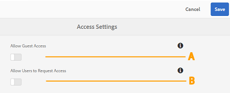

# 在 Brand Portal 上管理使用者存取權 {#administer-user-access-on-brand-portal}

Adobe Experience Manager Assets Brand Portal 6.4.2之後授權管理員設定訪客存取權，並讓使用者能夠在其組織的Brand Portal上請求存取權。 這些設定已在管理面板上作為&#x200B;**[!UICONTROL 存取設定]**&#x200B;設定提供。 這兩個設定預設為停用。

**A** — 讓來賓使用Brand Portal歡迎畫面上的&#x200B;**[!UICONTROL `Guest Access?`]**&#x200B;連結存取Brand Portal的設定。 （預設為停用）

**B** — 可讓使用者使用Brand Portal歡迎畫面上的&#x200B;**[!UICONTROL `Need access?`]**&#x200B;連結來要求存取Brand Portal的設定。 （預設為停用）

## 允許訪客存取 {#allow-guest-access}

透過允許訪客存取，使用者無需登入Brand Portal即可存取公開資產。
若要允許訪客存取，管理員必須執行下列步驟：

1. 選取AEM標誌，從頂部的工具列存取管理工具。
1. 從系統管理工具面板，選取&#x200B;**[!UICONTROL 存取]**&#x200B;以開啟&#x200B;**[!UICONTROL 存取設定]**&#x200B;頁面。
1. 啟用&#x200B;**[!UICONTROL 允許訪客存取]**&#x200B;設定。
1. **[!UICONTROL 儲存]**&#x200B;變更。
1. 登出讓變更生效。

## 允許使用者索取存取權限 {#allow-users-to-request-access}

管理員可允許組織使用者從歡迎畫面請求對Brand Portal的存取權。 但是，管理員需要啟用&#x200B;**[!UICONTROL 允許使用者要求存取許可權]**&#x200B;設定，讓要求存取許可權連結出現在歡迎畫面上。

若要讓組織使用者請求存取Brand Portal，管理員需要：

1. 選取AEM標誌，從頂部的工具列存取管理工具。
1. 從系統管理工具面板，選取&#x200B;**[!UICONTROL 存取]**&#x200B;以開啟&#x200B;**[!UICONTROL 存取設定]**&#x200B;頁面。
1. 啟用&#x200B;**[!UICONTROL 允許使用者要求存取]**&#x200B;設定。
1. **[!UICONTROL 儲存]**&#x200B;變更。
1. 登出讓變更生效。
