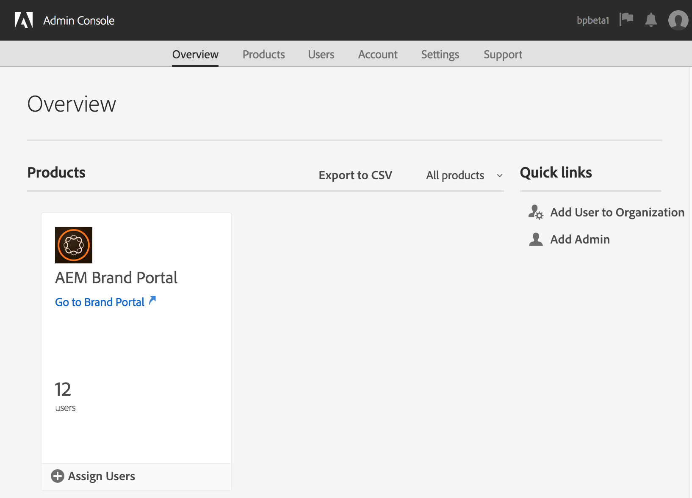
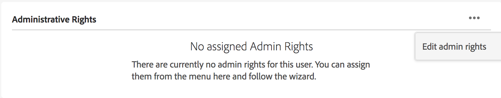

# 管理使用者、群組和使用者角色 {#manage-users-groups-and-user-roles}

管理員可以使用Adobe Admin Console建立Experience Manager Assets Brand Portal使用者和產品設定檔，並使用Brand Portal使用者介面管理其角色。 檢視者和編輯者無法使用此許可權。

在[[!UICONTROL Admin Console]](https://adminconsole.adobe.com/enterprise/overview)中，您可以檢視與您的組織相關聯的所有產品。 產品可以是任何Experience Cloud解決方案，例如Adobe Analytics、Adobe Target或Experience Manager Assets Brand Portal。 選擇AEM Brand Portal產品，並建立產品設定檔。

<!--
Comment Type: draft

<note type="note">

Product profiles (formerly known as product configurations*). 

* The nomenclature has changed from product configurations to Product Profiles in the new Adobe Admin Console.

</note>
-->

這些產品設定檔每8小時會與Brand Portal使用者介面同步一次，並在Brand Portal中顯示為群組。 新增使用者和建立產品設定檔，並將使用者新增到這些產品設定檔後，您可以在Brand Portal中將角色指派給使用者和群組。

>[!NOTE]
>
>若要在Brand Portal中建立群組，請從Adobe[!UICONTROL Admin Console]，使用&#x200B;**[!UICONTROL 產品>產品設定檔]**，而非&#x200B;**[!UICONTROL 使用者頁面>使用者群組]**。 Adobe[!UICONTROL Admin Console]中的產品設定檔是用來在Brand Portal中建立群組。

## 新增使用者 {#add-a-user}

如果您是產品管理員，請使用Adobe[[!UICONTROL Admin Console]](https://adminconsole.adobe.com/enterprise/overview)來建立使用者，並將他們指派給產品設定檔（*先前稱為產品設定*），這些設定檔在Brand Portal中顯示為群組。 您可以使用群組來執行大量作業，例如角色管理和資產共用。

>[!NOTE]
>
>無權存取Brand Portal的新使用者可以從Brand Portal的登入畫面請求存取權。 如需詳細資訊，請參閱[要求存取Brand Portal](../using/brand-portal.md#request-access-to-brand-portal)。 在通知區域收到存取權要求通知後，請按一下相關的通知，然後按一下[授與存取權]。**&#x200B;** 或者，您也可以按照收到的存取要求電子郵件中的連結進行操作。 接下來，若要透過[Adobe[!UICONTROL Admin Console]](https://adminconsole.adobe.com/enterprise/overview)新增使用者，請遵循下列程式中的步驟4-7。

>[!NOTE]
>
>您可以直接或從Brand Portal登入[Adobe[!UICONTROL Admin Console]](https://adminconsole.adobe.com/enterprise/overview)。 如果您直接登入，請依照下列步驟4-7新增使用者。

1. 從頂端的AEM工具列中，按一下Adobe標誌以存取管理工具。

   

1. 從系統管理工具面板，按一下&#x200B;**[!UICONTROL 使用者]**。

   

1. 在[!UICONTROL 使用者角色]頁面中，按一下&#x200B;**[!UICONTROL 管理]**&#x200B;標籤，然後按一下&#x200B;**[!UICONTROL 啟動Admin Console]**。

   

1. 在Admin Console中，執行下列任一項作業以建立新使用者：

   * 從頂端的工具列按一下&#x200B;**[!UICONTROL 概觀]**。 在[!UICONTROL 總覽]頁面中，按一下Brand Portal產品卡片上的&#x200B;**[!UICONTROL 指派使用者]**。

   

   * 從頂端的工具列按一下&#x200B;**[!UICONTROL 使用者]**。 在[!UICONTROL 使用者]頁面中，預設會選取左側邊欄中的[!UICONTROL 使用者]。 按一下&#x200B;**[!UICONTROL 新增使用者]**。

   

1. 在「新增使用者」對話方塊中，輸入您要新增使用者的電子郵件ID，或從您輸入時顯示的建議清單中選取使用者。

   

1. 將使用者指派給至少一個產品設定檔（先前稱為產品設定），讓使用者可以存取Brand Portal。 從&#x200B;**[!UICONTROL 選取適當的產品設定檔請為此產品]**&#x200B;欄位選取設定檔。
1. 按一下「**[!UICONTROL 儲存]**」。歡迎電子郵件會傳送給新新增的使用者。 受邀使用者可以按一下歡迎電子郵件中的連結，以存取Brand Portal。 使用者可以使用Admin Console中設定的電子郵件ID ([!UICONTROL Adobe ID]、[!UICONTROL Enterprise ID]或[!UICONTROL Federated ID])登入。 如需詳細資訊，請參閱[首次登入體驗](../using/brand-portal-onboarding.md)。

   >[!NOTE]
   >
   >如果使用者無法登入Brand Portal，組織的管理員應該造訪Adobe[!UICONTROL Admin Console]。 檢查使用者是否出現且已新增至至少一個產品設定檔。

   如需有關授予使用者管理許可權的資訊，請參閱[提供系統管理員許可權給使用者](../using/brand-portal-adding-users.md#provideadministratorprivilegestousers)。

## 新增產品設定檔 {#add-a-product-profile}

[!UICONTROL Admin Console]中的產品設定檔（先前稱為產品設定）可用來在Brand Portal中建立群組，讓您能夠在Brand Portal中執行大量作業，例如角色管理和資產共用。 **Brand Portal**&#x200B;是可用的預設產品設定檔；您可以建立更多產品設定檔，並將使用者新增至新的產品設定檔。

>[!NOTE]
>
>您可以直接或從Brand Portal登入[[!UICONTROL Admin Console]](https://adminconsole.adobe.com/enterprise/overview)。 如果您直接登入[!UICONTROL Admin Console]，請依照下列程式中的步驟4-7新增產品設定檔。

1. 從頂端的AEM工具列中，按一下Adobe標誌以存取管理工具。

   

1. 從系統管理工具面板，按一下&#x200B;**[!UICONTROL 使用者]**。

   

1. 在[!UICONTROL 使用者角色]頁面中，按一下&#x200B;**[!UICONTROL 管理]**&#x200B;標籤，然後按一下&#x200B;**[!UICONTROL 啟動Admin Console]**。

   

1. 從頂端的工具列按一下&#x200B;**[!UICONTROL 產品]**。
1. 在[!UICONTROL 產品]頁面中，預設會選取[!UICONTROL 產品設定檔]。 按一下&#x200B;**[!UICONTROL 新設定檔]**。

   

1. 在[!UICONTROL 建立新設定檔]頁面中，提供設定檔名稱、顯示名稱和設定檔描述。 選擇將使用者新增至設定檔或從中移除時，透過電子郵件通知使用者。

   

1. 按一下&#x200B;**[!UICONTROL 完成]**。 產品設定群組。 例如，**[!UICONTROL 銷售群組]**&#x200B;已新增至Brand Portal。

   

## 將使用者新增至產品設定檔 {#add-users-to-a-product-profile}

若要將使用者新增至Brand Portal群組，請在[!UICONTROL Admin Console]中將使用者新增至對應的產品設定檔（先前稱為產品設定）。 您可以個別或大量新增使用者。

>[!NOTE]
>
>您可以直接或從Brand Portal登入[[!UICONTROL Admin Console]](https://adminconsole.adobe.com/enterprise/overview)。 如果您直接登入Admin Console，請依照下列程式中的步驟4-7，將使用者新增至產品設定檔。

1. 從頂部的工具列中，按一下Experience Manager標誌以存取管理工具。

   

1. 從系統管理工具面板，按一下&#x200B;**[!UICONTROL 使用者]**。

   

1. 在[!UICONTROL 使用者角色]頁面中，按一下&#x200B;**[!UICONTROL 管理]**&#x200B;標籤，然後按一下&#x200B;**[!UICONTROL 啟動Admin Console]**。

   ![啟動[!DNL Admin Console]](assets/launch_admin_console.png)

1. 從頂端的工具列按一下&#x200B;**[!UICONTROL 產品]**。
1. 在[!UICONTROL 產品]頁面中，預設會選取[!UICONTROL 產品設定檔]。 開啟您想要新增使用者的產品設定檔，例如[!UICONTROL 銷售群組]。

   

1. 若要將個別使用者新增至產品設定檔，請執行下列動作：

   * 按一下&#x200B;**[!UICONTROL 新增使用者]**。

   

   * 在[!UICONTROL 新增使用者至銷售群組]頁面中，輸入您要新增之使用者的電子郵件識別碼，或從您鍵入時顯示的建議清單中選取使用者。

   

   * 按一下「**[!UICONTROL 儲存]**」。

1. 若要將大量使用者新增至產品設定檔，請執行以下操作：

   * 選擇&#x200B;**[!UICONTROL 省略符號(...) >透過CSV新增使用者]**。

   

   * 在&#x200B;**[!UICONTROL 透過CSV新增使用者]**&#x200B;頁面中，下載CSV範本或拖放CSV檔案。

   

   * 按一下 **[!UICONTROL 上傳]**。

   當您將使用者新增到預設產品設定檔Brand Portal時，系統會傳送一封歡迎電子郵件給他們的電子郵件ID。 受邀使用者接著可以按一下歡迎電子郵件中的連結，並使用其[!UICONTROL Adobe ID]登入來存取Brand Portal。 請參閱[首次登入體驗](../using/brand-portal-onboarding.md)。

   新增至自訂或新產品設定檔的使用者不會收到電子郵件通知。

## 提供管理員許可權給使用者 {#provide-administrator-privileges-to-users}

您可以授予Brand Portal使用者系統管理員或產品管理員許可權。 但是，請避免在[!UICONTROL 角色]中指派其他可用的管理Admin Console。 例如，產品設定檔管理員、使用者群組管理員和支援管理員。 請參閱[系統管理角色](https://helpx.adobe.com/tw/enterprise/using/admin-roles.html)。

>[!NOTE]
>
>您可以直接或從Brand Portal登入[[!UICONTROL Admin Console]](https://adminconsole.adobe.com/enterprise/overview)。 如果您直接登入[!UICONTROL Admin Console]，請依照下列程式中的步驟4-8，將使用者新增至產品設定檔。

1. 從頂端的AEM工具列中，按一下Adobe標誌以存取管理工具。

   

1. 從系統管理工具面板，按一下&#x200B;**[!UICONTROL 使用者]**。

   

1. 在[!UICONTROL 使用者角色]頁面中，按一下&#x200B;**[!UICONTROL 管理]**&#x200B;標籤，然後按一下&#x200B;**[!UICONTROL 啟動Admin Console]**。

   

1. 從頂端的工具列按一下&#x200B;**[!UICONTROL 使用者]**。
1. 在[!UICONTROL 使用者]頁面的左側邊欄中，預設會選取[!UICONTROL 使用者]。 按一下要提供管理員許可權之使用者的使用者名稱。

   

1. 在使用者設定檔頁面中，找出底部的&#x200B;**[!UICONTROL 管理許可權]**&#x200B;區段，然後選擇&#x200B;**[!UICONTROL 省略符號(...) >編輯管理許可權]**。
   Admin Console中的管理員許可權

1. 在[!UICONTROL 編輯管理員]頁面中，選取「系統管理員」或「產品管理員」。

   

   >[!NOTE]
   >
   >Brand Portal僅支援系統管理員和產品管理員角色。
   >
   >Adobe建議您避免使用「系統管理員」角色，因為它會授予組織內所有產品的全組織管理員許可權。 例如，組織的系統管理員包括用於行銷的三個雲端產品，擁有所有三個產品的完整許可權集。 只有系統管理員可以設定Experience Manager Assets，以便資產可以從Experience Manager Assets發佈到Brand Portal。 如需詳細資訊，請參閱[使用Brand Portal設定Experience Manager Assets](../using/configure-aem-assets-with-brand-portal.md)。
   >
   >相反地，「產品管理員」角色僅授予特定產品的管理員許可權。 如果您想要在Brand Portal中實施更精細的存取控制，請使用產品管理員角色，並將產品選為Brand Portal。

   >[!NOTE]
   >
   >Brand Portal不支援產品設定檔管理員（先前稱為設定管理員）許可權。 避免將產品設定檔管理員許可權指派給使用者。

1. 檢閱管理員型別選取專案，然後按一下[儲存]。**&#x200B;**

   >[!NOTE]
   >
   >若要撤銷使用者的管理員許可權，請在&#x200B;**[!UICONTROL 編輯管理員]**&#x200B;頁面中進行適當的變更，然後按一下&#x200B;**[!UICONTROL 儲存]**。

## 管理使用者角色 {#manage-user-roles}

管理員可以在Brand Portal中修改使用者的角色。

除了管理員角色外，Brand Portal還支援下列角色：

* [!UICONTROL 檢視器]：具有此角色的使用者可以檢視系統管理員與他們共用的檔案和資料夾。 檢視者也可以搜尋和下載資產。 但是，檢視器無法與其他使用者共用內容（檔案、資料夾、[!UICONTROL 集合]）。
* [!UICONTROL 編輯者]：具有此角色的使用者擁有檢視器的所有許可權。 此外，編輯人員可以與其他使用者共用內容（資料夾、[!UICONTROL 集合]、連結）。

1. 從頂端的AEM工具列中，按一下Adobe標誌以存取管理工具。

   

1. 從系統管理工具面板，按一下&#x200B;**[!UICONTROL 使用者]**。

   

1. 在[!UICONTROL 使用者角色]頁面中，[!UICONTROL 使用者]索引標籤預設為選取。 對於您要變更其角色的使用者，請從&#x200B;**[!UICONTROL 角色]**&#x200B;下拉式清單中選取&#x200B;**[!UICONTROL 編輯者]**&#x200B;或&#x200B;**[!UICONTROL 檢視者]**。

   

   若要同時修改多個使用者的角色，請選取使用者，並從&#x200B;**[!UICONTROL 角色]**&#x200B;下拉式清單中選擇適當的角色。

   >[!NOTE]
   >
   >管理員使用者的[!UICONTROL 角色]清單已停用。 您無法選取這些使用者來修改其角色。

   >[!NOTE]
   >
   >如果使用者是編輯器群組的成員，也會停用使用者角色。 若要撤銷使用者的編輯許可權，請將該使用者從「編輯器」群組中移除，或將整個群組的角色變更為「檢視器」。

1. 按一下「**[!UICONTROL 儲存]**」。會針對對應的使用者修改角色。 如果您選取了多個使用者，則會同時修改所有使用者的角色。

   >[!NOTE]
   >
   >使用者許可權變更只有在使用者重新登入Brand Portal之後，才會反映在&#x200B;**[!UICONTROL 使用者角色]**&#x200B;頁面中。

## 管理群組角色和許可權 {#manage-group-roles-and-privileges}

管理員可以將特定許可權與Brand Portal上的[群組](../using/brand-portal-adding-users.md#main-pars-title-278567577)使用者建立關聯。 **[!UICONTROL 使用者角色]**&#x200B;頁面上的&#x200B;**[!UICONTROL 群組]**&#x200B;索引標籤可讓管理員：

* 將角色指派給使用者群組
* 限制使用者群組從Brand Portal下載影像檔案的原始轉譯(.jpeg， .tiff， .png， .bmp， .gif， .pjpeg， x-portable-anymap， x-portable-bitmap， x-portable-graymap， x-rgb， x-xbitmap， x-xpixmap， x-icon， image/photoshop， image/x-photoshop， .psd， image/vnd.adobe.photoshop)。

>[!NOTE]
>
>針對以連結形式共用的資產，存取影像檔案原始轉譯的許可權將根據共用資產的使用者許可權而套用。

若要修改角色以及存取特定群組成員原始轉譯的許可權，請遵循下列步驟：

1. 在&#x200B;**[!UICONTROL 使用者角色]**&#x200B;頁面上，瀏覽至&#x200B;**[!UICONTROL 群組]**&#x200B;標籤。
1. 選取您要變更角色的群組。
1. 從&#x200B;**[!UICONTROL 角色]**&#x200B;下拉式清單中選取適當的角色。

   若要讓群組成員存取他們從入口網站或共用連結下載之影像檔案的原始轉譯，請保留針對該群組選取的&#x200B;**[!UICONTROL 存取原始檔案]**&#x200B;選項。 此方法包含檔案型別，例如：

   * .jpeg
   * .tiff
   * .png
   * .bmp
   * .gif
   * .pjpeg
   * .psd
   * x-portable-anymap
   * x-portable-bitmap
   * x-portable-graymap
   * x-portable-pixmap
   * x-rgb
   * x-xbitmap
   * x-xpixmap
   * x圖示
   * image/photoshop
   * image/x-photoshop
   * image/vnd.adobe.photoshop

   依預設，會為所有使用者選取&#x200B;**[!UICONTROL 存取原始檔案]**&#x200B;選項。 若要防止使用者群組存取原始轉譯，請取消選取與該群組對應的選項。

   

   >[!NOTE]
   >
   >如果將使用者新增到多個群組，並且其中一個群組具有限制，則該限制適用於該使用者。
   >
   >此外，存取影像檔案原始轉譯的任何限制都不會套用至管理員，即使管理員是受限制群組的成員。

1. 按一下「**[!UICONTROL 儲存]**」。會針對對應的群組修改角色。

   >[!NOTE]
   >
   >使用者對群組的關聯，或使用者的群組成員資格，每8小時同步至Brand Portal一次。 使用者或群組角色的變更會在下次同步工作執行後生效。
