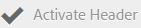

# 自訂壁紙、標題和電子郵件訊息 {#customize-wallpaper-header-and-email-message}

Brand Portal管理員可以對向使用者顯示的介面進行有限的自訂。 您可以為Brand Portal登入頁面選擇特定的背景影像（桌布）。 您也可以新增標題影像和自訂資產共用電子郵件，以符合客戶的品牌。

## 自訂登入畫面背景圖案 {#customize-the-login-screen-wallpaper}

如果沒有自訂品牌桌布影像，則登入頁面上會顯示預設桌布。

1. 從頂部的工具列中，按一下Experience Manager標誌以存取管理工具。

   

1. 從系統管理工具面板，按一下&#x200B;**[!UICONTROL 品牌]**。

   

1. 在&#x200B;**[!UICONTROL 設定品牌]**&#x200B;頁面的左側邊欄上，預設會選取&#x200B;**[!UICONTROL 桌布]**。 顯示登入頁面上顯示的預設背景影像。

   

1. 若要新增背景影像，請按一下頂端工具列中的&#x200B;**[!UICONTROL 選擇影像]**&#x200B;圖示。

   

   執行下列任一項作業：

   * 若要從您的電腦上傳影像，請按一下[上傳]。**&#x200B;** 導覽至所需的影像並上傳。
   * 若要使用現有的Brand Portal影像，請按一下&#x200B;**[!UICONTROL 從現有選取]**。 使用資產選擇器選擇影像。

   

1. 指定背景影像的頁首文字和說明。 若要儲存變更，請從頂端的工具列按一下&#x200B;**[!UICONTROL [儲存]。]**

1. 從頂端的工具列中，按一下&#x200B;**[!UICONTROL 預覽]**&#x200B;圖示，以產生包含影像的Brand Portal介面預覽。

   

   

1. 若要啟用或停用預設壁紙，請在&#x200B;**[!UICONTROL 設定品牌>壁紙]**&#x200B;頁面中執行下列動作：

   * 若要在Brand Portal登入頁面上顯示預設的桌布影像，請按一下頂端工具列中的&#x200B;**[!UICONTROL 停用桌布]**。 系統會顯示訊息，確認自訂影像已停用。

   

   * 若要還原Brand Portal登入頁面上的自訂影像，請從工具列按一下&#x200B;**[!UICONTROL 啟動桌布]**。 系統會顯示訊息，確認影像已還原。

   

   * 按一下[儲存]儲存變更。**&#x200B;**

## 自訂標題 {#customize-the-header}

登入Brand Portal後，標題會出現在各種Brand Portal頁面上。

1. 從頂部的工具列中，按一下Experience Manager標誌以存取管理工具。

   

1. 從系統管理工具面板，按一下&#x200B;**[!UICONTROL 品牌]**。

   

1. 若要自訂Brand Portal介面的頁首，請在&#x200B;**[!UICONTROL 設定品牌]**&#x200B;頁面上從左側邊欄選取&#x200B;**[!UICONTROL 頁首影像]**。 會顯示預設的頁首影像。

   

1. 若要上傳頁首影像，請按一下&#x200B;**[!UICONTROL 選擇影像]**&#x200B;圖示並選擇&#x200B;**[!UICONTROL 上傳]**。

   若要使用現有的Brand Portal影像，請選擇&#x200B;**[!UICONTROL 選取現有的]**。

   

   使用資產選擇器選擇影像。

   

1. 若要在頁首影像中包含URL，請在&#x200B;**[!UICONTROL 影像URL]**&#x200B;方塊中指定。 您可以指定外部或內部URL。 內部連結也可以是相對連結，例如，
   [!UICONTROL `/mediaportal.html/content/dam/mac/tenant_id/tags`]。
此連結會將使用者導向至標籤資料夾。
若要儲存變更，請從頂端的工具列按一下&#x200B;**[!UICONTROL [儲存]。]**

   

1. 從頂端的工具列中，按一下&#x200B;**[!UICONTROL 預覽]**&#x200B;圖示，以產生含有標題影像的Brand Portal介面預覽。

   
   

1. 若要啟用或停用頁首影像，請在&#x200B;**[!UICONTROL 設定品牌>頁首影像]**&#x200B;頁面中執行下列動作：

   * 若要防止頁首影像出現在Brand Portal頁面上，請按一下頂端工具列的&#x200B;**[!UICONTROL 「停用頁首」]**。 系統會顯示訊息，確認影像已停用。

   

   * 若要讓頁首影像重新出現在Brand Portal頁面上，請按一下頂端工具列中的&#x200B;**[!UICONTROL 「啟動頁首」]**。 系統會顯示訊息，確認影像已啟動。

   

   * 按一下[儲存]儲存變更。**&#x200B;**

## 自訂電子郵件訊息 {#customize-the-email-messaging}

當資產以連結形式共用時，使用者會收到包含該連結的電子郵件。 管理員可以自訂這些電子郵件的訊息，即標誌、說明和頁尾。

1. 從頂部的工具列中，按一下Experience Manager標誌以存取管理工具。

   

1. 從系統管理工具面板，按一下&#x200B;**[!UICONTROL 品牌]**。

   

1. 當資產以連結形式共用或透過電子郵件下載時，以及當共用&#x200B;**[!UICONTROL 集合]**&#x200B;時，會傳送電子郵件通知給使用者。 若要自訂電子郵件訊息，請在&#x200B;**[!UICONTROL 設定品牌]**&#x200B;頁面上從左側邊欄選取&#x200B;**[!UICONTROL 電子郵件訊息]**。

   

1. 若要新增標誌至外寄電子郵件，請按一下頂端工具列中的&#x200B;**[!UICONTROL 上傳]**。

1. 在&#x200B;**[!UICONTROL 描述]**&#x200B;區段中，指定電子郵件頁首與頁尾文字。 若要儲存變更，請從頂端的工具列按一下&#x200B;**[!UICONTROL [儲存]。]**

   >[!NOTE]
   >
   >如果您未使用建議的標誌大小，或頁首與頁尾文字超過建議的字數，電子郵件訊息中的內容可能會出現亂碼。
