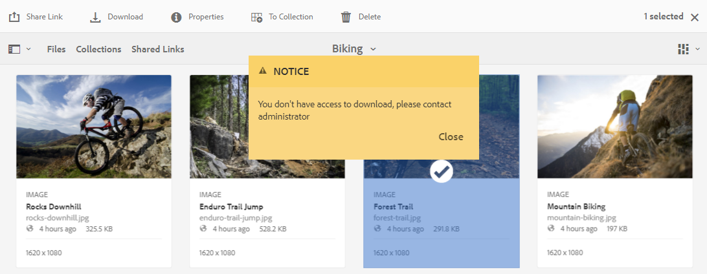
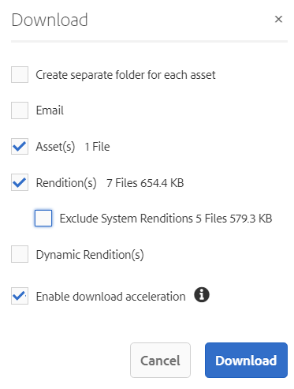

# 下載資產 {#download-assets-from-bp}

Adobe Experience Manager Assets Brand Portal可讓使用者同時下載可從Brand Portal存取的資產和資料夾，藉此增強下載體驗。 此方法表示核准的品牌資產可以安全地發佈，以供離線使用。 請閱讀下文，瞭解如何從Brand Portal下載資產（已核准的資產），以及[下載效能](#expected-download-performance)的期望。

>[!NOTE]
>
>在Brand Portal 2020.10.0 （及更新版本）中，**[!UICONTROL 快速下載]**&#x200B;設定預設為啟用，會使用IBM® Aspera Connect來加速下載資產。 從Brand Portal下載資產之前，請在瀏覽器的擴充功能中安裝IBM® Aspera Connect 3.9.9 (`https://www.ibm.com/docs/en/aspera-connect/3.9.9`)。 請參閱[指南以加速從Brand Portal](../using/accelerated-download.md)下載。
>
>如果您不想使用IBM® Aspera Connect並繼續正常下載程式，請聯絡Brand Portal管理員以關閉&#x200B;**[!UICONTROL 快速下載]**&#x200B;設定。

## 設定資產下載 {#configure-download}

Brand Portal管理員可以為Brand Portal使用者設定資產下載和使用者群組設定。 此功能可讓使用者從Brand Portal介面存取及下載資產轉譯。

>[!NOTE]
>
>使用者介面上的下載設定可為Brand Portal使用者提供自助式體驗，讓他們輕鬆設定和下載資產轉譯。 它不會限制在應用程式層的資產下載，例如，使用者仍然可以存取和下載具有完整URL路徑的資產轉譯。

以下設定會定義如何從Brand Portal介面存取及下載資產轉譯：

* 啟用下載設定
* 設定使用者群組設定

### 啟用下載設定 {#enable-download-settings}

管理員可以啟用&#x200B;**[!UICONTROL 下載設定]**，以定義Brand Portal使用者可存取的轉譯集以供下載。

可用的設定包括：

* **[!UICONTROL 快速下載]**

  它提供使用IBM® Aspera Connect加速資產下載的功能。 預設會在&#x200B;**[!UICONTROL 下載設定]**&#x200B;中啟用&#x200B;**[!UICONTROL 快速下載]**&#x200B;設定。

* **[!UICONTROL 自訂轉譯]**

  啟用下載資產的自訂和（或）動態轉譯。

  除了原始資產和系統產生的轉譯之外的所有資產轉譯都稱為自訂轉譯。 其中包含資產可用的靜態和動態轉譯。 任何使用者都可以在Experience Manager Assets中建立自訂靜態轉譯，但只有管理員才能建立自訂動態轉譯。 請參閱如何套用影像預設集或動態轉譯[。](../using/brand-portal-image-presets.md)

* **[!UICONTROL 系統轉譯]**

  啟用下載系統產生的資產轉譯。

  這些資產是根據「DAM更新資產」工作流程，在Experience Manager Assets中自動產生的縮圖。

* **[!UICONTROL 資產下載]**

  轉譯會下載到每個資產的個別資料夾中。 此設定適用於超過20個資產的資料夾、收藏集和大量下載。

以系統管理員身分登入您的Brand Portal租使用者，並瀏覽至&#x200B;**[!UICONTROL 工具]** > **[!UICONTROL 下載]**。

管理員可以啟用任何設定組合，讓Brand Portal使用者存取及下載資產轉譯。

>[!NOTE]
>
>只有管理員可以下載過期的資產。 如需過期資產的詳細資訊，請參閱[管理資產的數位版權](../using/manage-digital-rights-of-assets.md)。

### 設定使用者群組設定 {#configure-user-group-settings}

除了&#x200B;**[!UICONTROL 下載設定]**&#x200B;之外，Brand Portal管理員還可以進一步設定不同使用者群組的設定，以檢視和（或）下載原始資產及其轉譯。

以系統管理員身分登入您的Brand Portal租使用者，並瀏覽至&#x200B;**[!UICONTROL 工具]** > **[!UICONTROL 使用者]**。 在&#x200B;**[!UICONTROL 使用者角色]**&#x200B;頁面中，瀏覽至&#x200B;**[!UICONTROL 群組]**&#x200B;索引標籤以設定使用者群組的檢視和（或）下載設定。

>[!NOTE]
>
>如果將使用者新增到多個群組，並且其中一個群組具有限制，則該限制適用於使用者。

根據設定，對於獨立資產、多個資產、包含資產的資料夾、授權或未授權的資產，以及使用共用連結下載資產，下載工作流程保持不變。

以下矩陣定義使用者是否可存取轉譯，視[下載設定](#configure-download)而定：

| **下載設定：自訂轉譯** | **下載設定：系統轉譯** | **使用者群組設定：下載原始專案** | **使用者群組設定：下載轉譯** | **結果** |
|---|---|---|---|---|
| 開啟 | 開啟 | 開啟 | 開啟 | 檢視和下載所有轉譯 |
| 開啟 | 開啟 | 關閉 | 關閉 | 檢視原始資產 |
| 關閉 | 關閉 | 開啟 | 開啟 | 檢視和下載原始資產 |
| 開啟 | 關閉 | 開啟 | 開啟 | 檢視和下載原始資產和自訂轉譯 |
| 關閉 | 開啟 | 開啟 | 開啟 | 檢視和下載原始資產及系統轉譯 |
| 開啟 | 關閉 | 關閉 | 關閉 | 檢視原始資產 |
| 關閉 | 開啟 | 關閉 | 關閉 | 檢視原始資產 |
| 關閉 | 關閉 | 關閉 | 開啟 | 檢視原始資產 |
| 關閉 | 關閉 | 開啟 | 關閉 | 檢視和下載原始資產 |
| 關閉 | 關閉 | 關閉 | 關閉 | 檢視原始資產 |

## 下載資產 {#download-assets}

Brand Portal使用者可以從Brand Portal介面下載多個資產、包含資產的資料夾和集合。

>[!NOTE]
>
>如果您沒有存取或下載資產轉譯的許可權，請聯絡Brand Portal管理員。

如果使用者有權存取轉譯，則會提供具有以下功能的增強型&#x200B;**[!UICONTROL 下載]**&#x200B;對話方塊：

* 檢視下載清單中任何資產的所有可用轉譯。
* 排除不需要下載的資產轉譯。
* 按一下即可將相同的轉譯集套用至所有類似的資產型別。
* 針對不同的資產型別套用不同的轉譯集。
* 為每個資產建立個別的資料夾。
* 下載選取的資產及其轉譯。

>[!NOTE]
>
>只有在&#x200B;**[!UICONTROL 下載設定]**&#x200B;中啟用&#x200B;**[!UICONTROL 自訂轉譯]**&#x200B;和（或）**[!UICONTROL 系統轉譯]**&#x200B;時，**[!UICONTROL 下載]**&#x200B;對話方塊才會出現。

### 下載資產的步驟 {#bulk-download}

以下是從Brand Portal介面下載資產或包含資產的檔案夾的步驟：

1. 登入您的Brand Portal租使用者。 依預設，**[!UICONTROL 檔案]**&#x200B;檢視會開啟，其中包含所有已發佈的資產和資料夾。

   執行下列任一項作業：

   * 選取您要下載的資產或資料夾。 從頂端的工具列按一下&#x200B;**[!UICONTROL 下載]**&#x200B;圖示。

     

   * 若要下載資產的特定資產轉譯，請將指標暫留在資產上，然後按一下快速動作縮圖中的&#x200B;**[!UICONTROL 下載]**&#x200B;圖示。

     

     >[!NOTE]
     >
     >如果您是第一次下載資產，而且瀏覽器中未安裝IBM® Aspera Connect，則會提示您安裝Aspera下載加速器(`https://www.ibm.com/docs/en/aspera-connect/3.9.9`)。

     >[!NOTE]
     >
     >如果您下載的資產也包含授權資產，系統會將您重新導向至&#x200B;**[!UICONTROL 版權管理]**&#x200B;頁面。 在此頁面中，選取資產，按一下&#x200B;**[!UICONTROL 同意]**，然後按一下&#x200B;**[!UICONTROL 下載]**。 如果您選擇不同意，授權資產將不會下載。
     > 
     >受授權保護的資產已附加[授權合約](https://experienceleague.adobe.com/zh-hant/docs/experience-manager-65/content/assets/administer/drm)，方法是在Experience Manager Assets中設定資產的[中繼資料屬性](https://experienceleague.adobe.com/zh-hant/docs/experience-manager-65/content/assets/administer/drm)。

     

1. **[!UICONTROL 下載]**&#x200B;對話方塊會開啟，其中列出所有選取的資產。

   按一下任何資產以檢視可用的轉譯，並選取與您要下載的轉譯對應的核取方塊。

   您可以手動選取或排除個別資產的轉譯，或按一下「**套用**」圖示來選取相同的一組轉譯，以供下載類似的資產型別（此範例中的所有影像檔案）。 在&#x200B;**[!UICONTROL 全部套用]**&#x200B;對話方塊中，按一下&#x200B;**[!UICONTROL 完成]**&#x200B;以將規則套用至所有類似的資產。

   

   您也可以按一下&#x200B;**移除**&#x200B;圖示，從下載清單移除資產（如有需要）。

   

   若要在下載資產時保留Brand Portal資料夾結構，請選取&#x200B;**[!UICONTROL `Create separate folder for each asset`]**&#x200B;核取方塊。

   下載按鈕會反映所選專案的計數。 套用完規則後，按一下&#x200B;**[!UICONTROL 下載專案]**。

   

1. 預設會在&#x200B;**[!UICONTROL 下載設定]**&#x200B;中啟用&#x200B;**[!UICONTROL 快速下載]**&#x200B;設定。 因此，確認方塊會出現，以允許使用IBM® Aspera Connect加速下載。

   若要繼續使用&#x200B;**[!UICONTROL 快速下載]**，請按一下&#x200B;**[!UICONTROL 允許]**。 所有選取的轉譯都會使用IBM® Aspera Connect下載到zip資料夾中。

   如果您不想要使用IBM® Aspera Connect，請按一下&#x200B;**[!UICONTROL 拒絕]**。 如果&#x200B;**[!UICONTROL 快速下載]**&#x200B;被拒絕或失敗，系統會填入「錯誤」訊息。 按一下&#x200B;**[!UICONTROL 正常下載]**&#x200B;按鈕以繼續下載資產。

<!-- removed the known issue from step 2 as it is fixed in 2022.02.0 release.
   >[!CAUTION]
   >
   >(**Experience Manager Assets as a Cloud Service** only) The following known issue will be fixed in the upcoming release:
   >
   >The download dialog lists the smart crop renditions of the selected asset, however, the user cannot download the smart crop renditions.
-->

>[!NOTE]
>
>如果管理員已關閉&#x200B;**[!UICONTROL 快速下載]**&#x200B;設定，則選取的轉譯會直接下載到zip資料夾中，而不使用IBM® Aspera Connect。

>[!NOTE]
>
>如果&#x200B;**[!UICONTROL 下載設定]**&#x200B;中啟用了&#x200B;**[!UICONTROL 資產下載]**&#x200B;設定，則會將資產轉譯下載到zip資料夾內每個資產的個別資料夾中。
>  
>如果資產是從共用連結下載，資產轉譯會針對zip資料夾內的每個資產下載在個別資料夾中。
>
>當您選取要下載的資料夾、集合或超過20個資產時，會略過&#x200B;**[!UICONTROL 下載]**&#x200B;對話方塊。 反之，所有可存取的資產轉譯（動態轉譯除外）都會下載到zip資料夾中。

>[!NOTE]
>
>Brand Portal支援在混合和Scene7模式中設定Dynamic Media。
>
>(*如果Experience Manager Assets作者執行個體是在&#x200B;**Dynamic Media混合模式***中執行)
>
>若要預覽或下載動態轉譯，請啟用動態媒體。 確認資產的金字塔型轉譯存在於發佈資產的Experience Manager Assets作者例項中。 將資產從Experience Manager Assets發佈至Brand Portal時，也會發佈其Pyramid tiff轉譯。

如果[管理員未授權您存取原始轉譯](../using/brand-portal-adding-users.md#main-pars-procedure-202029708)，則無法下載所選資產的原始轉譯。

<!-- This issue has been resolved, check with engineering.
>[!NOTE]
>
>Once you have downloaded the asset renditions, the **[!UICONTROL Download]** button is disabled to avoid creating duplicate copies of the renditions. To download more (missing or another copy of renditions), refresh the browser to re-enable the download button.
-->

### 從資產詳細資訊頁面下載資產 {#download-assets-from-asset-details-page}

除了下載工作流程外，還有另一種方法可直接從資產詳細資訊頁面下載個別資產的轉譯。

使用者可以預覽不同的資產轉譯、選取特定的轉譯，以及直接從資產詳細資料頁面中的&#x200B;**[!UICONTROL 轉譯]**&#x200B;面板下載資產轉譯，而不需要開啟&#x200B;**[!UICONTROL 下載]**&#x200B;對話方塊。

以下是從資產詳細資訊頁面下載資產轉譯的步驟：

1. 登入您的Brand Portal租使用者，然後按一下資產以開啟資產詳細資訊頁面。
1. 按一下左側的覆蓋圖示，然後按一下&#x200B;**[!UICONTROL 轉譯]**。

   

1. **[!UICONTROL 轉譯]**&#x200B;面板會根據資產[下載設定](#configure-download)列出所有可存取的資產轉譯。

   選取您要下載的特定轉譯，然後按一下&#x200B;**[!UICONTROL 下載專案]**。

   

1. 預設會在&#x200B;**[!UICONTROL 下載設定]**&#x200B;中啟用&#x200B;**[!UICONTROL 快速下載]**&#x200B;設定。 因此，確認方塊會出現，以允許使用IBM® Aspera Connect加速下載。

   若要繼續使用&#x200B;**[!UICONTROL 快速下載]**，請按一下&#x200B;**[!UICONTROL 允許]**。 所有選取的轉譯都會使用IBM® Aspera Connect下載到zip資料夾中。

   如果您拒絕使用&#x200B;**[!UICONTROL 快速下載]**，系統會填入錯誤訊息。 按一下&#x200B;**[!UICONTROL 正常下載]**&#x200B;按鈕以繼續下載資產。

<!-- removed the known issue from step 3 as it is fixed in 2022.02.0 release.
   >[!CAUTION]
   >
   >(**Experience Manager Assets as a Cloud Service** only) The following known issues will be fixed in the upcoming release:
   >
   >The **[!UICONTROL Renditions]** panel does not list all the static renditions of the assets that are published to Brand Portal after December 16, 2021.
   >
   >The **[!UICONTROL Renditions]** panel lists the smart crop renditions of the asset, however, the user cannot preview or download the smart crop renditions.
-->

>[!NOTE]
>
>如果管理員已關閉&#x200B;**[!UICONTROL 快速下載]**&#x200B;設定，則選取的轉譯會直接下載到zip資料夾中，而不使用IBM® Aspera Connect。

>[!NOTE]
>
>個別下載的Assets會顯示在資產下載報表中。 不過，如果下載了包含資產的資料夾，該資料夾和資產不會顯示在資產下載報表中。

<!--
>[!NOTE]
>
>Assets that are individually downloaded are visible in the assets download report. However, if a folder containing assets is downloaded, the folder and assets are not displayed in the assets download report.
-->

<!-- Backup of content before updating the new feature docs.
## Configure asset download {#configure-download}

The download configuration allows the Brand Portal administrators to define the set of renditions available to the Brand Portal users for downloading the assets. The administrator can configure the asset **[!UICONTROL Download]** settings from the Brand Portal interface. 

The available configurations are:

* **[!UICONTROL Fast Download]** 

  Enables high-speed download of the assets. To know more, see [guide to accelerate downloads from Brand Portal](../using/accelerated-download.md).

* **[!UICONTROL Custom Renditions]** 
  
  Download custom and (or) dynamic renditions of the assets. 
  All the asset renditions other than the original asset and system-generated renditions are called as custom renditions. It includes static as well as dynamic renditions available for the asset. Any user can create a custom static rendition in AEM Assets, whereas, only the AEM administrator can create custom dynamic renditions. To know more, see [how to apply image presets or dynamic renditions](../using/brand-portal-image-presets.md)

* **[!UICONTROL System Renditions]** 

  Download system-generated renditions of the assets. These are the thumbnails which are automatically generated in AEM Assets based on the "DAM update asset" workflow. 

Log in to your Brand Portal tenant as an administrator and navigate to **[!UICONTROL Tools]** > **[!UICONTROL Download]**. By default, the **[!UICONTROL Fast Download]** configuration is enabled in the **[!UICONTROL Download Settings]**. 

The administrators can enable any combination to configure the asset download process.

Based on the configuration, the download workflow remains constant for stand-alone assets, multiple assets, folders containing assets, licensed or unlicensed assets, and downloading assets using share link. 

* If both **[!UICONTROL Custom Renditions]** and **[!UICONTROL System Renditions]** configurations are turned-off, the original renditions of the assets are downloaded without any additional dialog being presented to the users.    

* If any of the **[!UICONTROL Custom Renditions]** or **[!UICONTROL System Renditions]** configuration is enabled, an additional **[!UICONTROL Download]** dialog box appears wherein you can choose whether to download the original asset along with its renditions, or download only specific renditions. 

>[!NOTE]
>
>Only the administrators can download the expired assets. For more information about expired assets, see [manage digital rights of assets](../using/manage-digital-rights-of-assets.md).

## Steps to download assets {#steps-to-download-assets}

Following are the steps to download assets or folders containing assets from Brand Portal:

1. From the Brand Portal interface, do one of the following:

   * Select the folders or assets you want to download. From the toolbar at the top, click the **[!UICONTROL Download]** icon.

     

   * To download a specific asset or folder, hover the pointer over the asset or folder and click the **[!UICONTROL Download]** icon available in the quick action thumbnails.

     

     >[!NOTE]
     >
     >If you are downloading the assets for the first time and do not have IBM Aspera Connect installed in your browser, it will prompt you to install the Aspera download accelerator. 

     >[!NOTE]
     >
     >If the assets you are downloading also include licensed assets, you are redirected to the **[!UICONTROL Copyright Management]** page. In this page, select the assets, click **[!UICONTROL Agree]**, and then click **[!UICONTROL Download]**. If you choose to disagree, licensed assets are not downloaded. 
     > 
     >License-protected assets have [license agreement attached]() to them, which is done by setting asset's [metadata property]() in Experience Manager Assets.

     

     
     >[!NOTE]
     >
     >Ensure to select all the required asset renditions while downloading them from the asset details page, and click **[!UICONTROL Download]**. The selected renditions are downloaded to your local machine.
     > 
     >Once you download, the **[!UICONTROL Download]** button is disabled to avoid creating duplicate copies of the downloaded renditions. To download more (missing or another copy of renditions), refresh the browser to re-enable the download button.

     If any of the **[!UICONTROL Custom Renditions]** or **[!UICONTROL System Renditions]** configuration is enabled in the **[!UICONTROL Download Settings]**, the **[!UICONTROL Download]** dialog appears with the **[!UICONTROL Asset(s)]** check box selected by default. If the **[!UICONTROL Fast Download]** configuration is enabled, the **[!UICONTROL Enable download acceleration]** check box is selected by default.

     

     >[!NOTE]
     >
     >If the downloading assets are image files, and you select only the **[!UICONTROL Asset(s)]** check box in the **[!UICONTROL Download]** dialog but are not [authorized by the administrator to have access to the original renditions of image files](../using/brand-portal-adding-users.md#main-pars-procedure-202029708) then no image files are downloaded and a notification appears, stating that you have been restricted by the administrator to access original renditions.

     

1. To download the renditions in addition to the original assets, select the **[!UICONTROL Rendition(s)]** check box. However, if you want to download the system-generated renditions along with the custom renditions, clear the **[!UICONTROL Exclude System Renditions]** check box.

   

   * To download only the renditions, clear the **[!UICONTROL Asset(s)]** check box.

     >[!NOTE]
     >
     >By default, only the assets are downloaded. However, original renditions of image files are not downloaded if you are not [authorized by the administrator to have access to the original renditions of image files](../using/brand-portal-adding-users.md#main-pars-procedure-202029708).

    * To share the selected assets with other users through a link, select the **[!UICONTROL Email]** check box. An email notification is sent to the users with the download link. To know how to download assets from shared links, see [downloading assets from shared links](../using/brand-portal-link-share.md#main-pars-header-1703469193).  

      

      >[!NOTE]
      >
      >The download link on email notification expires after 45 days.
      >
      >The administrators can customize email messages, that is, logo, description, and footer, using the [Branding](../using/brand-portal-branding.md) feature.

    * You can select a predefined image preset or create a custom dynamic rendition from the **[!UICONTROL Download]** dialog box. 

      To apply a [custom image preset to the asset and its renditions](../using/brand-portal-image-presets.md#applyimagepresetswhendownloadingimages), select the **[!UICONTROL Dynamic Rendition(s)]** check box. Specify the image preset properties (such as size, format, color space, resolution, and image modifier) to apply the custom image preset while downloading the asset and its renditions. To download only the dynamic renditions, clear the **[!UICONTROL Asset(s)]** check box.

      

      >[!NOTE]
      >
      >Brand Portal supports configuring Dynamic Media in both - Hybird and Scene 7 mode. 
      >
      >(*If AEM author instance is running on **Dynamic Media Hybrid mode***)
      >
      >To preview or download dynamic renditions of an asset, ensure that the dynamic media is enabled and the asset's Pyramid tiff rendition exists at the AEM Assets author instance from where the assets have been published. When an asset is published to Brand Portal, its Pyramid tiff rendition is also published.
      
  
    * To preserve the Brand Portal folder hierarchy while downloading assets, select the **[!UICONTROL Create separate folder for each asset]** check box. By default, the Brand Portal folder hierarchy is ignored and all the assets are downloaded in one folder in your local system.

1. Click **[!UICONTROL Download]**.

   The assets (and renditions if selected) are downloaded as a zip file to your local folder. However, no zip file is created if a single asset is downloaded without any of the renditions. 

   If you are not [authorized by the administrator to have access to the original renditions](../using/brand-portal-adding-users.md#main-pars-procedure-202029708), the original renditions of the selected assets are not downloaded. 

   >[!NOTE]
   >
   >Assets that are individually downloaded are visible in the assets download report. However, if a folder containing assets is downloaded, the folder and assets are not displayed in the assets download report.
-->

## 預期的下載效能 {#expected-download-performance}

根據本機網際網路連線和伺服器延遲等因素，不同使用者端位置的使用者可能會有不同的檔案下載體驗。 在不同使用者端位置觀察到2 GB檔案的預期下載效能如下，其中位於美國奧勒岡的Brand Portal伺服器如下：

| 使用者端位置 | 使用者端與伺服器之間的延遲 | 預期下載速度 | 下載2 GB檔案所花的時間 |
|-------------------------|-----------------------------------|-------------------------|------------------------------------|
| 美國西部（北加利福尼亞） | 18 毫秒 | 7.68 MB/秒 | 4 分鐘 |
| 美國西部（奧勒岡州） | 42 毫秒 | 3.84 MB/秒 | 9 分鐘 |
| 美國東部（維吉尼亞北部） | 85 毫秒 | 1.61 MB/秒 | 21 分鐘 |
| APAC （東京） | 124 毫秒 | 1.13 MB/秒 | 30 分鐘 |
| Noida | 275 毫秒 | 0.5 MB/秒 | 68 分鐘 |
| 雪梨 | 175 毫秒 | 0.49 MB/秒 | 69 分鐘 |
| 倫敦 | 179 毫秒 | 0.32 MB/秒 | 106 分鐘 |
| 新加坡 | 196 毫秒 | 0.5 MB/秒 | 68 分鐘 |

>[!NOTE]
>
>在測試條件下可觀察引用的資料，對於處於不同位置且經歷不同延遲和頻寬的使用者而言，這些條件可能有所不同。
