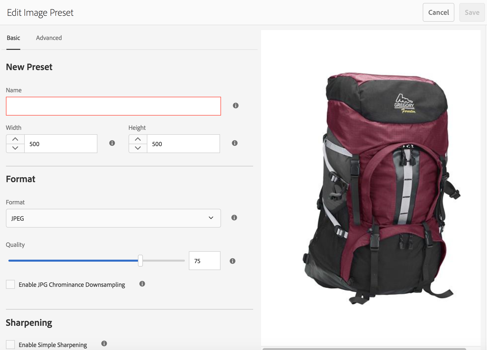
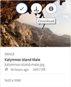

# 套用影像預設集或動態轉譯 {#apply-image-presets-or-dynamic-renditions}

像巨集一樣，影像預設集是預先定義的集合，其中包含以名稱儲存的調整大小和格式指令。 影像預設集可讓Experience Manager Assets Brand Portal動態傳送不同大小、格式和屬性的影像。

影像預設集是用來產生影像的動態轉譯，且可供預覽和下載。 預覽影像及其轉譯時，您可以選擇預設集，將影像重新格式化為符合管理員所設定的規格。

(*如果Experience Manager Assets作者執行個體是在&#x200B;**Dynamic Media混合模式***中執行)。 若要在Brand Portal中檢視資產的動態轉譯，請確定其金字塔TIFF轉譯存在於您發佈至Brand Portal的Experience Manager Assets製作執行個體中。 發佈資產時，資產的PTIFF轉譯也會發佈至Brand Portal。

>[!NOTE]
>
>下載影像及其轉譯時，無法選取現有預設集。 反之，您可以指定自訂影像預設集的屬性。 如需詳細資訊，請參閱[下載影像時套用影像預設集](../using/brand-portal-image-presets.md#main-pars-text-1403412644)。

如需建立影像預設集時所需引數的詳細資訊，請參閱[管理影像預設集](../using/brand-portal-image-presets.md)。

## 建立影像預設集 {#create-an-image-preset}

Experience Manager Assets管理員可建立影像預設集，這些預設集會在資產詳細資訊頁面上顯示為動態轉譯。 您可以從頭開始建立影像預設集，或使用新名稱儲存現有影像預設集。 建立影像預設集時，請選擇影像傳送的大小和格式命令。 當傳送影像以供檢視時，會根據選取的指令最佳化其外觀。

>[!NOTE]
>
>影像的動態轉譯是使用其「金字塔」TIFF建立的。 如果金字塔TIFF不適用於任何資產，則無法在Brand Portal中擷取該資產的動態轉譯。
>
>如果Experience Manager Assets Author執行個體以&#x200B;**Dynamic Media混合模式**&#x200B;執行，則會建立影像資產的金字塔TIFF轉譯並儲存在Experience Manager Assets存放庫中。
>
>而如果Experience Manager Assets作者執行個體以&#x200B;**Dynamic Media Scene7模式**&#x200B;執行，則Scene7伺服器上存在影像資產的金字塔TIFF轉譯。
>
>將這類資產發佈至Brand Portal時，會套用影像預設集並顯示動態轉譯。

1. 從頂部的工具列中，按一下Experience Manager標誌以存取管理工具。

1. 從系統管理工具面板，按一下&#x200B;**[!UICONTROL 影像預設集]**。

   

1. 在影像預設集頁面中，按一下&#x200B;**[!UICONTROL 建立]**。

   

1. 在&#x200B;**[!UICONTROL 編輯影像預設集]**&#x200B;頁面中，視需要在&#x200B;**[!UICONTROL 基本]**&#x200B;和&#x200B;**[!UICONTROL 進階]**&#x200B;標籤中輸入值，包括名稱。 預設集會出現在左窗格中，並可與其他資產一起即時使用。

   

   >[!NOTE]
   >
   >您也可以使用&#x200B;**[!UICONTROL 編輯影像預設集]**&#x200B;頁面來編輯現有影像預設集的屬性。 若要編輯影像預設集，請從影像預設集頁面中選取它，然後按一下&#x200B;**[!UICONTROL 編輯]**。

1. 按一下「**[!UICONTROL 儲存]**」。影像預設集隨即建立並顯示在影像預設集頁面上。
1. 若要刪除影像預設集，請從影像預設集頁面中選取它，然後按一下&#x200B;**[!UICONTROL 刪除]**。 在確認頁面中，按一下&#x200B;**[!UICONTROL 刪除]**&#x200B;以確認刪除。 影像預設集會從影像預設集頁面中移除。

## 預覽影像時套用影像預設集 {#apply-image-presets-when-previewing-images}

預覽影像及其轉譯時，請從現有的預設集中選擇，將影像重新格式化為管理員所設定的規格。

1. 在Brand Portal介面中，按一下影像以開啟。
1. 按一下左側的覆蓋圖示，然後選擇&#x200B;**[!UICONTROL 轉譯]**。

   

1. 從&#x200B;**[!UICONTROL 轉譯]**&#x200B;清單中，選取適當的動態轉譯，例如&#x200B;**[!UICONTROL 縮圖]**。 預覽影像會根據您選擇的轉譯進行轉譯。

   

## 下載影像時套用影像預設集 {#apply-image-presets-when-downloading-images}

從Brand Portal下載影像及其轉譯時，您無法從現有的影像預設集中選擇。 不過，您可以根據要重新格式化影像的方式，自訂影像預設集屬性。

1. 從Brand Portal介面，執行下列任一項作業：

   * 將指標暫留在您要下載的影像上。 在可用的快速動作縮圖中，按一下&#x200B;**[!UICONTROL 下載]**&#x200B;圖示。

   

   * 選取您要下載的影像。 從頂端的工具列按一下&#x200B;**[!UICONTROL 下載]**&#x200B;圖示。

   

1. 在&#x200B;**[!UICONTROL 下載]**&#x200B;對話方塊中，根據您是否要下載具有轉譯或不具有轉譯的資產，選取必要的選項。

   

1. 若要下載資產的動態轉譯，請選取&#x200B;**[!UICONTROL 動態轉譯]**&#x200B;選項。
1. 自訂影像預設集屬性，以在下載期間動態地重新格式化影像及其轉譯。 指定大小、格式、色域、解析度和影像修飾元。

   

1. 按一下&#x200B;**[!UICONTROL 下載]**。 自訂動態轉譯會以ZIP檔案下載，連同您選擇下載的影像和轉譯。 不過，如果下載單一資產，則不會建立zip檔案，這可確保快速下載。
