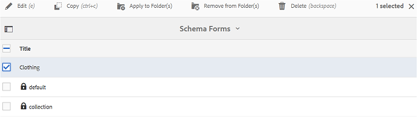

# 使用中繼資料結構表單 {#use-the-metadata-schema-form}

中繼資料結構描述會說明「屬性」頁面的配置，以及針對使用特定結構描述的資產所顯示的中繼資料屬性。 您套用至資產的結構描述會決定中繼資料欄位出現在其「屬性」頁面上。

每個資產的&#x200B;**[!UICONTROL 屬性]**&#x200B;頁面包含預設中繼資料屬性，視資產的MIME型別而定。 管理員可以使用中繼資料結構編輯器來修改現有結構或新增自訂中繼資料結構。 Experience Manager Assets Brand Portal為各種MIME型別的資產提供預設表單。 不過，您也可以為這類資產新增自訂表單。

## 新增中繼資料結構表單 {#add-a-metadata-schema-form}

若要建立新的中繼資料結構表單，請執行下列動作：

1. 從頂部的工具列中，按一下Experience Manager標誌以存取管理工具。

   

1. 在管理工具面板中，按一下&#x200B;**[!UICONTROL 中繼資料結構描述]**。

   

1. 在&#x200B;**[!UICONTROL 中繼資料結構Forms]**&#x200B;頁面上，按一下&#x200B;**[!UICONTROL 建立]**。

   

1. 在&#x200B;**[!UICONTROL 建立結構表單]**&#x200B;對話方塊中，指定結構表單的標題，然後按一下&#x200B;**[!UICONTROL 建立]**&#x200B;以完成表單建立程式。

   

## 編輯中繼資料結構表單 {#edit-a-metadata-schema-form}

您可以編輯新新增或現有的中繼資料結構表單。 中繼資料結構表單包含衍生自其父項的內容，包括索引標籤和索引標籤內的表單專案。 您可以將這些表單專案對應或設定至中繼資料節點內的欄位。

您可以將新的索引標籤或表單專案新增到中繼資料結構表單。 衍生的標籤和表單專案（來自父項）處於鎖定狀態。 您無法在子層級變更它們。

若要編輯中繼資料結構表單，請執行下列動作：

1. 從頂部的工具列中，按一下Experience Manager標誌以存取管理工具。

   

1. 在管理工具面板中，按一下&#x200B;**[!UICONTROL 中繼資料結構描述]**。
1. 從&#x200B;**[!UICONTROL 中繼資料結構Forms]**&#x200B;頁面，選取結構表單以編輯其屬性，例如&#x200B;**[!UICONTROL 集合]**。

   

   >[!NOTE]
   >
   >未編輯的範本會在它們之前顯示鎖定符號。 如果您自訂任何範本，則範本前的「鎖定」符號會消失。

1. 從頂端的工具列按一下&#x200B;**[!UICONTROL 編輯]**。

   **[!UICONTROL 中繼資料結構描述編輯器]**&#x200B;頁面會開啟，左側會開啟&#x200B;**[!UICONTROL Basic]**&#x200B;標籤，右側會開啟&#x200B;**[!UICONTROL Build Form]**&#x200B;標籤。

1. 在&#x200B;**[!UICONTROL 中繼資料結構編輯器]**&#x200B;頁面中，將一個或多個元件從&#x200B;**[!UICONTROL 建置表單]**&#x200B;索引標籤中的元件型別清單拖曳到&#x200B;**[!UICONTROL 基本]**&#x200B;索引標籤，以自訂資產的&#x200B;**[!UICONTROL 屬性]**&#x200B;頁面。

   

1. 若要設定元件，請選取該元件，並在&#x200B;**[!UICONTROL 設定]**&#x200B;索引標籤中修改其屬性。

### 建置表單索引標籤中的元件 {#components-in-the-build-form-tab}

**[!UICONTROL 建置表單]**&#x200B;索引標籤會列出您可在結構描述表單中使用的專案。 **[!UICONTROL 設定]**&#x200B;索引標籤提供您在&#x200B;**[!UICONTROL 建置表單]**&#x200B;索引標籤中選取之每個專案的屬性。 下表列出&#x200B;**[!UICONTROL 建置表單]**&#x200B;索引標籤中可用的表單專案：

| 元件名稱 | 說明 |
|---------------------|--------------------------------------------------------------------------------------------------------------------------------------------------------------------------------------------------------------------------------------------------------------------------------------------|
| **[!UICONTROL 區段標題]** | 新增區段標題以取得常用元件清單。 |
| **[!UICONTROL 單行文字]** | 新增單行文字屬性。 它會儲存為字串。 |
| **[!UICONTROL 多值文字]** | 新增多值文字屬性。 它會儲存為字串陣列。 |
| **[!UICONTROL 數字]** | 新增數字元件。 |
| **[!UICONTROL 日期]** | 新增日期元件。 |
| **[!UICONTROL 下拉式清單]** | 新增下拉式清單。 |
| **[!UICONTROL 標準標籤]** | 新增標籤。 **注意：**&#x200B;如果管理員從Experience Manager Assets發佈中繼資料結構表單，而路徑不包含租使用者資訊，例如`/etc/tags/<custom_tag_namespace>`，則可能需要變更路徑值，例如`/etc/tags/mac/<tenant_id>/<custom_tag_namespace>`。 |
| **[!UICONTROL 智慧標記]** | 如果您已購買並設定Experience Manager Assets智慧標籤附加元件，則會自動偵測標籤。 |
| **[!UICONTROL 隱藏欄位]** | 新增隱藏欄位。 儲存資產時，會以POST引數的形式傳送。 |
| **[!UICONTROL 資產參考者]** | 新增此元件以檢視資產所參考的資產清單。 |
| **[!UICONTROL 資產引用]** | 新增以顯示參照資產的資產清單。 |
| **[!UICONTROL 資產評等]** | 在資產發佈至Brand Portal之前，從Experience Manager Assets新增資產的平均評等。 |
| **[!UICONTROL 內容中繼資料]** | 新增以控制其他中繼資料索引標籤在資產屬性頁面中的顯示。 |

>[!NOTE]
>
>請勿使用&#x200B;**[!UICONTROL 產品參考]**，因為它無法運作。

#### 編輯中繼資料元件 {#edit-the-metadata-component}

若要編輯表單上中繼資料元件的屬性，請按一下該元件，然後在&#x200B;**[!UICONTROL 設定]**&#x200B;索引標籤中編輯其屬性。

* **[!UICONTROL 欄位標籤]**：在資產的「屬性」頁面上顯示的中繼資料屬性名稱。

* **[!UICONTROL 對應至屬性]**：此屬性的值提供資產節點的相對路徑/名稱，此資產節點會儲存在CRX存放庫中。 它以「**」開頭。/**」，因為表示路徑在資產的節點下。

以下是此屬性的有效值：

— `./jcr:content/metadata/dc:title`：將值儲存在資產的中繼資料節點，做為屬性[!UICONTROL `dc:title`]。

— `./jcr:created`：在資產的節點顯示jcr屬性。 如果您在檢視屬性上設定這些屬性，建議您將它們標示為「停用編輯」，因為這些屬性受到保護。否則，當您儲存資產的屬性時，會出現「資產無法修改」錯誤。

* **[!UICONTROL 預留位置]**：使用此屬性為使用者提供中繼資料屬性的相關資訊。
* **[!UICONTROL 必要]**：使用此屬性，在[屬性]頁面上將中繼資料屬性標示為必要。
* **[!UICONTROL 停用編輯]**：使用此屬性，讓中繼資料屬性在[屬性]頁面上無法編輯。
* **[!UICONTROL 以唯讀方式顯示空白欄位]**：標示此屬性，以在[屬性]頁面上顯示中繼資料屬性（即使它沒有值）。 根據預設，當中繼資料屬性沒有值時，它不會列在屬性頁面上。
* **[!UICONTROL 描述]**：使用此屬性為中繼資料元件新增簡短描述。
* **[!UICONTROL 刪除圖示]**：按一下此圖示，即可從結構表單中刪除元件。

>[!NOTE]
>
>資產的中繼資料編輯器表單中，所有中繼資料欄位都是唯讀的。 由於資產的中繼資料必須先在Experience Manager Assets中編輯，才會發佈至Brand Portal。

#### 在結構表單中新增或刪除索引標籤 {#add-or-delete-a-tab-in-the-schema-form}

預設結構描述表單包含&#x200B;**[!UICONTROL 基本]**&#x200B;和&#x200B;**[!UICONTROL 進階]**&#x200B;標籤。 結構編輯器可讓您新增或刪除索引標籤。

* 若要在結構表單上新增索引標籤，請按一下&#x200B;**[!UICONTROL +]**。 依預設，新索引標籤的名稱為「Unnamed-1」。 您可以從&#x200B;**[!UICONTROL 設定]**&#x200B;標籤修改名稱。

* 若要刪除標籤，請按一下&#x200B;**[!UICONTROL x]**。 按一下[儲存]儲存變更。****

## 將中繼資料結構套用至資料夾 {#apply-a-metadata-schema-to-a-folder}

Brand Portal可讓您自訂及控制中繼資料結構，好讓資產的&#x200B;**[!UICONTROL 屬性]**&#x200B;頁面僅顯示您選擇要顯示的特定資訊。 若要控制&#x200B;**[!UICONTROL 屬性]**&#x200B;頁面中顯示的中繼資料，請從中繼資料結構表單中移除必要的中繼資料，並將其套用至特定資料夾。

若要將中繼資料結構表單套用至資料夾，請執行下列動作：

1. 從頂部的工具列中，按一下Experience Manager標誌以存取管理工具。

   

1. 在管理工具面板中，按一下&#x200B;**[!UICONTROL 中繼資料結構描述]**。

1. 從&#x200B;**[!UICONTROL 中繼資料結構描述Forms]**&#x200B;頁面，選取您要套用至資產的結構描述表單，例如&#x200B;**[!UICONTROL 服飾]**。

   

1. 從頂端的工具列按一下&#x200B;**[!UICONTROL 套用至資料夾]**。

1. 從&#x200B;**[!UICONTROL 選取資料夾]**&#x200B;頁面，導覽至您要套用&#x200B;**[!UICONTROL 服飾]**&#x200B;中繼資料結構描述的資料夾，例如&#x200B;**[!UICONTROL 手套]**。

   

1. 按一下&#x200B;**[!UICONTROL 套用]**，將中繼資料結構表單套用至資料夾。

   **[!UICONTROL 服飾]**&#x200B;中繼資料結構表單中可用的中繼資料已套用至&#x200B;**[!UICONTROL 手套]**&#x200B;資料夾，並顯示在資料夾的&#x200B;**[!UICONTROL 屬性]**&#x200B;頁面中。

   

>[!NOTE]
>
>如果您將包含巢狀結構描述的結構描述套用至包含視訊檔案的資料夾，視訊檔案的中繼資料屬性可能無法正確呈現。 為確保中繼資料屬性正確呈現，請移除巢狀結構並僅將父結構描述套用至資料夾。

## 刪除中繼資料結構表單 {#delete-a-metadata-schema-form}

Brand Portal僅可讓您刪除自訂結構表單。 它不允許您刪除預設的結構表單/範本。 不過，您可以刪除這些表單中的任何自訂變更。

若要刪除表單，請選取表單並按一下&#x200B;**[!UICONTROL 刪除]**&#x200B;圖示。

>[!NOTE]
>
>刪除預設表單的自訂變更後，**[!UICONTROL 鎖定]**&#x200B;符號會重新出現在中繼資料結構介面的表單名稱前，表示表單已恢復為預設狀態。

## MIME型別的結構表單 {#schema-forms-for-mime-types}

### 為MIME型別新增表單 {#adding-new-forms-for-mime-types}

除了預設表單之外，您還可以為各種MIME型別的資產新增自訂表單，或在適當的表單型別下建立新表單。 例如，若要新增影像/png子類型 **[!UICONTROL 的新範本]** ，請在「影像」表單下建立表單。方案表單的標題是子類型名稱。在此範例中，標題為&quot;png&quot;。

#### 針對各種MIME型別使用現有結構描述範本 {#using-an-existing-schema-template-for-various-mime-types}

您可以將現有的範本用於不同的MIME型別。 例如，針對MIME型別&#x200B;**image/png**&#x200B;的資產使用&#x200B;**image/jpeg**&#x200B;表單。

在此情況下，請在CRX存放庫中的[!UICONTROL `/etc/dam/metadataeditor/mimetypemappings`]建立新節點。 指定節點名稱並定義下列屬性：

| **名稱** | **類型** | **值** |
|---|---|---|
| exposedmimetype | 字串 | image/jpeg |
| mimetypes | 字串[] | image/png |

* **exposedmimetype**：要對應的現有表單名稱
* **mimetypes**：使用&#x200B;**exposedmimetype**&#x200B;屬性中定義之表單的MIME型別清單

Brand Portal對應下列MIME型別和結構表單：

| **結構描述表單** | **MIME型別** |
|---|---|
| image/jpeg | image/pjpeg |
| image/tiff | image/x-tiff |
| application/pdf | application/postscript |
| application/x-ImageSet | Multipart/Related; type=application/x-ImageSet |
| application/x-SpinSet | Multipart/Related; type=application/x-SpinSet |
| application/x-MixedMediaSet | Multipart/Related; type=application/x-MixedMediaSet |
| video/quicktime | video/x-quicktime |
| video/mpeg4 | video/mp4 |
| video/avi | video/avi， video/msvideo， video/x-msvideo |
| video/wmv | video/x-ms-wmv |
| video/flv | video/x-flv |

以下是預設中繼資料屬性的清單：

* jcr:content/metadata/cq:tags
* jcr:content/metadata/dc:format
* jcr:content/metadata/dam:status
* jcr：content/metadata/videoCodec
* jcr：content/metadata/audioCodec
* jcr：content/metadata/dc：title
* jcr：content/metadata/dc：description
* jcr：content/metadata/xmpMM：InstanceID
* jcr：content/metadata/xmpMM：DocumentID
* jcr：content/metadata/dam：sha1
* jcr：content/metadata/dam：solutionContext
* jcr：content/metadata/videoBitrate
* jcr：content/metadata/audioBitrate
* jcr：content/usages/usedBy
* jcr:content/jcr:lastModified
* jcr:content/metadata/prism:expirationDate
* jcr：content/onTime
* jcr：content/offTime
* jcr:content/metadata/dam:size
* jcr：content/metadata/tiff：ImageWidth
* jcr：content/metadata/tiff：ImageLength
