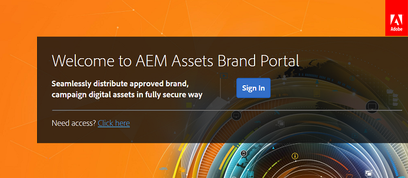

# 首次登入體驗 {#first-time-login-experience}

所有新的Experience Manager Assets Brand Portal使用者（包括管理員）皆有相同的首次登入體驗。 管理員將您新增至組織的Brand Portal帳戶後，您無需接受邀請即可自動加入。 您會收到一封歡迎電子郵件，其中包含存取您組織的Brand Portal帳戶的連結。

以下是第一次登入Brand Portal的使用者所要執行的步驟：

1. 開啟歡迎電子郵件，然後按一下&#x200B;**[!UICONTROL 開始使用]**。

1. 在註冊頁面中，指定您的詳細資料（包括名字、姓氏、密碼和國家/地區）。

   >[!NOTE]
   >
   >如果您是Adobe Experience Cloud的現有使用者，畫面會顯示登入頁面，而非註冊頁面。 若要登入Adobe Experience Cloud，請輸入您的Adobe ID和密碼。

   >[!NOTE]
   >
   >如果您的組織使用Enterprise ID，系統不會檢視此註冊頁面，而是將您重新導向至Enterprise登入頁面。 如需詳細資訊，請參閱[Enterprise ID、登入及帳戶說明](https://helpx.adobe.com/in/enterprise/kb/enterprise-id-faq.html)。

1. 按一下&#x200B;**[!UICONTROL 繼續]**，繼續前往您組織的Brand Portal頁面。
1. 從Brand Portal登入頁面，按一下&#x200B;**[!UICONTROL 登入]**&#x200B;以登入Brand Portal。

   

   >[!NOTE]
   >
   >若要登入Brand Portal，您必須有權使用至少一個Experience Manager Assets產品設定檔。
