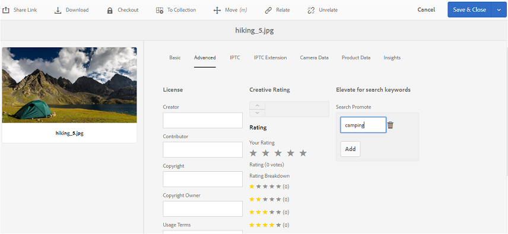

# Brand Portal的Publish標籤 {#publish-tags-to-brand-portal}

瞭解如何從Experience Manager Assets發佈標籤至Brand Portal。

標籤對於組織資產以及增強與其相關聯之資產的可搜尋性很有用。 標籤可視為附加資產的關鍵字或標籤（中繼資料），並可讓您透過搜尋結果快速找到資產。 若要瞭解如何在Experience Manager Assets中指派標籤給資產，請參閱[使用標籤來組織資產](https://experienceleague.adobe.com/docs/experience-manager-65/assets/managing/organize-assets.html)。

當資產（和集合）與標籤相關聯時，標籤(與AEM中的資產和集合相關聯)會自動發佈至Brand Portal。Brand Portal 發佈的標籤有助於讓搜尋找到關聯的資產。

>[!NOTE]
>
>不過，建議先僅將標籤發佈至Brand Portal，再發佈與標籤相關的資產（和集合）。 這可確保更快地將資產（和集合）發佈到Brand Portal。

## 管理標記 {#manage-tags}

您可以使用現有的標籤來附加至資產，或從AEM Tags主控台（**[!UICONTROL 工具）建立新標籤 | 標籤 | AEM標籤]**。 在這兩種情況下，您必須先將標籤發佈至Brand Portal，然後將其與適當的資產建立關聯。

若要在AEM上建立標籤、在Brand Portal上發佈標籤，並將標籤與適當的資產（或集合）相關聯，請按照以下步驟操作：

1. **建立標籤**
以系統管理許可權登入AEM Author執行個體，並從全域導覽存取**[!UICONTROL AEM標籤]**&#x200B;主控台：

   1. 選取&#x200B;**[!UICONTROL 工具]**

   1. 選取&#x200B;**[!UICONTROL 一般]**

   1. 選取&#x200B;**[!UICONTROL 標籤]**

1. 選取&#x200B;**[!UICONTROL 建立]**，然後選取&#x200B;**[!UICONTROL 建立標籤]**&#x200B;選項。
1. 指定下列設定：

   * **[!UICONTROL 標題]**
     *（必要）*&#x200B;標籤的顯示標題。
   * **[!UICONTROL 名稱]**
     *（必要）*&#x200B;標籤的名稱。 如果未指定，則會從標題建立有效的節點名稱。 請參閱 [TagID](https://experienceleague.adobe.com/docs/experience-manager-65/developing/platform/tagging/framework.html)。
   * **說明**
     *（選擇性）*&#x200B;標籤的說明。
   * **標籤路徑**
標籤的JCR路徑。

1. 選取&#x200B;**[!UICONTROL 提交]**&#x200B;以建立標籤。

   在AEM例項上建立標籤後，即可將標籤附加至資產（使用該資產的「屬性」區段或「管理標籤」區段）。

1. **將標籤Publish到Brand Portal**。

   移至&#x200B;**[!UICONTROL AEM標籤]**&#x200B;主控台([!UICONTROL 工具 | 標籤 | AEM標籤])，選取所需的標籤並將Publish新增至Brand Portal。

1. **將標籤附加至資產（或集合）**。

   選取資產（或集合），然後使用該資產的「屬性」區段或「管理標籤」區段附加所需的標籤。 若要進一步瞭解如何在AEM Assets中指派標籤給資產，請參閱[使用標籤來組織資產](https://experienceleague.adobe.com/docs/experience-manager-65/assets/managing/organize-assets.html)。

1. **Publish資產（或集合）至Brand Portal**。\
   將資產（或集合）發佈至Brand Portal時，Brand Portal上也提供附加標籤。

   若要在Brand Portal中檢視個別資產（或集合）上的附加標籤，請登入Brand Portal並選取資產，在「屬性」區段下方，您會看到附加標籤。

## 搜尋提升 {#search-promote}

AEM Assets Brand Portal可讓您根據關鍵字標籤，讓特定資產成為搜尋排名最前的結果。

若要提升搜尋關鍵字的資產，請執行下列步驟：

1. 開啟AEM作者執行個體上資產的&#x200B;**[!UICONTROL 屬性]**&#x200B;頁面。
1. 移至&#x200B;**[!UICONTROL 進階]**&#x200B;標籤。
1. 在&#x200B;**[!UICONTROL 提升搜尋關鍵字]**&#x200B;區段的&#x200B;**[!UICONTROL 搜尋提升]**&#x200B;中，選取&#x200B;**[!UICONTROL 新增]**&#x200B;以新增搜尋關鍵字或標籤。

   

1. 儲存變更。
1. 將資產Publish至Brand Portal。
1. 登入Brand Portal。 檢視資產的&#x200B;**[!UICONTROL 屬性]**&#x200B;區段中的&#x200B;**[!UICONTROL 進階]**索引標籤。
請注意，**[!UICONTROL Search Promote]**&#x200B;關鍵字也會顯示在該資產的屬性中。
