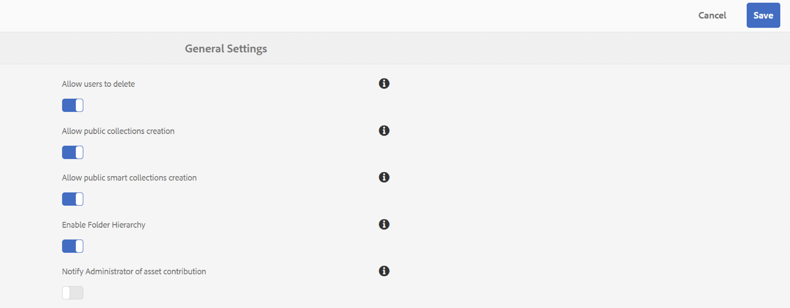

# 發行說明 {#release-notes}

深入了解 Adobe Experience Manager Assets Brand Portal 2024.10.0 版本中的新功能、增強功能、已修正的重大問題和已知問題。

## 發行資訊 {#release-information}

| 產品 | Adobe Experience Manager Assets Brand Portal |
|---|---|
| 版本 | 2024.10.0 |
| 日期 | 2024 年 10 月 |

## 概觀 {#overview}

Adobe Experience Manager (AEM) Assets Brand Portal 能協助您橫跨多種裝置輕鬆地取得和控制已核准的創意資產，並安全地向外部對象及內部業務使用者分發這些資產。其能協助提高資產共用的效率、縮短資產的上市時間，以及降低不合規和未經授權存取的風險。Brand Portal 讓使用者能夠隨時隨地以公司核准的格式瀏覽、搜尋、預覽、下載和匯出資產。

## 2024.10.0 新增功能 {#whats-new-in-2024.10.0}

### 已修正重大問題 {#critical-issues-fixed}

#### 錯誤修正 {#bug-fixes}

此版本包含下列錯誤修正:

* 來源匯入事件的電子郵件通知未發送。
* 使用搜尋篩選器時，[!DNL Brand Portal] 會在搜尋篩選器視窗內顯示重複的資料夾。
* 無法下載包含名稱中帶有特殊字元之未授權資產的集合。
* 導覽至[!UICONTROL 搜尋表單編輯器]時，標籤未本地化。
* 標籤未在連結共用視窗中本地化。
* 無法下載名稱中帶有特殊字元的影片。
* 從 [!DNL Adobe Experience Manager Assets] 發佈至 Brand Portal 和取消發佈資產的操作未正確運作。
* 無法播放從 Brand Portal 下載的影片。

## 舊版本

### 2024 年 2 月發行版本 {#feb-2024}

**錯誤修正和增強功能**

此版本包含下列錯誤修正:

* 無法在土耳其語地區設定中下載受 DRM 保護的數位資產。
* 無法開啟和下載包含多行標題之資產的現有報告。
* 當您使用動作列中的「[!UICONTROL 下載]」按鈕下載資產時，最多會下載 1000 項資產。
* 在內容樹狀結構中檢視時，PSD 類型資產的名稱不正確。
* 資產詳細資料頁面上的「[!UICONTROL 刪除轉譯]」選項沒有作用。
* 下載快顯視窗中的資產標題和大小不符。
* 建立報告時，標籤未本地化。
* 支援管理員在 Brand Portal 中被稱為管理員。

### 2023 年 10 月版本 {#oct-2023}

**錯誤修正和增強功能**
此版本包含下列增強功能：

* 瀏覽[!UICONTROL 集合]的效能改進。

* 使用全方位搜尋欄位執行部分搜尋時，搜尋結果有所改善。

此版本包含下列錯誤修正:

* 無法將「[!UICONTROL 日期]」和「[!UICONTROL 選項]」述詞儲存至「[!UICONTROL 智慧型集合]」。

* 在英語以外的其他地區設定中操作時，「[!UICONTROL 日期和時間]」格式不一致。

* 搜尋資產時，缺少[!UICONTROL 刪除]按鈕。

* 如果「[!UICONTROL 連結共用]」的「[!UICONTROL 標題]」欄位中包含多位元組符號，則無法下載報告。

* 檢視 PDF 類型的文件時，標籤和工具提示未本地化。

### 2023 月 8 月版本 {#aug-2023}

**錯誤修正和增強功能**
此版本包含下列增強功能：

* 在[!UICONTROL 下載]快顯視窗中載入資產時的效能提升。
* 當您下載資產或資產的轉譯時，現在將以其原始檔案類型格式而非 zip 檔案下載。

此版本包含下列錯誤修正:

* 搜尋篩選器的長標籤或標記未正確顯示。
* 無法在「下載」對話框中顯示較長的轉譯名稱。
* 無法在卡片視圖中預覽影片資產。

### 2023 年 5 月版本 {#may-2023}

**錯誤修正**
此版本包含以下重大問題的修正：

* 如果從共用連結下載資產時發生錯誤，錯誤提示的 `Notice` 和 `Close` 標籤未本地化。
* 使用 `Filter` 窗格存取搜尋篩選器時，Brand Portal 顯示&#x200B;**請求頁首欄位過大**&#x200B;錯誤。

**已知問題**
此版本包含下列已知問題：

* 資產來源報告內容僅有部分本地化。
* 使用者基本資料中的一些欄位無法在使用者基本資料中編輯。

### 2023 年 2 月版本 {#feb-2023}

**錯誤修正**

此版本包含以下重大問題的修正：

* 無法在 Brand Portal 上更新基本資料圖片。
* 內容樹狀結構窗格無法調整大小。如果檔案名稱長度超過內容樹狀結構的預設寬度，則無法水平和垂直拖曳內容樹狀結構。因此，無法讀取較長的檔名。
* 在搜尋表單中兩次皆使用相同的屬性述詞時，搜尋結果並不一致。
* 中間登入頁面上的文字並未針對所有語言進行本地化。

**增強功能**

此版本包含下列增強功能:

* 現在可以使用新的現代 PDF 檢視器，讓 PDF 資產的預覽畫面更清楚。
* 您現在可以選擇啟用或停用管理員的資產來源通知。導覽至「[!UICONTROL 一般設定]」，然後啟用或停用 [!UICONTROL `Notify Administrator of asset contribution`]。

  

* 若是請求存取被停用，未經授權的使用者就無法請求 Brand Portal 的存取權。
* 僅有為 Brand Portal 佈建的組織才會顯示在基本資料選擇器清單中。

**已知問題**

此版本包含下列已知問題：

* 資產來源報告內容僅有部分本地化。
* 使用者基本資料中的一些欄位無法在使用者基本資料中編輯。

### 2022 年 10 月版本 {#oct-2022}

**已修正重大問題**

此版本包含以下重大問題的修正：

* 將大型檔案從 Brand Portal 複製到第三方工具時回應速度較慢。
* 當您選取轉譯計數核取方塊時，選取個別轉譯的核取方塊會被停用。
* 搜尋回應速度慢。

>[!IMPORTANT]
>
>AEM Assets Brand Portal 中的即時簡短通知將於 2022 年 12 月 1 日起停止使用。您不再收到即時簡短通知，而會收到以下事件的電子郵件通知：
>
>* 以連結的方式共用資產
>* 請求存取權的工作流程
>* 共用貢獻資料夾
>* 開始匯出至 AEM
>* 匯出至 AEM 已完成
>

### 2022 年 8 月版本 {#aug-2022}

**已修正重大問題**

此版本包含以下重大問題的修正：

* 當 NUI 無法在 Experience Manager 中處理資產時，Brand Portal 會顯示不準確的資產匯入狀態。
* 當預覽動作失敗時，沒有告知失敗的通知。
* 每項資產的 `totalUploadedSize` 屬性之不正確數值已修正。
* 按一下「**下載全部項目**」，且資產有大量可用的轉譯時，Brand Portal 會下載無效的 .ZIP 檔案。
* Brand Portal 使用者介面上某些字串的翻譯被截斷。

### 2022 年 5 月版本 {#may-2022}

**新功能**

Brand Portal 現在每隔十二小時便會自動執行工作，刪除所有發佈至 AEM 的 Brand Portal 資產。因此，您不需要手動刪除「貢獻」資料夾中的資產，使資料夾大小不超過臨界值限制。

**已修正重大問題**

此版本包含以下重大問題的修正：

* 當您下載的資料夾或集合包含帶有顏色標記之資產時，也會下載 XML 檔案。
* 當您下載包含轉譯的影片時，Brand Portal 會建立一個無效的 .ZIP 檔案。
* 當您在 AEM 作者上建立預設集和資產，然後將其發佈至 Brand Portal 時，您可以在下載資產時選取動態轉譯。但是，您無法將已下載的 .ZIP 檔案解壓縮。此問題導致無法存取下載的內容。
* 從 Brand Portal 上的某些資料夾下載影片資產時出現問題。
* 當您使用電子郵件共用貢獻資料夾的 URL 時，檢視者和編輯者角色在使用階層連結存取其父系資料夾時會遇到問題。
* 來源發佈的報告顯示錯誤的工作開始時間。

### 2022 年 2 月版本 {#feb-2022}

**新功能**

* 訪客使用者的工作階段逾時臨界值已從 2 小時縮短至 15 分鐘。
* 多頁面 PDF 已移除額外的「**[!UICONTROL 檢視頁面]**」選項，因為使用者現在可以從 Adobe Document Cloud 檢視器檢視 PDF 頁面。
* 使用者無法搜尋、導覽或開啟資料夾。使用者介面反映錯誤訊息：`Failed to load data`。
* **[!UICONTROL 轉譯]**&#x200B;面板未列出發佈至 Brand Portal 之資產的所有靜態轉譯。
* **[!UICONTROL 轉譯]**&#x200B;面板列出資產的智慧裁剪轉譯，但使用者無法預覽或下載智慧裁剪轉譯。
* 下載對話框列出所選資產的智慧裁剪轉譯，但使用者無法下載智慧裁剪轉譯。
* 非管理員使用者在下載資產時只能取得原始資產轉譯。未下載系統和自訂轉譯。
* 套用搜尋篩選器以下載資產時，下載對話框中的 `Download` 按鈕已停用且不允許使用者下載資產。
* 當 `Smart Tags` 和 (或) `Color Tags` 啟用後，下載對話框會列出做為轉譯的 `json` 檔案，並把這些 `json` 檔案下載成歸檔 zip 資料夾。
* 匿名使用者無法透過共用的連結下載資產，因為該連結會重新導向至 Brand Portal 登入頁面。
* 系統未反映目前使用中使用者數量的正確數值。

<!--
### New Features {#new-features}

This release includes the following new features:

* AEM Assets as a Cloud Service is now entitled to have a pre-configured Brand Portal instance. The Cloud Manager user can activate Brand Portal on the AEM Assets as a Cloud Service instance.

* Asset Sourcing feature is now available on AEM Assets as a Cloud Service. It allows the Brand Portal users to upload assets to the permitted contribution folders and publish the contribution folder from Brand Portal to AEM Assets as a Cloud Service instance. 

* An additional **[!UICONTROL Asset Download]** setting has been introduced under the **[!UICONTROL Download Settings]**. It creates a separate folder for each asset while downloading the folders, collections, or bulk download of assets. 
-->
<!-- 
* The **[!UICONTROL Download]** dialog is revamped in a list view with additional options to exclude the renditions which are not required, apply the same set of rules for similar asset types, and download the selected asset renditions.
-->

<!--
* The new **[!UICONTROL Download]** dialog now appears with all the renditions of the selected assets or folders containing assets in a list view, wherein the Brand Portal users can apply same set of renditions for similar asset types and download the selected asset renditions. 
-->

<!-- 
* Navigation to the **[!UICONTROL Files]**, **[!UICONTROL Collections]**, and **[!UICONTROL Shared Links]** is now possible from all the Brand Portal pages in one-click.  

* The **[!UICONTROL Renditions]** panel in the asset details page now allows the Brand Portal users to select the original asset and (or) specific asset renditions, and directly download them from the **[!UICONTROL Renditions]** panel without having to open the **[!UICONTROL Download]** dialog.
-->

<!--
Brand Portal users can exclude specific renditions which are not required and directly download the original asset and its renditions from the **[!UICONTROL Renditions]** panel on the asset details page. 
-->

<!-- 
* In addition to the existing **[!UICONTROL Download]** configurations, the Brand Portal administrators can also [configure permissions for different group of users]() to view and (or) download the original asset and its renditions from the asset details page. These configurations will define who can access and (or) download the asset renditions.
-->

<!--
### Enhancements {#enhancements}

Brand Portal 2021.08.0 is an internal release that introduces Business profiles for enterprise and teams customers to give organizations better control over their assets. 

This release includes the following enhancements:

* The users now have organization-specific entitlement on the new and migrated organizations. If a user is entitled to multiple organizations, the user has to select the organization at the time of login.

* The new users that are added in Admin Console must **Join Team** to get entitled to the organization. 

>[!NOTE]
>
>Business profiles are currently applicable for the new organizations that are created after August 16, 2021. 
>
>Until your organization is migrated, you can continue to use Adobe ID, Enterprise ID, or Federated ID types to access the organization.   
-->

<!-- 
* For folder download, a separate folder is created for each asset using share link irrespective of the **[!UICONTROL Download Settings]**. 
* The Brand Portal **[!UICONTROL Usage Report]** has been modified to reflect only the active Brand Portal users.
-->

<!--
* The threshold of session timeout for the guest users has been reduced from 2 hours to 15 minutes.
* The additional **[!UICONTROL View pages]** option has been removed for multi-page PDFs as the user can now view the PDF pages from the Adobe Document Cloud Viewer.

* The users are unable to search, navigate, or open folders. The user interface reflects the error message: `Failed to load data`. 
* The **[!UICONTROL Renditions]** panel does not list all the static renditions of the assets that are published to Brand Portal.
* The **[!UICONTROL Renditions]** panel lists the smart crop renditions of the asset, however, the user cannot preview or download the smart crop renditions.
* The download dialog lists the smart crop renditions of the selected asset, however, the user cannot download the smart crop renditions. 
* A non-admin user is getting only the original asset rendition when downloading an asset. The system and custom renditions are not downloaded.  
* When applying search filter to download an asset, the `Download` button is disabled in the download dialog and does not allows the user to download the asset.
* If `Smart Tags` and (or) `Color Tags` are enabled, the download dialog lists the `json` files as renditions and downloads these `json` files in the archived zip folder.
* The anonymous users are unable to download assets using a shared link because the link redirects to the Brand Portal login page. 
* The system is not reflecting the correct value for the number of active concurrent users.
-->

<!--
### New features {#new-features}

Brand Portal now executes automatic jobs every twelve hours to delete all Brand Portal assets that are published to AEM. As a result, you do not need to delete the assets in the Contribution folder manually to keep the folder size below the threshold limit. See [What's new in Experience Manager Assets Brand Portal](whats-new.md).
-->

<!--
This release includes fixes to the following critical issues:

* When you download a folder or a collection that includes assets with color tags, an XML file gets downloaded as well.

* When you download a video that includes renditions, Brand Portal creates an invalid .ZIP file.

* When you create presets and assets on AEM author and publish them to Brand Portal and then select dynamic renditions while downloading the assets, you cannot extract the downloaded .ZIP file.

* Issues while downloading video assets from certain folders available on Brand Portal.

* When you share the Contribution folder's URL using an email, Viewer and Editor roles face issues while accessing its parent folder using the breadcrumb.

* Sourcing published report displays an incorrect job start time.
>
 
<!--
* Asset Sourcing email notifications are not delivered for some organizations. 

* Video files with extension `.mov` are not running on Brand Portal. 

* In the **[!UICONTROL Smart Collections]** dropdown list, only ten saved collections are visible. 
-->
<!--
* *_deleted tenants are listed as valid tenant which fails during the execution of TenantCustomizers/TenantUpdates where tenant id is returned as /etc/tenants/`<nodename>`.
-->

<!--
In case only the original assets are downloaded, the asset reflects its own extension and does not open until the extension is manually changed to zip. 
* The user interface of the collection folder does not respond on clicking the navigation arrow. 
* **[!UICONTROL Create]** button is visible in the **[!UICONTROL Column]** view even when the folders are empty.
* **[!UICONTROL Omni search]** fails with a 414 error message (Request-URI Too Long) if the dispatcher is bypassed while accessing the Brand Portal instance.
* An empty zip folder is downloaded if the asset contains a comma (`,`) in the file name.
* The viewer users get the option to add users to the collection they have created. 
* Inconsistent behavior is experienced when an asset (thumbnail or web rendition) is downloaded using share link.

See [what's new in Brand Portal 2021.02.0](whats-new.md).
-->

<!--
### Known Issues {#known-issues}

This release includes the following known issue:

* Search on the **[!UICONTROL Asset Reports]** shows processing on the product interface with no search result.
* The video DM encodes are not visible to the non-admin users on the asset details page.
* The alignment of the size of individual asset renditions and total download size is distorted in the Download dialog.
-->

<!--
* Download Settings configuration to configure asset download from Brand Portal. Fast download, custom renditions, and system renditions are the available configurations. 
-->

<!--
* Document Viewer has been introduced to enhance the PDF viewing experience. New options are available for viewing the PDF files in Brand Portal.

* Advances in the asset download process which improves the Brand Portal user experience while [downloading assets from Brand Portal](brand-portal-download-assets.md). Brand Portal administrators can configure **[!UICONTROL Fast Download]**, **[!UICONTROL Custom Renditions]**, and **[!UICONTROL System Renditions]** from the **[!UICONTROL Download]** settings. 

For details, see [what's new in Brand Portal 6.4.7](whats-new.md). 

### Critical Issues Fixed {#critical-issues-fixed-647}

This release includes fixes to the following critical issues:

* The viewer users are not permitted to share link for collections but the option to share is visible to them on the product interface.

* The **[!UICONTROL Download]** button on the options bar does not list all the licensed assets of the selected folder.

* The search takes longer to show the results for certain keywords.

* The **[!UICONTROL Agree]** and **[!UICONTROL Disagree]** check boxes does not appear on bulk selection of licensed and unlicensed assets during download.

* Filter-based search shows processing on the product interface with no search result. 

* The assets do not download from share link if the shared folder contains numerous and large assets.

### Known Issues {#known-issues-647}

This release includes the following known issues:

* If multiple assets are selected, license text does not appear on clicking Terms and Conditions on the license agreement page during download using share link.   

-->

## 語言 {#languages}

Brand Portal 使用者介面提供以下語言版本：

* 英文
* 德文
* 法文
* 西班牙文
* 義大利文
* 巴西葡萄牙文
* 日文
* 簡體中文
* 韓文

## 獲得認證的平台 {#certified-platforms}

若要查看哪些平台已通過此 Brand Portal 版本的認證，請查看[技術要求](https://experienceleague.adobe.com/zh-hant/docs/experience-manager-65/content/implementing/deploying/introduction/technical-requirements)中&#x200B;**支援製作使用者介面的瀏覽器**&#x200B;區段內的&#x200B;**支援觸控最佳化的 UI** 欄位。

## 連結 {#links}

* [adobe.com 上的 Adobe Experience Manager 產品頁面](https://business.adobe.com/in/products/experience-manager/adobe-experience-manager.html)
* [Assets Brand Portal 文件](https://experienceleague.adobe.com/zh-hant/docs/experience-manager-brand-portal/using/home)

## 產品存取和支援 (受限網站) {#product-access-and-support-restricted-sites}

這些網站僅適用於客戶。如果您是客戶並且需要存取權，請聯絡您的 Adobe 客戶經理。

<!--
* [https://daycare.day.com](https://daycare.day.com) 
-->

<!--
* [Customer Support]()
-->
