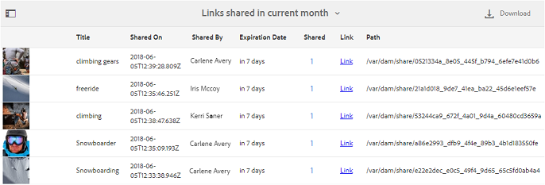
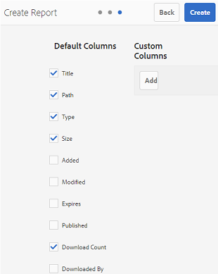

# 使用報告 {#work-with-reports}

報告功能有助於評估Brand Portal使用情況，並瞭解內部和外部使用者如何與已核准的資產互動。 管理員可以檢視Brand Portal使用情況報表，該報表一律可在「資產報表」頁面上取得。 不過，使用者登入的報告以及透過連結共用的資產已下載、過期、發佈和檢視，這些報告可以從「資產報告」頁面產生和檢視。 這些報表有助於分析資產部署，讓您獲得關鍵成功量度，以衡量組織內外對已核准資產的採用程度。

報表管理介面是直覺式的，並包含存取已儲存報表的精細選項和控制項。 您可以從「資產報表」頁面檢視、下載或刪除報表，所有先前產生的報表都會列於此處。

## 檢視報表 {#view-reports}

若要檢視報表，請執行下列步驟：

1. 從頂部的工具列中，按一下Experience Manager標誌以存取管理工具。

   

1. 在管理工具面板中，按一下&#x200B;**[!UICONTROL 建立/管理報表]**&#x200B;以開啟&#x200B;**[!UICONTROL 資產報表]**&#x200B;頁面。

   

1. 從「資產報告」頁面存取&#x200B;**[!UICONTROL 使用情況]**&#x200B;報告和其他產生的報告。

   >[!NOTE]
   >
   >使用情況報告是在Brand Portal中產生的預設報告。 無法建立或刪除。 不過，您可以建立、下載及刪除「下載」、「到期日」、「Publish」、「`Link Share`」和使用者登入報告。

   若要檢視報表，請按一下報表連結。 或者，選取報告，然後按一下工具列中的「檢視」圖示。

   **[!UICONTROL 使用情況報表]**&#x200B;會顯示作用中Brand Portal使用者人數、所有資產所佔用的儲存空間，以及Brand Portal中資產總計計數的相關資訊。 未指派給Admin Console中任何產品設定檔的Brand Portal使用者會被視為非作用中使用者，不會反映在&#x200B;**[!UICONTROL 使用情況報表]**中。
報表也會顯示每個資訊量度的允許容量。

   

   「**[!UICONTROL 使用者登入]**」報表提供登入Brand Portal之使用者的相關資訊。 報表會顯示從Brand Portal 6.4.2部署到產生報表時的顯示名稱、電子郵件ID、角色（管理員、檢視者、編輯者、來賓）、群組、上次登入、活動狀態以及每個使用者的登入計數。

   

   **[!UICONTROL 下載]**&#x200B;報告清單以及在特定日期和時間範圍內下載的所有資產的詳細資訊。

   

   >[!NOTE]
   >
   >資產&#x200B;**[!UICONTROL 下載]**&#x200B;報表只會顯示個別選取並從Brand Portal下載的資產。 如果使用者下載了包含資產的資料夾，報表不會顯示該資料夾或資料夾內的資產。

   **[!UICONTROL 到期]**&#x200B;報告會列出並詳細列出特定時間範圍內到期的所有資產。

   

   **[!UICONTROL Publish]**&#x200B;報告列出在指定時間範圍內從Experience Manager Assets發佈到Brand Portal的所有資產，並提供相關資訊。

   

   >[!NOTE]
   >
   >Publish報表不會顯示內容片段的相關資訊，因為內容片段無法發佈至Brand Portal。

   **[!UICONTROL 連結共用]**&#x200B;報表會列出特定時間範圍內所有透過Brand Portal介面的連結共用的資產。 報告會詳細說明透過連結共用資產的時間、共用資產的使用者以及連結的到期日。 也會報告租使用者和使用者的共用連結數。 連結共用報表的欄無法自訂。

   

   >[!NOTE]
   >
   >「連結共用報表」不會顯示透過連結存取共用資產或已透過連結下載資產的使用者。
   >
   >若要透過共用連結追蹤下載，您必須在&#x200B;**[!UICONTROL 建立報告]**&#x200B;頁面上選取&#x200B;**[!UICONTROL 僅共用連結下載]**&#x200B;選項後，產生下載報告。 不過，在此情況下，使用者（下載者）是匿名的。

## 產生報表 {#generate-reports}

管理員可產生及管理下列標準報表。 產生之後，會儲存報告以供[稍後存取](../using/brand-portal-reports.md#main-pars-header)。

* 使用者登入
* 下載
* 過期
* 發佈
* 連結共用

您可以自訂下載、到期和Publish報告中的欄以供檢視。 若要產生報表，請執行下列步驟：

1. 從頂部的工具列中，按一下Experience Manager標誌以存取管理工具。

1. 在管理工具面板中，按一下&#x200B;**[!UICONTROL 建立/管理報表]**&#x200B;以開啟&#x200B;**[!UICONTROL 資產報表]**&#x200B;頁面。

   

1. 在「資產報表」頁面中，按一下&#x200B;**[!UICONTROL 建立]**。
1. 從&#x200B;**[!UICONTROL 建立報告]**&#x200B;頁面，選取要建立的報告，然後按一下&#x200B;**[!UICONTROL 下一步]**。

   

1. 設定報告詳細資訊。 指定&#x200B;**[!UICONTROL 下載]**、**[!UICONTROL 到期]**&#x200B;和&#x200B;**[!UICONTROL Publish]**&#x200B;報告的標題、說明、資料夾結構（報告需要執行並產生統計資料的位置）和日期範圍。

   

   **[!UICONTROL 連結共用]**&#x200B;報告只需要標題、說明和日期範圍引數。

   

   >[!NOTE]
   >
   >產生報表時，標題中的特殊字元`#`和`%`會以連字型大小(-)取代。

1. 按一下[下一步]****，設定下載、到期和Publish報告的欄。
1. 視需要選取或取消選取適當的核取方塊。 例如，若要在&#x200B;**[!UICONTROL 下載]**&#x200B;報告中檢視使用者（已下載資產）的名稱，請選取&#x200B;**[!UICONTROL 下載者]**。 下圖說明如何在「下載」報表中選取預設欄。

   

   您也可以新增自訂欄到這些報表，以顯示更多符合自訂需求的資料。

   若要將自訂欄新增至下載、Publish或到期報告，請執行下列動作：

   1. 若要顯示自訂資料行，請按一下[!UICONTROL 自訂資料行]內的&#x200B;**[!UICONTROL 新增]**。
   1. 在&#x200B;**[!UICONTROL 資料行名稱]**&#x200B;欄位中指定資料行名稱。
   1. 使用屬性選擇器，選取欄需要對應的屬性。

      
或者，在屬性路徑欄位中輸入路徑。

      

      若要新增更多自訂欄，請按一下[新增] ****&#x200B;並重複步驟2和3。

1. 按一下「**[!UICONTROL 建立]**」。訊息會通知已啟動報表產生作業。

## 下載報表 {#download-reports}

若要將報表儲存並下載為.csv檔案，請執行下列任一項作業：

* 在「資產報告」頁面上選取報告，然後從頂部的工具列按一下&#x200B;**[!UICONTROL 下載]**。

* 從「資產報表」頁面，開啟報表。 從報表頁面頂端選取&#x200B;**[!UICONTROL 下載]**&#x200B;選項。

## 刪除報告 {#delete-reports}

若要刪除現有報表，請從&#x200B;**[!UICONTROL Asset Reports]**&#x200B;頁面中選取報表，然後從頂端的工具列按一下&#x200B;**[!UICONTROL 刪除]**。

>[!NOTE]
>
>無法刪除&#x200B;**[!UICONTROL 使用狀況]**&#x200B;報告。
