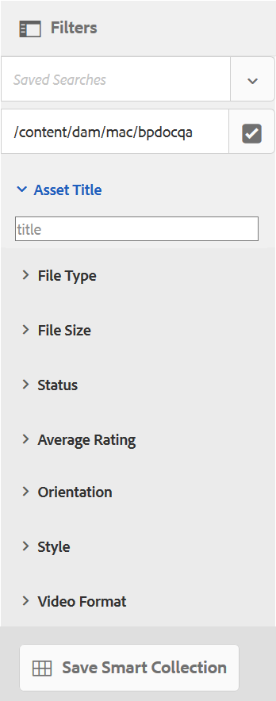

# 使用自訂搜尋多面向 {#use-custom-search-facets}

管理員可以將搜尋述詞新增至[!UICONTROL 篩選器]面板，以自訂搜尋並使搜尋功能通用。

Brand Portal支援[已核准品牌資產的細微搜尋](../using/brand-portal-searching.md#search-using-facets-in-filters-panel)，這是因為&#x200B;[**篩選器**&#x200B;面板](../using/brand-portal-searching.md#search-using-facets-in-filters-panel)所致。 透過管理工具中的&#x200B;**[!UICONTROL 搜尋表單]**，可在「篩選器」面板上使用搜尋Facet。 名為「資產管理搜尋邊欄」的預設搜尋表單存在於管理工具的「搜尋Forms」頁面中。 不過，管理員可以透過編輯預設搜尋表單（資產管理搜尋邊欄）來自訂預設的篩選器面板，方法是新增、修改或移除搜尋述詞，從而使搜尋功能通用。

您可以使用各種搜尋述詞來自訂&#x200B;**[!UICONTROL 篩選器]**&#x200B;面板。 例如，新增屬性述詞，以搜尋符合您在此述詞中指定的單一屬性的資產。 新增選項述詞，以搜尋符合您為特定屬性指定的一或多個值的資產。 新增日期範圍述詞，以搜尋在指定日期範圍內建立的資產。

>[!NOTE]
>
>Experience Manager Assets可讓組織[從AEM Author](../using/publish-schema-search-facets-presets.md#publish-search-facets-to-brand-portal)將自訂搜尋表單發佈到Brand Portal，而不是在Brand Portal上重新建立相同的表單。

## 新增搜尋述詞 {#add-a-search-predicate}

若要將搜尋述詞新增至&#x200B;**[!UICONTROL 篩選器]**&#x200B;面板：

1. 若要存取管理工具，請按一下頂端工具列的Experience Manager標誌。

   

1. 從系統管理工具面板，按一下&#x200B;**[!UICONTROL 搜尋Forms]**。

   

1. 在&#x200B;**[!UICONTROL 搜尋Forms]**&#x200B;頁面中，選取&#x200B;**[!UICONTROL Assets管理搜尋邊欄]**。

   

1. 在頂端出現的工具列上，按一下&#x200B;**[!UICONTROL 編輯]**&#x200B;以開啟編輯搜尋表單。

   

1. 在[!UICONTROL 編輯搜尋表單]頁面中，將述詞從[!UICONTROL 選取述詞]標籤拖曳至主窗格。 例如，拖曳&#x200B;**[!UICONTROL 屬性述詞]**。

   **[!UICONTROL 屬性]**&#x200B;欄位會出現在主窗格中，而右側的&#x200B;**[!UICONTROL 設定]**&#x200B;索引標籤會顯示屬性述詞。

   

   >[!NOTE]
   >
   >**[!UICONTROL 設定]**&#x200B;索引標籤中的標題標籤會識別您選取的述詞型別。

1. 在&#x200B;**[!UICONTROL 設定]**&#x200B;索引標籤中，輸入屬性述詞的標籤、預留位置文字和說明。

   * 如果您要允許以指定的屬性值為依據進行資產的部分短語搜尋（和萬用字元搜尋），請選取&#x200B;**[!UICONTROL 部分搜尋]**。 依預設，述詞支援全文檢索搜尋。
   * 如果您希望以屬性值為基礎的資產搜尋不區分大小寫，請選取&#x200B;**[!UICONTROL 忽略大小寫]**。 根據預設，搜尋篩選中的屬性值搜尋會區分大小寫。

   >[!NOTE]
   >
   >選取&#x200B;**[!UICONTROL 部分搜尋]**&#x200B;核取方塊時，預設會選取&#x200B;**[!UICONTROL 忽略大小寫]**。

1. 在&#x200B;**[!UICONTROL 屬性名稱]**&#x200B;欄位中，開啟屬性選擇器並選取執行搜尋所依據的屬性。 或者，輸入屬性的名稱。 例如，輸入 `jcr :content/metadata/dc:title` 或 `./jcr:content/metadata/dc:title`。

   >[!NOTE]
   >
   >在Brand Portal中，`dam:asset`的`jcrcontent/metadata`中的所有字串屬性（以`xmp`開頭的屬性除外）預設都會編制索引。 依預設，其他所有型別的自訂屬性都不會編制索引。
   >
   >建立屬性述詞時，可以使用任何已編制索引的屬性。 如果設定了任何非索引屬性，則未索引屬性上的搜尋查詢可能不會提供任何搜尋結果。

   

1. 按一下&#x200B;**[!UICONTROL 完成]**&#x200B;以儲存設定。
1. 從[!UICONTROL Assets]使用者介面，按一下覆蓋圖示並選擇&#x200B;**[!UICONTROL 篩選器]**&#x200B;以瀏覽至&#x200B;**[!UICONTROL 篩選器]**&#x200B;面板。 **[!UICONTROL 屬性]**&#x200B;述詞已新增至面板。

   

1. 在&#x200B;**[!UICONTROL 屬性]**&#x200B;文字方塊中輸入要搜尋之資產的標題。 例如，「Adobe」。 執行搜尋時，標題符合「Adobe」的資產會顯示在搜尋結果中。

## 搜尋述詞清單 {#list-of-search-predicates}

與新增&#x200B;**[!UICONTROL 屬性]**&#x200B;述詞的方式類似，您可以將下列述詞新增至&#x200B;**[!UICONTROL 篩選器]**&#x200B;面板：

| **述詞名稱** | **說明** | **屬性** |
|-------|-------|----------|
| **[!UICONTROL 路徑瀏覽器]** | 搜尋述詞，以搜尋特定位置的資產。 **注意：** *對於登入的使用者，篩選器上的路徑瀏覽器僅顯示與該使用者共用的資料夾（及其祖先）的內容結構。*  管理員使用者可以使用路徑瀏覽器導覽至任何資料夾，以搜尋該資料夾中的資產。  然而，非管理員使用者可以透過在「路徑瀏覽器」中導覽至資料夾（可供他們存取）來搜尋該資料夾中的資產。 | <ul><li>欄位標籤</li><li>路徑</li><li>說明</li></ul> |
| **[!UICONTROL 屬性]** | 根據特定中繼資料屬性搜尋資產。 **注意：** *選取部分搜尋時，預設會選取[忽略大小寫]*。 | <ul><li>欄位標籤</li><li>預留位置</li><li>屬性名稱</li><li>部分搜尋</li><li>忽略大小寫</li><li> 說明</li></ul> |
| **[!UICONTROL 多值屬性]** | 類似屬性述詞，但允許多個輸入值，以分隔字元（預設為COMMA[，]）分隔，符合任何輸入值的資產會傳回結果中。 | <ul><li>欄位標籤</li><li>預留位置</li><li>屬性名稱</li><li>分隔符號支援</li><li>忽略大小寫</li><li>說明</li></ul> |
| **[!UICONTROL 標籤]** | 搜尋述詞，以根據標籤搜尋資產。 您可以設定Path屬性以填入Tags清單中的各種標籤。 *注意：如果管理員從AEM發佈搜尋表單，而路徑不包含租使用者資訊，例如[!UICONTROL `/etc/tags/<custom_tag_namespace>`]，則可能需要變更路徑值，例如[!UICONTROL `/etc/tags/mac/<tenant_id>/<custom_tag_namespace>`]。 | <ul><li>欄位標籤</li><li>屬性名稱</li><li>路徑</li><li>說明</li></ul> |
| **[!UICONTROL 路徑]** | 搜尋述詞，以搜尋特定位置的資產。 | <ul><li>欄位標籤</li><li>路徑</li><li>說明</li></ul> |                                                     |
| **[!UICONTROL 相對日期]** | 搜尋述詞，以根據資產的相對建立日期來搜尋資產。 | <ul><li>欄位標籤</li><li>屬性名稱</li><li>相對日期</li></ul> |
| **[!UICONTROL 範圍]** | 搜尋述詞，以搜尋位於指定屬性值範圍內的資產。 在「篩選器」面板中，您可以指定範圍的最小和最大屬性值。 | <ul><li>欄位標籤</li><li>屬性名稱</li><li>說明</li></ul> |
| **[!UICONTROL 日期範圍]** | 搜尋述詞，針對日期屬性搜尋在指定範圍內建立的資產。 在「篩選器」面板中，您可以指定「開始」和「結束」日期。 | <ul><li>欄位標籤</li><li>預留位置</li><li>屬性名稱</li><li>範圍文字（從）</li><li>範圍文字（至）</li><li>說明</li></ul> |
| **[!UICONTROL 日期]** | 根據日期屬性的資產滑桿式搜尋的搜尋述詞。 | <ul><li>欄位標籤</li><li>屬性名稱</li><li>說明</li></ul> |
| **[!UICONTROL 檔案大小]** | 搜尋述詞，以根據資產的大小進行搜尋。 | <ul><li>欄位標籤</li><li>屬性名稱</li><li>路徑</li><li>說明</li></ul> |
| **[!UICONTROL 資產上次修改時間]** | 搜尋述詞，以根據上次修改日期搜尋資產。 | <ul><li>欄位標籤</li><li>屬性名稱</li><li>說明</li></ul> |
| **[!UICONTROL 核准狀態]** | 搜尋述詞，以根據核准中繼資料屬性搜尋資產。 預設屬性名稱為&#x200B;**dam：status**。 | <ul><li>欄位標籤</li><li>屬性名稱</li><li>說明</li></ul> |
| **[!UICONTROL 簽出狀態]** | 搜尋述詞，以根據AEM Assets發佈資產時的取出狀態來搜尋資產。 | <ul><li>欄位標籤</li><li>屬性名稱</li><li>說明</li></ul> |
| **[!UICONTROL 簽出者]** | 搜尋述詞，以根據已簽出資產的使用者來搜尋資產。 | <ul><li>欄位標籤</li><li>屬性名稱</li><li>說明</li></ul> |
| **[!UICONTROL 到期狀態]** | 搜尋述詞，以根據到期狀態搜尋資產。 | <ul><li>欄位標籤</li><li>屬性名稱</li><li>說明</li></ul> |
| **[!UICONTROL 集合的成員]** | 根據資產是否為集合的一部分來搜尋資產的搜尋述詞。 | 說明 |
| **[!UICONTROL 隱藏]** | 一般使用者無法明確看見此述詞，且此述詞用於任何隱藏的限制，通常用來將搜尋結果型別限製為&#x200B;**dam：Asset**。 | <ul><li>欄位標籤</li><li>屬性名稱</li><li>說明</li></ul> |

>[!NOTE]
>
>* 請勿使用&#x200B;**[!UICONTROL 選項述詞]**、**[!UICONTROL Publish狀態述詞]**&#x200B;和&#x200B;**[!UICONTROL 評等述詞]**，因為這些述詞在Brand Portal中無法運作。
>* Brand Portal不支援資料夾型別述詞`(nt:folder type)`，這可能會導致效能問題。 如果它存在於已發佈的自訂搜尋表單中，則可透過編輯搜尋表單將其刪除。

## 刪除搜尋述詞 {#delete-a-search-predicate}

若要刪除搜尋述詞，請執行下列步驟：

1. 按一下Adobe標誌以存取管理工具。

   

1. 從系統管理工具面板，按一下&#x200B;**[!UICONTROL 搜尋Forms]**。

   

1. 在&#x200B;**[!UICONTROL 搜尋Forms]**&#x200B;頁面中，選取&#x200B;**[!UICONTROL Assets管理搜尋邊欄]**。

   

1. 在頂端出現的工具列上，按一下&#x200B;**[!UICONTROL 編輯]**&#x200B;以開啟編輯搜尋表單。

   

1. 在[!UICONTROL 編輯搜尋表單]頁面中，從主窗格中選取您要刪除的述詞。 例如，選取&#x200B;**[!UICONTROL 屬性述詞]**。

   右側的&#x200B;**[!UICONTROL 設定]**&#x200B;標籤會顯示屬性述詞欄位。

1. 若要刪除屬性述詞，請按一下bin圖示。 在&#x200B;**[!UICONTROL 刪除欄位]**&#x200B;對話方塊中，按一下&#x200B;**[!UICONTROL 刪除]**&#x200B;以確認刪除動作。

   **[!UICONTROL 屬性述詞]**&#x200B;欄位已從主窗格中移除，**[!UICONTROL 設定]**&#x200B;索引標籤會變成空白。

   

1. 若要儲存變更，請按一下工具列中的[完成]。****
1. 從&#x200B;**[!UICONTROL Assets]**&#x200B;使用者介面，按一下覆蓋圖示並選擇&#x200B;**[!UICONTROL 篩選器]**&#x200B;以瀏覽至&#x200B;**[!UICONTROL 篩選器]**&#x200B;面板。 **[!UICONTROL 屬性]**&#x200B;述詞已從面板中移除。

   
