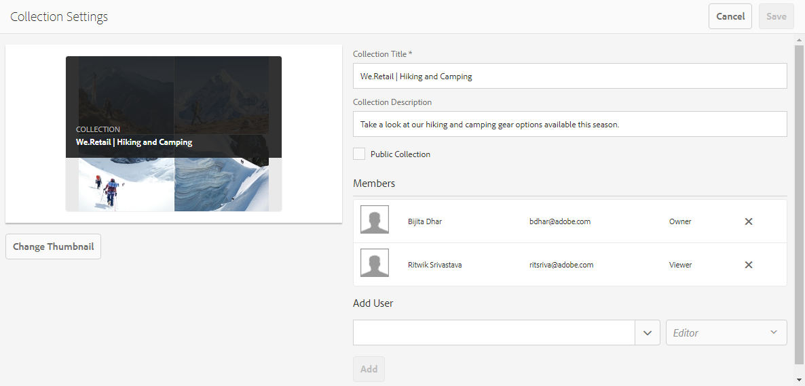

# 在品牌入口網站上共用系列 {#share-collections-bp}

AEM Assets品牌入口網站管理員可以與授權使用者共用或取消共用系列或智慧型系列。 編輯人員只能檢視和共用由他們建立、與他們共用的系列，以及公開的系列。 不過，編輯者無法將公開系列變更為非公開系列。

>[!NOTE]
>
>編輯者無法將公開系列變更為非公開的系列，因此，「系列設定」對話方塊中沒有「公 [!UICONTROL 開系列] 」核取 [!UICONTROL 方塊可用] 。

## 共用系列 {#share-collection}

若要共用系列，請依照下列步驟進行：

1. 按一下左側的覆蓋圖示，然後選擇「導 **[!UICONTROL 覽」]**。

   

2. 從左側的脫軌中，按一下「系 **[!UICONTROL 列」]**。

   

3. 從「系 **[!UICONTROL 列]** 」主控台，執行下列其中一項作業：

   * 將指標暫留在您要共用的系列上。 從系列的快速動作縮圖中，按一下「設 **[!UICONTROL 定]** 」圖示。
   

   * 選取您要共用的系列。 在頂端的工具列中，按一下「設 **[!UICONTROL 定」]**。
   

4. 在「系 [!UICONTROL 列設定] 」對話方塊中，選取您要與其共用系列的使用者或群組，並選取使用者或群組的角色，以符合其全域角色。 例如，將編輯器角色指派給全域編輯器，將檢視器角色指派給全域檢視器。

   或者，若要讓系列可供所有使用者使用，而不論其群組成員資格和角色為何，請選取「公用系列」核取方塊 **[!UICONTROL ，將其公開]** 。

   >[!NOTE]
   >
   >However, non-admin users can be restricted from creating public collections, to avoid having numerous public collections so that system space can be saved. Organizations can disable the Allow public collections creation configuration from General settings available in admin tools panel.****

   

   Editors cannot change a public collection to a non-public collection and, therefore, do not have Public Collection check-box available in Collection Settings dialog.

   

5. Select Add, and then Save. ******** The collection is shared with the chosen users.

   >[!NOTE]
   >
   >A user's role governs access to the assets and folders inside a collection. If a user does not have access to assets, an empty collection is shared with the user. Also, a user's role governs the actions available for collections.

## Unshare a collection {#unshare-a-collection}

To unshare a previously shared collection, do the following:

1. From the Collections console, select the collection you want to unshare.

   In the toolbar, click Settings.****

   

2. On the Collection Settings dialog box, under Members, click the x symbol next to users or groups to remove them from the list of users you shared the collection with.****

   

3. In the warning message box, click Confirm to confirm unshare.****

   Click **[!UICONTROL Save]**.

4. Log in to Brand Portal with the credentials of the user you removed from the shared list. 系列會從「系列」控制 **[!UICONTROL 台移除]** 。
