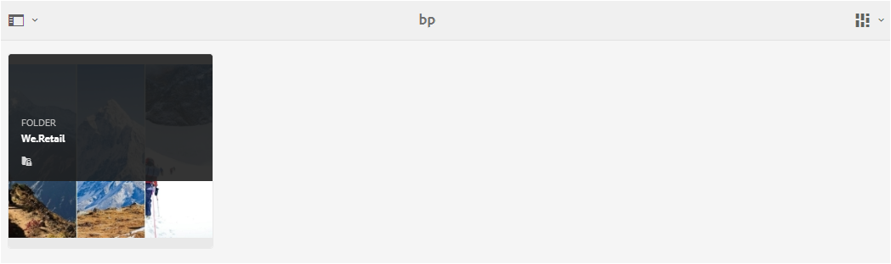

# 在Brand Portal上共用資料夾 {#share-folders}

Assets需要從預先設定的Experience Manager製作例項發佈至Brand Portal，因為Brand Portal不支援資產擷取。

## Brand Portal中的資料夾共用工作流程 {#folder-sharing-workflow-in-brand-portal}

以下說明資料夾共用工作流程和使用者存取權：

* 根據預設，從Experience Manager Assets發佈至Brand Portal的所有資料夾僅可供Brand Portal管理員看到，除非在設定復寫時標籤為公開。
* 管理員使用&#x200B;**[!UICONTROL 資料夾屬性]**&#x200B;主控台來與選擇性使用者或群組共用資料夾。 只有與資料夾共用的使用者或群組在登入Brand Portal後才能看到資料夾。 其他使用者看不到該資料夾。
* 系統管理員也可以選擇透過&#x200B;**[!UICONTROL 資料夾屬性]**&#x200B;主控台中的&#x200B;**[!UICONTROL 公用資料夾]**&#x200B;核取方塊將資料夾設為公用。 所有使用者皆可看到公用資料夾。

* 不論使用者角色和許可權為何，當使用者登入Brand Portal時，他們會看到所有公用資料夾，以及直接與他們共用或與其所屬群組共用的資料夾。 所有使用者都無法看見私人資料夾或與其他使用者共用的資料夾。

### 在Brand Portal上與使用者群組共用資料夾 {#sharing-folders-with-user-groups-on-brand-portal}

檔案夾資產的存取權取決於其父檔案夾的存取權，不論子檔案夾的設定為何。 AEM中的[ACL](https://experienceleague.adobe.com/zh-hant/docs/experience-manager-65/content/security/security)會控管此行為，子資料夾會從其父資料夾繼承ACL。 例如，假設資料夾A包含資料夾B，其中包含資料夾C。接著，擁有資料夾A存取許可權的使用者群組（或使用者）也會擁有資料夾B和資料夾C的相同存取許可權。資料夾B是A的子資料夾，會繼承其ACL，而資料夾C是B的子資料夾，則會繼承其ACL。

同樣地，只有存取資料夾B許可權的使用者群組（或使用者）對資料夾C而非資料夾A擁有相同的存取許可權。Adobe建議組織內容，以便將最公開的資產放在子資料夾中，允許從子資料夾一直限制存取根資料夾。

### 公用資料夾發佈 {#public-folder-publish}

只有在AEM Assets復寫設定期間選取&#x200B;**[!UICONTROL 公用資料夾Publish]**&#x200B;選項時，非管理員使用者（例如編輯者和檢視者）才能存取從Brand Portal發佈至Brand Portal的資產。

如果&#x200B;**[!UICONTROL 公用資料夾Publish]**&#x200B;選項已停用，系統管理員必須特別使用共用功能與非管理員使用者共用這些資產。

>[!NOTE]
>
>啟用&#x200B;**[!UICONTROL 公用資料夾Publish]**&#x200B;的選項可在AEM 6.3.2.1以後使用。

## 存取共用資料夾 {#access-to-shared-folders}

下列矩陣討論各種使用者角色的存取許可權以及共用或取消共用資產的許可權：

|               | 存取從AEM Assets發佈至Brand Portal的所有資料夾 | 存取共用資料夾 | 共用或取消共用資料夾許可權 |
|---------------|-----------|-----------|------------|
| 管理員 | 是 | 是 | 是 |
| 編輯者 | 否* | 可以，但前提是與他們共用或與其所屬的群組共用 | 是，僅適用於與其共用或與其所屬的群組的資料夾 |
| 檢視者 | 否* | 可以，但前提是與他們共用或與其所屬的群組共用 | 否 |
| 訪客使用者 | 否* | 可以，但前提是與他們共用或與其所屬的群組共用 | 否 |

>[!NOTE]
>
>依預設，使用AEM Author設定Brand Portal復寫時，**[!UICONTROL 公用資料夾Publish]**&#x200B;選項會停用。 如果已啟用選項，則所有使用者（非管理員使用者）預設都能存取發佈至Brand Portal的資料夾。

### 非管理員使用者對共用資料夾的存取權 {#non-admin-user-access-to-shared-folders}

非管理員使用者只能存取在Brand Portal上與他們共用的資料夾。 但是，這些資料夾在登入時如何顯示在入口網站上，取決於&#x200B;**[!UICONTROL 啟用資料夾階層]**&#x200B;設定的設定。

**如果設定已停用**

非管理員使用者登入Brand Portal後，即可在登陸頁面上看見與其共用的所有資料夾。

**如果已啟用組態**

非管理員使用者在登入Brand Portal時，可看見資料夾樹狀結構（從根資料夾開始）和排列在其各自父資料夾中的共用資料夾。

這些父資料夾是虛擬資料夾，無法對它們執行任何動作。 您可以使用鎖定圖示來辨識這些虛擬資料夾。

和共用資料夾不同，在&#x200B;**[!UICONTROL 卡片檢視]**&#x200B;中，暫留或選取時不會顯示任何動作工作。 在&#x200B;**[!UICONTROL 欄檢視]**&#x200B;和&#x200B;**[!UICONTROL 清單檢視]**&#x200B;中選取虛擬資料夾時，會顯示&#x200B;**[!UICONTROL 總覽]**&#x200B;按鈕。

>[!NOTE]
>
>請注意，虛擬資料夾的預設縮圖是第一個共用資料夾的縮圖影像。

   

## 共用資料夾 {#how-to-share-folders}

若要在Brand Portal上和使用者共用資料夾，請執行下列步驟：

1. 按一下左側的覆蓋圖示，然後選擇&#x200B;**[!UICONTROL 導覽]**。

   

1. 從左側的邊欄中，選取&#x200B;**[!UICONTROL 檔案]**。

   

1. 在Brand Portal介面中，選取您要共用的資料夾。

   

1. 從頂端的工具列中選取&#x200B;**[!UICONTROL 共用]**。

   

   [!UICONTROL 資料夾屬性]主控台就會顯示。

   

1. 如果您不想向使用者顯示預設名稱，請在&#x200B;**[!UICONTROL 資料夾屬性]**&#x200B;主控台的&#x200B;**[!UICONTROL 資料夾標題]**&#x200B;欄位中指定資料夾標題。
1. 從&#x200B;**[!UICONTROL 新增使用者]**&#x200B;清單中，選取您要共用資料夾的使用者或群組，然後按一下&#x200B;**[!UICONTROL 新增]**。
若要只與訪客使用者共用資料夾，而不與其他使用者共用，請從&#x200B;**[!UICONTROL 成員]**&#x200B;下拉式清單中選取&#x200B;**[!UICONTROL 匿名使用者]**。

   

   >[!NOTE]
   >
   >若要讓資料夾可供所有使用者使用，而不論其群組成員資格和角色為何，請選取&#x200B;**[!UICONTROL 公用資料夾]**&#x200B;核取方塊以將其設為公用。

1. 如有必要，請按一下&#x200B;**[!UICONTROL 變更縮圖]**&#x200B;來修改資料夾的縮圖影像。
1. 按一下「**[!UICONTROL 儲存]**」。

1. 若要存取共用資料夾，請使用共用該資料夾的使用者憑證登入Brand Portal。 在介面中檢閱共用資料夾。

## 取消共用資料夾 {#unshare-the-folders}

若要取消共用先前共用的資料夾，請執行下列步驟：

1. 在Brand Portal介面中，選取您要取消共用的資料夾。

   

1. 從頂端的工具列按一下&#x200B;**[!UICONTROL 共用]**。
1. 在&#x200B;**[!UICONTROL 資料夾屬性]**&#x200B;主控台的&#x200B;**[!UICONTROL 成員]**&#x200B;下方，按一下使用者旁邊的&#x200B;**[!UICONTROL x]**&#x200B;符號，以將他們從共用資料夾的使用者清單中移除。

   

1. 在警告訊息方塊中，按一下&#x200B;**[!UICONTROL 確認]**&#x200B;以確認取消共用。
按一下「**[!UICONTROL 儲存]**」。

1. 使用您從共用清單移除之使用者的憑證登入Brand Portal。 該資料夾在Brand Portal介面中無法再供使用者使用。
