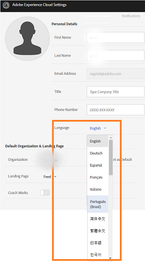

# Experience Manager Assets 品牌入口網站概覽 {#overview-of-aem-assets-brand-portal}

作為行銷人員，您有時需要與通道合作伙伴和內部業務用戶協作，以創建、管理並快速向客戶交付相關的數字內容。 及時傳遞整個客戶歷程的相關內容關鍵推動更大的需求、轉換、參與和客戶忠誠度。

但是，開發支持與團隊、合作伙伴和轉銷商高效、安全地共享經批准的品牌徽標、行銷活動資產或產品照片等内容的解決方案具有挑戰性。 確保此過程的效率和安全性需要仔細規劃和執行。

**Adobe Experience Manager (AEM) Assets Brand Portal**&#x200B;著重於行銷人員提供資產發佈和資產貢獻功能，與分散於全球各地的Brand Portal使用者有效合作的需求。

資產散佈可讓您取得、控制經核准的創意資產，並安全地將其散佈至跨裝置的外部團體和內部業務使用者。 不過，資產貢獻可讓Brand Portal使用者將資產上傳到Brand Portal並發佈到Experience Manager Assets，而不需要存取作者環境。 在Brand Portal **中，貢獻功能稱為**Assets Sourcing。 同時，它改善了資產分銷的整體Brand Portal體驗和Brand Portal使用者（外部機構/團隊）的貢獻，加快資產上市時間，並降低不合規和未經授權存取的風險。
請參閱Brand Portal](brand-portal-asset-sourcing.md)中的[資產來源。

瀏覽器式入口網站環境可讓您以核准的格式輕鬆上傳、瀏覽、搜尋、預覽和匯出資產。

## 透過 Brand Portal 設定 Experience Manager Assets {#configure-brand-portal}

使用Brand Portal設定Adobe Experience Manager Assets可為Brand Portal使用者啟用資產發佈、資產發佈和資產貢獻功能。

>[!NOTE]
>
>Experience Manager Assets as a Cloud Service、Experience Manager Assets 6.3及更高版本支援使用Brand Portal設定Experience Manager Assets。

Experience Manager Assets as a Cloud Service是透過Cloud Manager啟用Brand Portal來自動設定的Brand Portal。 啟動工作流程會在後端建立所需的設定，並在與Experience Manager Assets as a Cloud Service執行個體相同的IMS組織上啟動Brand Portal。

不過，Experience Manager Assets （內部部署和託管服務）是使用Adobe Developer Console以Brand Portal手動設定，這會取得Adobe Identity Management Services (IMS) Token以授權Brand Portal租使用者。

如需詳細資訊，請參閱[使用Brand Portal設定Experience Manager Assets](../using/configure-aem-assets-with-brand-portal.md)。

## Brand Portal中的使用者角色 {#Personas}

Brand Portal支援下列使用者角色：

* 訪客使用者
* 檢視者
* 編輯器
* 管理員

下表列出具有這些角色的使用者可以執行的工作：

|  | **瀏覽** | **搜尋** | **下載** | **共用資料夾** | **共用集合** | **以連結方式共用資產** | **管理員工具的訪問許可權** |
|--- |--- |--- |--- |--- |--- |--- |--- |
| **訪客用戶** | ✓* | ✓* | ✓* | x | x | x | x |
| **觀眾** | ✓ | ✓ | ✓ | x | x | x | x |
| **編輯器** | ✓ | ✓ | ✓ | ✓ | ✓ | ✓ | x |
| **管理員** | ✓ | ✓ | ✓ | ✓ | ✓ | ✓ | ✓ |

>[!NOTE]
>
>來賓使用者只能在公用資料夾和集合中瀏覽、訪問和搜尋資產。

<!--
&#42; Viewer users can access and download the public assets shared with them, and can add these assets to create their own collections.

>[!NOTE]
>
>There is a known issue that the share link for collections is currently visible to the viewer users. The viewer users does not have the privilege to add users to create a share link. This issue will be fixed in the upcoming release, the option to share link for the collections will not be available to the viewer users.
-->

### 訪客用戶 {#guest-user}

Experience Manager Assets品牌入口網站允許 [客人存取](#request-access-to-brand-portal) 品牌入口網站。 來賓用戶不需要憑據即可進入門戶，並有權訪問公用資料夾和集合。 身為訪客使用者，您可以瀏覽資產詳細資訊，並擁有公用資料夾和集合成員的完整資產檢視。 您可以搜尋、下載公用資產，並將其新增至[!UICONTROL Lightbox]集合。

不過，訪客工作階段會限制您建立系列與已儲存的搜尋，並進一步共用它們。 來賓工作階段中的使用者無法存取資料夾和集合設定，也無法以連結形式共用資產。 以下是訪客使用者可以執行的工作清單：

* [瀏覽及存取公用資產](browse-assets-brand-portal.md)

* [搜尋公用資產](brand-portal-searching.md)

* [下載公開資產](brand-portal-download-assets.md)

* [將資產新增至[!UICONTROL Lightbox]](brand-portal-light-box.md#add-assets-to-lightbox)

如需詳細資訊，請前往[Brand Portal的訪客存取權](../using/guest-access.md)。

### 檢視者 {#viewer}

在[!DNL Admin Console]中定義的Brand Portal使用者，其擁有以檢視器角色存取Brand Portal的許可權。 具有此角色的使用者可以登入Brand Portal並存取允許的資料夾、收藏集和資產。 使用者也可以瀏覽、預覽、下載和匯出資產（原始或特定轉譯）、設定帳戶設定及搜尋資產。 以下是檢視器可以執行的工作清單：

* [瀏覽資產](browse-assets-brand-portal.md)

* [搜尋資產](brand-portal-searching.md)

* [下載資產](brand-portal-download-assets.md)

### 編輯器 {#editor}

具有編輯者角色的使用者可以執行檢視者可以執行的所有工作。 此外，編輯者可以檢視管理員共用的檔案和資料夾。 具有編輯者角色的使用者也可以與其他人共用內容（檔案、資料夾、集合）。

除了檢視器可以執行的工作之外，編輯者還可以執行下列其他工作：

* [共用資料夾](brand-portal-sharing-folders.md)

* [共用集合](brand-portal-share-collection.md)

* [以連結形式共用資產](brand-portal-link-share.md)

### 管理員 {#administrator}

管理員包括在[!UICONTROL Admin Console]中標籤為系統管理員或Brand Portal產品管理員的使用者。 管理員可以添加和刪除系統管理員和用戶、定義預設、向使用者發送電子郵件以及視圖門戶使用方式和儲存報告。

>[!NOTE]
>
>在品牌入口網站中，在Admin Console]中[!UICONTROL 標有支持管理員角色的用戶具有与系統管理員相同的許可權。

管理員可以執行編輯者可以執行的所有任務。 以下是管理員可以執行的其他工作：

* [管理使用者、群組和用戶角色](brand-portal-adding-users.md)
* [自訂壁紙、頁面標題和電子郵件](brand-portal-branding.md)
* [使用自訂搜尋多面向](brand-portal-search-facets.md)
* [使用中繼資料結構](brand-portal-metadata-schemas.md)
* [套用影像預設集或動態轉譯](brand-portal-image-presets.md)
* [使用報告](brand-portal-reports.md)

除了上述工作之外，AEM Assets中的作者還可以執行下列工作：

* [使用Brand Portal設定AEM Assets](../using/configure-aem-assets-with-brand-portal.md)
* [將資料夾發佈至 Brand Portal](https://experienceleague.adobe.com/en/docs/experience-manager-65/content/assets/brandportal/brand-portal-publish-folder)
* [將集合發佈至 Brand Portal](https://experienceleague.adobe.com/en/docs/experience-manager-65/content/assets/brandportal/brand-portal-publish-collection)

## Brand Portal URL的替代別名 {#tenant-alias-for-portal-url}

Brand Portal 6.4.3以後，組織可以針對其Brand Portal租使用者的每個現有URL擁有一個替代（別名） URL。 別名URL可在URL中使用替代首碼來建立。\
如果租使用者名稱稱大於32個字元，則需要建立租使用者別名。
請注意，您只能自訂Brand Portal URL的前置詞，而不能自訂整個URL。 例如，具有現有網域`geomettrix.brand-portal.adobe.com`的組織可以取得根據請求建立的`geomettrixinc.brand-portal.adobe.com`。

不過，AEM作者執行個體只能使用租使用者ID URL設定[設定](../using/configure-aem-assets-with-brand-portal.md)，而不能使用租使用者別名（替代） URL。

>[!NOTE]
>
>若要在現有入口網站URL中取得租使用者名稱稱的別名，組織需要透過新的租使用者別名建立請求聯絡客戶支援。 首先，檢查別名是否可用，然後建立別名以處理此請求。
>
>若要取代舊別名或刪除舊別名，必須遵循相同的程式。

## 要求存取Brand Portal {#request-access-to-brand-portal}

使用者可以從登入畫面要求存取Brand Portal。 這些請求會傳送給Brand Portal管理員，管理員會透過Adobe [!UICONTROL Admin Console]授予使用者存取權。 授予存取權後，使用者會收到通知電子郵件。

若要要求存取權，請執行下列動作：

1. 從Brand Portal登入頁面中，選取&#x200B;**[!UICONTROL 按一下這裡]** （對應&#x200B;**[!UICONTROL 需要存取權？）]**。但是，若要輸入來賓工作階段，請選取與&#x200B;**[!UICONTROL 來賓存取？]**&#x200B;相對應的&#x200B;**[!UICONTROL 按一下這裡]**。

   

   [!UICONTROL 要求存取權]頁面隨即開啟。

1. 若要要求存取組織的Brand Portal，您必須具備有效的[!UICONTROL Adobe ID]、[!UICONTROL Enterprise ID]或[!UICONTROL Federated ID]。

   在[!UICONTROL 要求存取]頁面中，使用您的ID登入（案例1）或建立[!UICONTROL Adobe ID] （案例2）：

   ![[!UICONTROL 要求存取]](assets/bplogin_request_access_2.png)

   **方案 1**

   1. 如果您有Adobe ID、[!UICONTROL Enterprise ID]或[!UICONTROL Federated ID]，請按兩下“**[!UICONTROL 登錄]**”。此時會開啟 [!UICONTROL 「登入] 頁面」。

   1. 提供您的 [!UICONTROL Adobe ID] 憑據，然後按下 **[!UICONTROL 登錄]**。

      

   您被重新導向至[!UICONTROL 要求存取權]頁面。

   **案例2**

   1. 如果您沒有[!UICONTROL Adobe ID]，若要建立一個，請從[!UICONTROL 要求存取]頁面按一下&#x200B;**[!UICONTROL 取得Adobe ID]**。
[!UICONTROL 登入]頁面隨即開啟。
   1. 按一下&#x200B;**[!UICONTROL 取得Adobe ID]**。
[!UICONTROL 註冊]頁面開啟。
   1. 輸入您的名字和姓氏、電子郵件ID和密碼。
   1. 選取&#x200B;**[!UICONTROL 註冊]**。

      

   您被重新導向至[!UICONTROL 要求存取權]頁面。

1. 下一頁會顯示您的名稱和用來要求存取的電子郵件ID。 留下留言給管理員，然後按一下&#x200B;**[!UICONTROL 提交]**。

   

## 產品管理員授予存取權 {#grant-access-to-brand-portal}

Brand Portal產品管理員會在其Brand Portal通知區域及收件匣中的電子郵件接收存取要求。

若要授與存取權，產品管理員需要按一下Brand Portal通知區域中的相關通知，然後按一下[授與存取權]。****
或者，產品管理員也可以依照存取要求電子郵件中提供的連結，造訪Adobe [!UICONTROL Admin Console]，並將使用者新增至相關的產品設定。

系統已將您重新導向至[Adobe [!UICONTROL Admin Console]](https://adminconsole.adobe.com/enterprise/overview)首頁。 使用Adobe [!UICONTROL Admin Console]建立使用者，並將他們指派給產品設定檔（先前稱為產品設定），這些設定檔在Brand Portal中顯示為群組。 如需在[!UICONTROL Admin Console]中新增使用者的詳細資訊，請參閱[新增使用者](brand-portal-adding-users.md#add-a-user) （請依照程式中的步驟4-7新增使用者）。

## Brand Portal語言 {#brand-portal-language}

您可以從Adobe [!UICONTROL Brand Portal設定]變更Experience Cloud語言。

若要變更語言：

1. 從頂端功能表選取[!UICONTROL 使用者] > [!UICONTROL 編輯設定檔]。

   

1. 在[!UICONTROL Experience Cloud設定]頁面上，從[!UICONTROL 語言]下拉式功能表中選取語言。

## Brand Portal維護通知 {#brand-portal-maintenance-notification}

在Brand Portal排程進行維護之前，在您登入Brand Portal後，通知會顯示為橫幅。 範例通知：

您可以關閉此通知，並繼續使用Brand Portal。 此通知會出現在每個新工作階段中。

## 發行版本和系統資訊 {#release-and-system-information}

* [最新資訊](whats-new.md)
* [發行說明](brand-portal-release-notes.md)
* [支援的檔案格式](brand-portal-supported-formats.md)

## 相關資源 {#related-resources}

<!--
* [Adobe Customer Support]()
-->

* [AEM論壇](https://experienceleaguecommunities.adobe.com/t5/adobe-experience-manager/ct-p/adobe-experience-manager-community)
