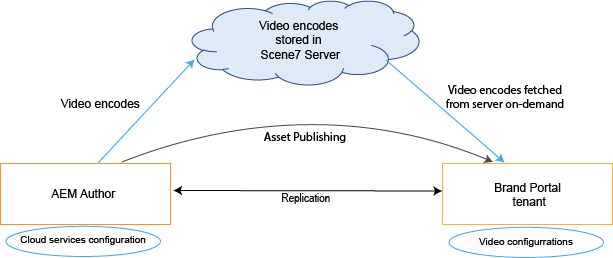

# Brand Portal 上的動態影片支援 {#dynamic-video-support-on-brand-portal}

透過Dynamic Media支援，在Brand Portal上自適應的預覽和播放視訊。 您也可以從入口網站和共用連結下載動態轉譯。
Brand Portal使用者可以：

* 在「資產詳細資訊」頁面、「卡片檢視」和連結共用預覽頁面中預覽影片。
* 在資產詳細資訊頁面上播放視訊編碼。
* 在「資產詳細資訊」頁面的「轉譯」索引標籤中檢視動態轉譯。
* 下載視訊編碼和包含視訊的資料夾。

>[!NOTE]
>
>若要使用視訊並將其發佈至Brand Portal，請確定您的Experience Manager作者執行個體設定為Dynamic Media混合模式或Dynamic Media **[!DNL Scene7]**&#x200B;模式。

若要預覽、播放和下載視訊，Brand Portal會向管理員公開下列兩個設定：

* [Dynamic Media混合式設定](#configure-dm-hybrid-settings)
如果Experience Manager Author例項以Dynamic Media — 混合模式執行。
* [Dynamic Media [!DNL Scene7] 設定](#configure-dm-scene7-settings)
如果Experience Manager Author執行個體是在Dynamic Media - **[!DNL Scene7]**&#x200B;模式下執行。
根據您在Brand Portal租使用者所復寫的Experience Manager Author例項中設定的設定，設定任一設定。

>[!NOTE]
>
>以Experience Manager Author設定的Brand Portal租使用者，在&#x200B;**[!UICONTROL Scene7 Connect]**&#x200B;執行模式上執行時，不支援動態視訊。

## 如何播放動態影片？ {#how-are-dynamic-videos-played}

已從雲端擷取

如果在Brand Portal上設定了Dynamic Media設定（[Hybrid](../using/dynamic-video-brand-portal.md#configure-dm-hybrid-settings)或[[!DNL Scene7]](../using/dynamic-video-brand-portal.md#configure-dm-scene7-settings)設定），則會從&#x200B;**[!DNL Scene7]**&#x200B;伺服器擷取動態轉譯。 因此，視訊編碼可以預覽和播放，而不會延遲和扭曲品質。

Brand Portal存放庫不會儲存視訊編碼並從&#x200B;**[!DNL Scene7]**&#x200B;伺服器擷取它們。 請確定Adobe Experience Manager編寫執行個體和Brand Portal上的Dynamic Media設定相同。

>[!NOTE]
>
>Brand Portal不支援視訊檢視器和檢視器預設集。 影片會在Brand Portal中的預設檢視器上預覽和播放。

## 先決條件 {#prerequisites}

若要在Brand Portal上處理動態影片，請確定：

* **在Dynamic Media模式中啟動Experience Manager Author**

  在[Dynamic Media - [!DNL Scene7] 模式](https://experienceleague.adobe.com/zh-hant/docs/experience-manager-65/content/assets/dynamic/config-dms7#enabling-dynamic-media-in-scene-mode)或[Dynamic Media — 混合模式](https://experienceleague.adobe.com/zh-hant/docs/experience-manager-65/content/assets/dynamic/config-dynamic)中啟動Experience Manager Author執行個體(已設定Brand Portal)，或

* **在Experience Manager作者執行個體上設定Dynamic Media雲端服務**

  根據Experience Manager Author執行所在的Dynamic Media模式（Scene7模式或混合模式），從[Tools[!DNL Scene7]在Experience Manager Author上設定](https://experienceleague.adobe.com/zh-hant/docs/experience-manager-65/content/assets/dynamic/config-dms7#configuring-dynamic-media-cloud-services)Dynamic Media雲端服務（[模式）](https://experienceleague.adobe.com/zh-hant/docs/experience-manager-65/content/assets/dynamic/config-dms7#configuring-dynamic-media-cloud-services)或&#x200B;**Dynamic Media雲端服務（混合模式）** | **雲端服務** | **動態媒體**。

* **在Brand Portal上設定Dynamic Media**

  根據Experience Manager Author上的Dynamic Media雲端設定，從Brand Portal管理工具設定[Dynamic Media設定](#configure-dm-hybrid-settings)或[[!DNL Scene7] 設定](#configure-dm-scene7-settings)。

  請確定已在Dynamic Media - [Scene7](#separate-tenants)模式和Dynamic Media — 混合模式中設定的Experience Manager Author執行個體使用&#x200B;**[!UICONTROL 個個別的Brand Portal租使用者]**。 如果您使用Dynamic Media **[!UICONTROL S7]**&#x200B;和Dynamic Media Hybrid的功能，此方法尤其重要。

* **將視訊編碼套用至Brand Portal的發佈資料夾**

  套用[視訊編碼](https://experienceleague.adobe.com/zh-hant/docs/experience-manager-65/content/assets/dynamic/video-profiles)並將包含豐富媒體資產的資料夾從Experience Manager製作執行個體發佈到Brand Portal。

* 如果啟用安全預覽，則在SPS中允許清單輸出IP **&#x200B;**

  如果使用Dynamic Media-**[!DNL Scene7]** （為公司啟用[安全預覽](https://experienceleague.adobe.com/zh-hant/docs/dynamic-media-classic/using/upload-publish/testing-assets-making-them-public)），則建議&#x200B;**[!DNL Scene7]**&#x200B;公司管理員[允許列出使用SPS (](https://experienceleague.adobe.com/zh-hant/docs/dynamic-media-classic/using/upload-publish/testing-assets-making-them-public#testing-the-secure-testing-service)Scene7 **[!UICONTROL Publishing System) Flash UI之個別區域的公用輸出IP]**。

  輸出IP如下：

  | **地區** | **輸出IP** |
  |--- |--- |
  | 不適用 | 130.248.160.68、20.94.203.130 |
  | EMEA | 185.34.189.3、51.132.146.75 |
  | APAC | 63.140.44.54 |

  若要允許列出任一輸出IP，請參閱[準備您的帳戶以進行安全測試服務](https://experienceleague.adobe.com/zh-hant/docs/dynamic-media-classic/using/upload-publish/testing-assets-making-them-public#testing-the-secure-testing-service)。

## 最佳做法

請依照下列作法，確認已從Brand Portal （和共用連結）成功預覽、播放和下載動態視訊資產：

### 為Dynamic Media區隔租使用者 — Scene7和Dynamic Media — 混合模式 {#separate-tenants}

如果您同時使用Dynamic Media - **[!DNL Scene7]**&#x200B;模式和Dynamic Media — 混合模式功能，請針對以Dynamic Media - **[!DNL Scene7]**&#x200B;和Dynamic Media — 混合模式設定的Experience Manager Author執行個體使用不同的Brand Portal租使用者。

### Experience Manager Author例項和Brand Portal有相同的設定詳細資料

請確定Brand Portal和&#x200B;**[!UICONTROL Experience Manager雲端設定]**&#x200B;中的設定詳細資料相同。 相同的設定詳細資料包括：

* **[!UICONTROL 標題]**
* **[!UICONTROL 註冊識別碼]**
* **[!UICONTROL Dynamic Media — 混合模式]**&#x200B;中的&#x200B;**[!UICONTROL 視訊服務URL]**
* **[!UICONTROL 標題]**
* 認證（**[!UICONTROL 電子郵件]**&#x200B;和密碼）
* **[!UICONTROL 地區]**
* Dynamic Media中的&#x200B;**[!UICONTROL 公司]** - **[!DNL Scene7]**&#x200B;模式

### Dynamic Media Scene7模式的允許清單公開輸出IP

如果Dynamic Media **[!UICONTROL Scene7]** — 已啟用[安全預覽](https://experienceleague.adobe.com/zh-hant/docs/dynamic-media-classic/using/upload-publish/testing-assets-making-them-public) — 用於提供視訊資產至Brand Portal，則&#x200B;**[!UICONTROL Scene7]**&#x200B;會建立用於中繼環境或內部應用程式的專用影像伺服器。 對此伺服器的任何請求都會檢查原始IP位址。 如果傳入的請求不在核准的IP位址清單中，則會傳回失敗回應。
因此，**[!UICONTROL Scene7]**&#x200B;公司管理員會透過&#x200B;**[!UICONTROL SPS]** (Scene7 Publishing System) Flash UI，為其公司的&#x200B;**[!UICONTROL Secure Testing]**&#x200B;環境設定核准的IP位址清單。 請確定您個別區域（來自以下區域）的輸出IP已新增至該核准清單。
若要允許列出任一輸出IP，請參閱[準備您的帳戶以進行安全測試服務](https://experienceleague.adobe.com/zh-hant/docs/dynamic-media-classic/using/upload-publish/testing-assets-making-them-public#testing-the-secure-testing-service)。
輸出IP如下：

| **地區** | **輸出IP** |
|--- |--- |
| 不適用 | 130.248.160.68、20.94.203.130 |
| EMEA | 51.132.146.75，130.248.244.202，130.248.244.203，130.248.244.204，130.248.244.210，130.248.244.211，130.248.244.212 |
| APAC | 63.140.44.54 |

## 設定Dynamic Media （混合）設定 {#configure-dm-hybrid-settings}

如果Experience Manager Author執行個體以Dynamic Media混合模式執行，則從系統管理工具面板使用&#x200B;**[!UICONTROL 視訊]**&#x200B;圖磚來設定Dynamic Media閘道設定。

>[!NOTE]
>
>[視訊編碼設定檔](https://experienceleague.adobe.com/zh-hant/docs/experience-manager-65/content/assets/dynamic/video-profiles)未發佈至Brand Portal。 而是從&#x200B;**[!UICONTROL Scene7]**&#x200B;伺服器擷取。 因此，若要在Brand Portal中成功播放視訊編碼，請確定設定詳細資料與Experience Manager Author執行個體中的[Dynamic Media雲端服務（[!DNL Scene7]模式）](https://experienceleague.adobe.com/zh-hant/docs/experience-manager-65/content/assets/dynamic/config-dms7#configuring-dynamic-media-cloud-services)相同。

若要在Brand Portal租使用者上設定Dynamic Media設定：

1. 選取Experience Manager標誌，以便您可以從Brand Portal頂部的工具列存取管理工具。
1. 從系統管理工具面板中，選取&#x200B;**[!UICONTROL 視訊]**&#x200B;圖磚。

   Brand Portal上的

   **[!UICONTROL 編輯Dynamic Media設定]**&#x200B;頁面開啟。

   Brand Portal上的

1. 指定&#x200B;**[!UICONTROL 註冊ID]**&#x200B;和&#x200B;**[!UICONTROL 視訊服務URL]** （DM閘道URL）。 請確定這些詳細資訊與您Experience Manager作者執行個體中&#x200B;**[!UICONTROL 工具>雲端服務]**&#x200B;的詳細資訊相同。
1. 選取&#x200B;**儲存**&#x200B;以儲存組態。

## 設定Dynamic Media Scene7設定 {#configure-dm-scene7-settings}

如果Experience Manager Author執行個體在Dynamic Media - **[!UICONTROL Scene7]**&#x200B;模式下執行，則從系統管理工具面板使用「**[!UICONTROL Dynamic Media設定]**」動態媒體設定，來設定&#x200B;**[!UICONTROL Scene7]**&#x200B;伺服器設定。

若要在Brand Portal租使用者上設定Dynamic Media **[!UICONTROL Scene7]**&#x200B;設定：

1. 選取Experience Manager標誌，以便您可以從Brand Portal頂部的工具列存取管理工具。

2. 從系統管理工具面板中，選取&#x200B;**[!UICONTROL Dynamic Media組態]**&#x200B;圖磚。

   在Brand Portal![上的[!UICONTROL DM &#x200B;]Scene 7](assets/DMS7-Tile.png)設定

   **[!UICONTROL 編輯Dynamic Media組態]**&#x200B;頁面隨即顯示。

   Brand Portal上的

3. 提供：

   * **[!UICONTROL 標題]**
   * 用於存取Scene7伺服器的認證（**[!UICONTROL 電子郵件識別碼]**&#x200B;和&#x200B;**[!UICONTROL 密碼]**）
   * **[!UICONTROL 地區]**

   請確定這些值與在Experience Manager編寫執行個體中找到的值相同。

4. 選取&#x200B;**[!UICONTROL 連線至Dynamic Media]**。

5. 提供&#x200B;**[!UICONTROL 公司名稱]**，並&#x200B;**[!UICONTROL 儲存]**&#x200B;組態。

6. 選取&#x200B;**[!UICONTROL 重設]**&#x200B;以清除所有變更、重設密碼，並將組態還原成預設狀態。

