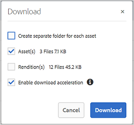

# Brand Portal的訪客存取權 {#guest-access-to-brand-portal}

Experience Manager Assets Brand Portal允許訪客存取入口網站。 訪客使用者不需要認證即可進入入口網站，且可以存取入口網站的公開資產（和集合）。 訪客工作階段中的使用者可以將資產新增至Lightbox （私人集合）並下載相同的資產，直到其工作階段持續存在，或除非訪客使用者選擇[[!UICONTROL 結束工作階段]](#exit-guest-session)。 訪客使用者工作階段會維持15分鐘作用中。

訪客存取功能可讓組織快速[與預定對象共用](../using/brand-portal-sharing-folders.md#how-to-share-folders)核准的資產，而不需要將其加入。 Brand Portal 6.4.2之後已可同時為多位訪客使用者提供服務，佔每個組織使用者配額總數的10%。 允許訪客存取可節省時間，以管理在Brand Portal上具有有限功能的使用者並瞭解其上線分數。\
組織可以使用系統管理工具面板中&#x200B;**[!UICONTROL 存取]**&#x200B;設定的&#x200B;**[!UICONTROL 允許訪客存取]**&#x200B;選項，啟用（或停用）組織Brand Portal帳戶的訪客存取。

<!--
Comment Type: annotation
Last Modified By: mgulati
Last Modified Date: 2018-08-17T10:42:59.879-0400
Removed the first para: "AEM Assets Brand Portal allows public users to enter the portal anonymously and have restricted access to the allowed public resources as guests. Organization users with guest role need not seek access and authentication from administrators."
-->

## 開始來賓工作階段 {#begin-guest-session}

若要以匿名方式進入Brand Portal，請在Brand Portal的歡迎畫面中選取&#x200B;**[!UICONTROL 按一下這裡]** （對應&#x200B;**[!UICONTROL `Guest Access?`]**）。 輸入驗證碼安全性檢查以授予使用Brand Portal的存取權。

## 來賓工作階段持續時間 {#guest-session-duration}

訪客使用者工作階段會維持15分鐘作用中。
此程式會將**[!UICONTROL Lightbox]**&#x200B;的狀態從工作階段開始時間保留15分鐘。 之後，目前的來賓工作階段會重新啟動，導致Lightbox狀態遺失。

例如，某個訪客使用者在1500小時登入Brand Portal，並在15:05小時將資產新增至&#x200B;**[!UICONTROL Lightbox]**&#x200B;進行下載。 如果使用者未在15:15小時（登入後15分鐘內）之前下載&#x200B;**[!UICONTROL Lightbox]**&#x200B;集合（或其資產），則使用者必須重新啟動工作階段。 **[!UICONTROL Lightbox]**&#x200B;是空的，這表示如果工作階段遺失，已上傳的資產將無法再使用。

## 允許並行來賓工作階段 {#concurrent-guest-sessions-allowed}

每個組織的同時來賓工作階段數限製為使用者配額總數的10%。 這表示對於使用者配額為200的組織，最多可同時工作20個訪客使用者。 第21位使用者被拒絕存取，而且只有在20位作用中來賓使用者的工作階段結束時，才能以來賓身分存取。

>[!NOTE]
>
>如果授權使用者人數超過合約值（配額），Brand Portal不會傳送通知。 此外，它不會限制授權使用者的任何活動。

## 訪客使用者與Brand Portal的互動 {#guest-user-interaction-with-brand-portal}

### 來賓UI導覽

以訪客身分進入Brand Portal時，使用者可以看到所有[公開或僅與訪客使用者共用的](../using/brand-portal-sharing-folders.md#sharefolders)資產和資料夾。 此檢視是僅內容檢視，以卡片、清單或欄配置顯示資產。

如果管理員啟用[啟用資料夾階層](../using/brand-portal-general-configuration.md#main-pars-header-1621071021)，訪客使用者在登入Brand Portal時，會從父資料夾中的根資料夾和共用資料夾看到資料夾樹狀結構。

這些父資料夾是虛擬資料夾，無法對它們執行任何動作。 您可以使用鎖定圖示來辨識這些虛擬資料夾。

和共用資料夾不同，在&#x200B;**[!UICONTROL 卡片檢視]**&#x200B;中，暫留或選取時不會顯示任何動作工作。 在&#x200B;**[!UICONTROL 欄檢視]**&#x200B;和&#x200B;**[!UICONTROL 清單檢視]**&#x200B;中選取虛擬資料夾時，會顯示&#x200B;**[!UICONTROL 總覽]**&#x200B;按鈕。

>[!NOTE]
>
>虛擬資料夾的預設縮圖是第一個共用資料夾的縮圖影像。

   

**[!UICONTROL 檢視設定]**&#x200B;選項可讓訪客使用者調整&#x200B;**[!UICONTROL 卡片檢視]**&#x200B;中的卡片大小，或調整要在&#x200B;**[!UICONTROL 清單檢視]**&#x200B;中顯示的欄位。

**[!UICONTROL 內容樹狀結構]**&#x200B;可讓您在資產階層之間移動。

Brand Portal為來賓使用者提供&#x200B;**[!UICONTROL 總覽]**&#x200B;選項，以便檢視所選資產/資料夾的&#x200B;**[!UICONTROL 資產屬性]**。 **[!UICONTROL 總覽]**&#x200B;選項可見：

* 在工具列的頂端，選取資產或資料夾時。
* 在下拉式清單中選取「邊欄選取器」 。

當您在選取資產或資料夾時選取&#x200B;**[!UICONTROL 概觀]**&#x200B;選項時，使用者可以看到資產建立的標題、路徑和時間。 而在資產詳細資訊頁面上，選取&#x200B;**[!UICONTROL 總覽]**&#x200B;選項可讓使用者檢視資產的中繼資料。

左側邊欄中的&#x200B;**[!UICONTROL 導覽]**&#x200B;選項可讓您從檔案導覽至集合，然後返回客體工作階段，讓使用者可以瀏覽檔案或集合中的資產。

**[!UICONTROL 篩選器]**&#x200B;選項可讓訪客使用者使用管理員設定的搜尋述詞來篩選資產檔案和資料夾。

### 訪客使用者功能

訪客使用者可以存取Brand Portal上的公開資產，且幾乎不受任何限制，詳細討論如下。

**來賓使用者可以**：

* 存取適用於所有Brand Portal使用者的所有公用資料夾和集合。
* 瀏覽成員、詳細資訊頁面，並擁有所有公用資料夾和集合成員的完整資產檢視。
* 在公用資料夾和集合中搜尋資產。
* 將資產新增至Lightbox集合中。 這些對集合的變更會在工作階段期間持續存在。
* 直接或透過Lightbox集合下載資產。

**來賓使用者不能**：

* 建立收藏集和已儲存的搜尋，或進一步共用它們。
* 存取資料夾和集合設定。
* 以連結形式共用資產。

### 下載來賓工作階段中的資產

訪客使用者可直接下載在Brand Portal上公開發佈或專門與訪客使用者共用的資產。 訪客使用者也可以在工作階段到期之前，將資產新增至&#x200B;**[!UICONTROL Lightbox]** （公用集合），以及下載&#x200B;**[!UICONTROL Lightbox]**&#x200B;集合。

若要下載資產和系列，請使用下列位置的下載圖示：

* 快速動作縮圖，出現在將游標停留在資產或集合上時
* 頂部的工具列，在選擇資產或集合時顯示

在[!UICONTROL 下載]對話方塊中選取&#x200B;**[!UICONTROL 啟用加速下載]**&#x200B;可讓您[增強下載效能](../using/accelerated-download.md)。

## 退出來賓工作階段 {#exit-guest-session}

若要結束來賓工作階段，請從標頭中可用的選項使用&#x200B;**[!UICONTROL 結束工作階段]**。 不過，如果用於來賓工作階段的瀏覽器索引標籤非使用中，則工作階段會在兩小時非使用後自動過期。

## 監視來賓使用者活動 {#monitoring-guest-user-activities}

管理員可以透過Brand Portal監控訪客使用者互動。 在Brand Portal中產生的報表可提供訪客使用者活動的關鍵深入分析。 例如，**[!UICONTROL 下載]**&#x200B;報告可用於追蹤訪客使用者下載的資產計數。 **[!UICONTROL 使用者登入]**&#x200B;報告可通知訪客使用者上次登入入口網站的時間，以及指定期間內的登入頻率。
