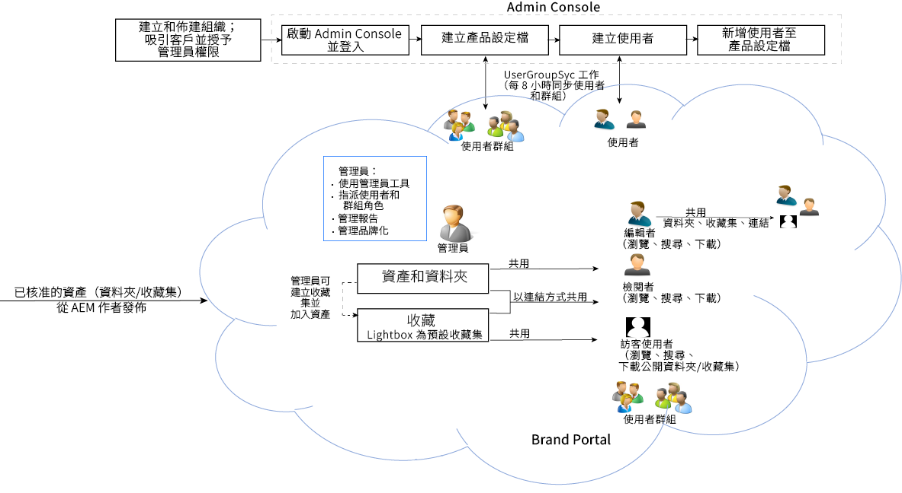

# Adobe Experience Manager Assets Brand Portal 指南 {#aem-brand-portal}

**Adobe Experience Manager Assets Brand Portal** 將經過核准的品牌和產品資產安全地分發給外部代理商、合作夥伴、內部團隊和經銷商，方便他們下載，協助組織滿足其行銷需求。

缺少安全的資產共用解決方案可能會導致：

* 需透過電子郵件或雲端以手動方式共用資產
* 品牌法規遵循問題
* 缺乏控制資產使用方式的手段
* 行銷活動和產品上市時間的延遲
* 地理位置和組織之間的內容重複
* 資產發佈前的儲存方式不安全

Brand Portal 讓行銷人員能夠與合作夥伴及內部使用者合作建立和管理設計指南、標誌及活動資產，並提供予利害關係人，從而確保符合品牌調性。

Brand Portal 是雲端型 SAAS 產品，並作為 Adobe Experience Manager Assets 產品之附加元件提供 (內部部署或受管理的服務)。您可以透過 [!DNL Adobe Experience Manager Assets] as a [!DNL Cloud Service] 使用 Brand Portal。[設定](https://experienceleague.adobe.com/zh-hant/docs/experience-manager-cloud-service/content/assets/brand-portal/configure-aem-assets-with-brand-portal)完成後，您可以將核准的資產從 [!DNL Adobe Experience Manager Assets] as a [!DNL Cloud Service] 執行個體發佈至 [!DNL Brand Portal]，並將其分發給 Brand Portal 使用者。

Brand Portal 解決方案工作流程如以下影像所示。

## Adobe Experience Manager Brand Portal 使用手冊

此使用手冊說明了 Brand Portal 產品和主要工作流程的深入分析。使用左側邊欄瀏覽各種功能，並深入研究以瞭解不同角色與入口網站的互動方式。

### 另請參閱

| 使用手冊 | 說明 |
|--- |---|
| [新功能](whats-new.md) | Brand Portal 中所做的變更。 |
| [發行說明](brand-portal-release-notes.md) | 目前版本中的增強功能、已修正的嚴重問題，以及已知問題。 |
| [設定 Experience Manager Assets 以便與 Brand Portal 搭配使用](../using/configure-aem-assets-with-brand-portal.md) | 如何使用 Experience Manager Assets 複製 Brand Portal 來發佈資產。 |
| [針對平行發佈的問題進行疑難排解](troubleshoot-parallel-publishing.md) | 針對 Brand Portal 與 Experience Manager Assets 之間的複寫問題進行疑難排解。 |
| [支援的檔案格式](brand-portal-supported-formats.md) | Brand Portal 支援的檔案格式，可供預覽和下載。 |
| [將資產發佈至 Brand Portal](brand-portal-sharing-folders.md) | 如何將資料夾、集合、連結、預設集、結構、Facet 和標記發佈至 Brand Portal。 |
| [Brand Portal 中的資產來源](brand-portal-asset-sourcing.md) | 如何在 AEM Assets 中設定資產來源、在 Brand Portal 中上傳資產，以及將貢獻資料夾發佈回 AEM Assets 中。 |
| [Brand Portal 功能影片](https://experienceleague.adobe.com/zh-hant?lang=zh-hant&amp;tag=Brand+Portal#recommended/solutions/experience-manager) | 透過影片教學課程了解如何使用 Experience Manager Assets Brand Portal。 |

### 實用資源

* [了解 Brand Portal 與 AEM Assets 的搭配使用](https://experienceleague.adobe.com/zh-hant/docs/experience-manager-brand-portal/using/home)
