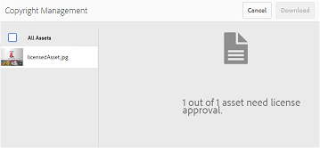

# 管理資產的數位版權 {#manage-digital-rights-of-assets}

確保創意資產和品牌資料的安全發佈和使用對於保護您的品牌至關重要。 將到期日（和時間）與從AEM發佈至Brand Portal的已核准資產建立關聯，或授權這些資產供條件式使用，即可強制執行此程式。 此外，Brand Portal可讓您指定從Brand Portal共用之資產的連結到期日。

請閱讀下文，瞭解如何在Brand Portal上保護資產，並瞭解相關的使用許可權。

## 資產有效期 {#asset-expiration}

資產到期是控制整個組織對Brand Portal上已核准資產之使用量的有效方式。 從AEM Assets發佈至Brand Portal的所有資產皆可設定到期日，以限制不同使用者角色對這些資產的使用。

### 與過期資產相關的使用許可權 {#usage-permissions-expired-assets}

在Brand Portal中，管理員可以檢視、下載已過期的資產，並將其新增至收藏集。 不過，編輯者和檢視者只能檢視過期的資產，並將其新增至收藏集。

管理員可以將過期的資產從AEM Assets發佈到Brand Portal。 不過，已過期的資產不能使用Brand Portal的連結來共用。 如果您從同時包含過期和未過期資產的資料夾中選取任何過期的資產，將無法使用&#x200B;**[!UICONTROL 共用連結]**&#x200B;動作。 但是，如果您選取的資料夾包含過期和未過期的資產，則可使用[!UICONTROL 共用]和&#x200B;**[!UICONTROL 共用連結]**&#x200B;動作。

>[!NOTE]
>
>即使資料夾包含過期的資產，仍可共用為連結。 在此情況下，連結不會列出過期的資產，而只會共用未過期的資產。

下表顯示過期資產的使用許可權：

|   | **[!UICONTROL 連結共用]** | **[!UICONTROL 下載]** | **[!UICONTROL 屬性]** | **[!UICONTROL 新增至集合]** | **[!UICONTROL 刪除]** |
|---|---|---|---|---|---|
| **[!UICONTROL 管理員]** | 無法使用 | 可使用 | 可使用 | 可使用 | 可使用 |
| **[!UICONTROL 編輯器]** | 無法使用 | 無法使用 | 可使用 | 可使用 | 無法使用 |
| **[!UICONTROL 檢視器]** | 無法使用 | 無法使用 | 可使用 | 可使用 | 無法使用 |
| **[!UICONTROL 來賓使用者]** | 無法使用 | 無法使用 | 可使用 | 可使用 | 無法使用 |

>[!NOTE]
>
>如果檢視者和編輯者下載的資料夾中包含已過期和未過期的資產，系統只會下載未過期的資產。 如果資料夾僅包含過期的資產，則會下載空白資料夾。

### 資產的到期狀態 {#expiration-status-of-assets}

您可以在資產的&#x200B;**[!UICONTROL 卡片檢視]**&#x200B;中檢視資產的到期狀態。 卡片上的紅色旗標表示資產已過期。

>[!NOTE]
>
>清單和欄檢視不會顯示資產的到期狀態。

## 資產連結有效期 {#asset-link-expiration}

透過連結共用資產時，管理員和編輯人員可以使用&#x200B;**[!UICONTROL 連結共用]**&#x200B;對話方塊中的&#x200B;**[!UICONTROL 到期]**&#x200B;欄位來設定到期日期和時間。 連結的預設到期日為共用連結日期起七天。

這可確保在由Brand Portal管理員和編輯人員設定的日期和時間過後以連結形式共用的資產。 此外，這些資產在到期日過後也無法再檢視和下載。 為了防止外部使用者存取您核准的資產，請在共用連結上設定到期日，以確保在指定時間過後不會向未知實體顯示這些連結。

如需連結共用的詳細資訊，請參閱[以連結方式共用資產](../using/brand-portal-link-share.md)。

## 授權的Assets {#licensed-assets}

授權資產在從Brand Portal下載前，必須先接受授權合約。 此授權資產的合約於您直接從Brand Portal下載資產，或透過共用連結下載資產時提供。 無論是否已過期，所有使用者都可以檢視受授權保護的資產。 不過，已到期的授權資產的下載和使用是有限的。 若要瞭解已到期授權資產的行為以及根據使用者角色可允許的活動，請參閱已到期資產的[使用許可權](../using/manage-digital-rights-of-assets.md#usage-permissions-expired-assets)。

受授權保護的資產已附加[授權合約](https://experienceleague.adobe.com/en/docs/experience-manager-65/content/assets/administer/drm)，方法是在[!DNL Experience Manager Assets]中設定資產的中繼資料屬性。

如果資產包含下列（或兩者）中繼資料屬性之一，則視為受保護資產：

* `xmpRights:WebStatement`：此屬性參考包含資產授權合約之頁面的路徑。 `xmpRights:WebStatement`應為存放庫中的有效路徑。
* `adobe_dam:restrictions`：這個屬性的值是指定授權合約的原始HTML。

如果您選擇下載受授權保護的資產，系統會根據中繼資料屬性，將您重新導向至&#x200B;**[!UICONTROL 版權管理]**&#x200B;頁面。

| `adobe_dam:restrictions` | `xmpRights:WebStatement` | 版權管理 |
| --- | --- | --- |
| 是 | - | 介面會顯示在Assets和Brand Portal中 |
| - | 是（無效路徑） | 無介面 |
| 是 | 是（無效路徑） | 無介面 |
| 是 | 是（有效路徑） | 介面會顯示在Assets或Brand Portal 中，這取決於路徑對Assets或Brand Portal （或兩者）是否有效。 |

您必須在此處選取要下載的資產，並接受相關的授權合約。 如果您不接受授權合約，則不會啟用&#x200B;**[!UICONTROL 下載]**&#x200B;按鈕。

如果選取範圍包含多個受保護的資產，請一次選取一個資產、接受授權合約，然後繼續下載資產。

## 產生過期資產的相關報告 {#generate-report-about-expired-assets}

管理員可以產生並下載報表，列出特定時間範圍內所有已過期的資產。 此報表包含過期資產的詳細資訊，例如大小、型別、指定資產階層中資產位置的路徑、資產過期時間以及資產發佈時間。 此報告的欄可自訂為根據使用者需求顯示更多資料。

如需有關報表功能的詳細資訊，請移至[使用報表](../using/brand-portal-reports.md#work-with-reports)。
