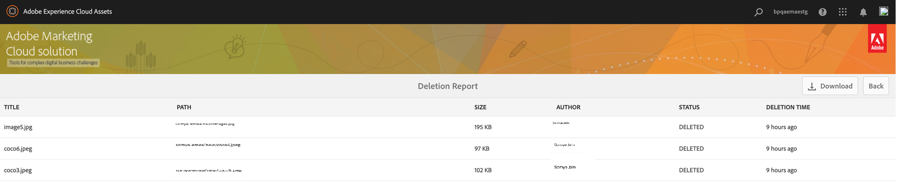
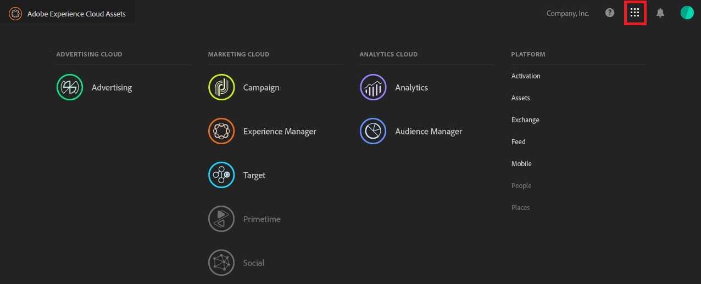
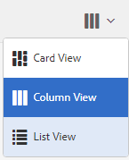

# Experience Manager Assets Brand Portal 新增功能 {#what-s-new-in-aem-assets-brand-portal}

Adobe Experience Manager Assets Brand Portal 協助您橫跨多種裝置輕鬆地取得和控制已核准的創意資產，並安全地對外部對象及內部業務使用者分發這些資產。其能協助提高資產共用的效率、縮短資產的上市時間，以及降低不合規和未經授權存取的風險。Adobe 正致力於改善整體的 Brand Portal 體驗。以下是新功能和增強功能的搶先了解內容。

## 2024.10.0 版的變更內容 {#what-changed-in-October-2024}

Brand Portal 2024.10.0 為內部版本，其中包含重大問題的修正。請參閱最新的 [Brand Portal 發行說明](brand-portal-release-notes.md)。

## 2024.02.0 版的變更內容 {#what-changed-in-February-2024}

Brand Portal 2024.02.0 為內部版本，其中包含重大問題的修正。請參閱最新的 [Brand Portal 發行說明](brand-portal-release-notes.md)。

## 2023.10.0 版的變更內容 {#what-changed-in-October-2023}

Brand Portal 2023.10.0 為內部版本，其中包含重大問題的修正。請參閱最新的 [Brand Portal 發行說明](brand-portal-release-notes.md)。

## 2023.08.0 版的變更內容 {#what-changed-in-August-2023}

Brand Portal 2023.08.0 為內部版本，其中包含重大問題的修正。請參閱最新的 [Brand Portal 發行說明](brand-portal-release-notes.md)。

## 2023.05.0 版的變更內容 {#what-changed-in-May-2023}

Brand Portal 2023.05.0 為內部版本，其中包含重大問題的修正。請參閱最新的 [Brand Portal 發行說明](brand-portal-release-notes.md)。

## 2023.02.0 版的變更內容 {#what-changed-in-February-2023}

Brand Portal 2023.02.0 為內部版本，其中包含重大問題的修正。請參閱最新的 [Brand Portal 發行說明](brand-portal-release-notes.md)。

## 2022.10.0 版的變更內容 {#what-changed-in-October-2022}

Brand Portal 2022.10.0 為內部版本，其中包含重大問題的修正。請參閱最新的 [Brand Portal 發行說明](brand-portal-release-notes.md)。

## 2022.08.0 版的變更內容 {#what-changed-in-August-2022}

Brand Portal 2022.08.0 為內部版本，其中包含重大問題的修正。請參閱最新的 [Brand Portal 發行說明](brand-portal-release-notes.md)。

## 2022.05.0 版的變更內容 {#what-changed-in-May-2022}

Brand Portal 現在每隔十二小時便會自動執行工作，刪除所有發佈至 AEM 的 Brand Portal 資產。因此，您不需要手動刪除「貢獻」資料夾中的資產，使資料夾大小不超過臨界值限制。您也可以使用 Brand Portal 中的「**[!UICONTROL 工具]** > **[!UICONTROL 資產貢獻狀態]** > **[!UICONTROL 刪除報告]**」選項，監視自動執行之刪除工作的狀態。工作報告會提供以下詳細資訊：

* 工作開始時間
* 工作結束時間
* 工作狀態
* 工作中包含的資產總數
* 工作中成功刪除的資產總數
* 執行工作之後變成可用的總儲存空間

您還可以進一步深入研究，檢視刪除工作中包含的每項資產的詳細資訊。報告中會包含如資產標題、大小、作者、刪除狀態和刪除時間等詳細資訊。

此外，Brand Portal 2022.05.0 包含重大問題的修正。請參閱最新的 [Brand Portal 發行說明](brand-portal-release-notes.md)。

## 2022.02.0 版的變更內容 {#what-changed-in-Feb-2022}

Brand Portal 2022.02.0 為內部版本，其中包含重大問題的修正。請參閱最新的 [Brand Portal 發行說明](brand-portal-release-notes.md)。

## 2021.10.0 版的變更內容 {#what-changed-in-october-2021}

Brand Portal 2021.10.0 為內部版本，其中包含重大問題的修正。請參閱最新的 [Brand Portal 發行說明](brand-portal-release-notes.md)。

## 2021.08.0 版的變更內容 {#what-changed-in-august-2021}

Brand Portal 2021.08.0 為內部版本，引入企業和團隊客戶的企業基本資料，讓組織能更好地控制其資產。使用者現在於新的移轉後組織中擁有組織特定的權益。移轉過程中，所有現有的 Adobe ID 帳戶都會移轉至 Business ID。

* 移轉完成後，Business ID 會指派給所有新組織和現有組織。
* Business ID 不需要任何特定的設定，例如申請網域或設定 SSO。
* 您可以使用任何電子郵件新增使用者，包括公用電子郵件網域，例如 gmail.com 或 outlook.com。

**對 Brand Portal 使用者的影響**

移轉不會影響您現有的資料集、資產、使用者或任何設定。移轉期間發生的唯一內部變更是您的現有組織獲得使用企業基本資料的權益。

>[!NOTE]
>
>企業基本資料目前適用於 2021 年 8 月 16 日之後建立的新組織。
>
>在組織移轉之前，您可以繼續使用 Adobe ID、Enterprise ID 或 Federated ID 類型來存取組織。

### 參考文章 {#reference-articles}

* [Adobe 基本資料簡介](https://helpx.adobe.com/tw/enterprise/kb/introducing-adobe-profiles.html)

* [管理 Adobe 基本資料](https://helpx.adobe.com/tw/enterprise/using/manage-adobe-profiles.html)

* [使用者和管理員登入體驗更新](https://helpx.adobe.com/tw/enterprise/using/storage-for-business.html#new-admin-sign-in-exp)

* [移轉期間的登入限制](https://helpx.adobe.com/tw/enterprise/kb/account-temporarily-unavailable.html)

* [在 Admin Console 中管理使用者](https://helpx.adobe.com/tw/enterprise/using/manage-users-individually.html)

* [管理企業使用者的產品基本資料](https://helpx.adobe.com/tw/enterprise/using/manage-product-profiles.html#assign-users)

* [網域信任](https://helpx.adobe.com/tw/enterprise/admin-guide.html/enterprise/using/set-up-identity.html#directory-trusting)

<!--   
### Add new users to T2E organization   {#add-users-to-T2E-org}

On adding a new user in Admin Console for a new or migrated T2E organization, the user will have to perform an additional step **Join Team** to get entitled to the T2E organization. 

The user is entitled only if the user chooses to **Join Team**, otherwise the user won't get access to the selected T2E organization in Brand Portal. 

>[!NOTE]
>
>The workflow is not applicable to the existing Brand Portal users.

### Additional screen while navigating to Admin Console   {#navigate-to-admin-console}

The administrators will have to perform an additional step of selecting the T2E organization while navigating from Brand Portal to Admin Console. The workflow applies on the new and migrated T2E organizations.   

Selection of the T2E organization is a one-time activity and is not required everytime the administrator navigates from Brand Portal to Admin Console.

1. Log in to a T2E organization in Brand Portal as administrator.
1. Go to **[!UICONTROL Tools]** > **[!UICONTROL Users]** > **[!UICONTROL Management]** and click on the link **[!UICONTROL Launch Admin Console]**. 

   Or, go to **[!UICONTROL Unified Shell]** > **[!UICONTROL Administration]** and click on the link **[!UICONTROL Launch Admin Console]**. 
1. Search the T2E organization to login to Admin Console.

   

### Restriction during migration of an organization   {#login-restriction}

When an organization is undergoing T2E migration, the users of that organization will not be able to login to Brand Portal. The following error message appears on the screen. However, the migration won't impact the active user session until the token expires. 

Once the migration is complete, the users can login to Brand Portal. The users will receive an email notification containing the entitlement changes. If the users are entitled to more than one organization, they will have to select the organization at the time of login. 
-->

<!--
For a new or migrated T2E orgnization, the users will have an organization specific entitlement. A user can have multiple entitlements with the same email id for different T2E organizations. 
-->

## 2021.06.0 版的變更內容 {#what-changed-in-june-2021}

Brand Portal 2021.06.0 為內部版本，其中包含重大問題的修正。請參閱最新的 [Brand Portal 發行說明](brand-portal-release-notes.md)。

## 2021.02.0 版的變更內容 {#what-changed-in-feb-2021}

Brand Portal 2021.02.0 透過啟用工作流程和資產來源功能增強 AEM Assets as a Cloud Service。其亦改善資產下載體驗並包含重大修正，並且讓管理員能夠在租用戶層級設定資料夾與集合的預設下載行為，以及資產的大量下載。Brand Portal **[!UICONTROL 使用情況報告]**&#x200B;也已修改，以反映使用中的 Brand Portal 使用者。

### 在 AEM Assets as a Cloud Service 上啟用 Brand Portal {#bp-automation-on-cloud-service}

AEM Assets as a Cloud Service 現在有權擁有預先設定的 Brand Portal 執行個體。Cloud Manager 使用者可以在 AEM Assets as a Cloud Service 執行個體上啟用 Brand Portal。

此前是使用 Adobe Developer Console 手動設定 AEM Assets as a Cloud Service 以便與 Brand Portal 搭配使用。

Cloud Manager 使用者觸發在後端建立必要設定的啟用工作流程，並在與 AEM Assets as a Cloud Service 執行個體相同的 IMS 組織上啟用 Brand Portal。

若要在您的 AEM Assets as a Cloud Service 執行個體上啟用 Brand Portal：

1. 登入 Adobe Cloud Manager 並導覽至「**[!UICONTROL 環境]**」。
1. 從清單中 (逐一) 選取環境。找到與 Brand Portal 關聯的環境後，按一下「**[!UICONTROL 啟用 Brand Portal]**」按鈕，開始啟用工作流程。
1. 啟用 Brand Portal 租用戶後，狀態會變更為「已啟用」。

請參閱[在 AEM Assets as a Cloud Service 上啟用 Brand Portal](https://experienceleague.adobe.com/zh-hant/docs/experience-manager-cloud-service/content/assets/brand-portal/configure-aem-assets-with-brand-portal)。

### AEM Assets as a Cloud Service 上的資產來源 {#asset-sourcing-on-cloud-service}

現在 AEM Assets as a Cloud Service 上可以使用資產來源功能。該功能預設為所有雲端服務使用者皆能使用。獲得許可的 Brand Portal 使用者要為資產來源做出貢獻，可以將新資產上傳到貢獻資料夾，並將貢獻資料夾從 Brand Portal 發佈至 AEM Assets as a Cloud Service 執行個體。管理員可以先檢查和核准來自 Brand Portal 使用者的貢獻，然後再分發給其他使用者。

此前僅可在 AEM Assets 上使用資產來源 (內部部署和受管理的服務)。

請參閱 [Brand Portal 中的資產來源](https://experienceleague.adobe.com/zh-hant/docs/experience-manager-brand-portal/using/asset-sourcing-in-brand-portal/brand-portal-asset-sourcing)。

### 資產下載 {#asset-download-setting}

除了現有的&#x200B;**[!UICONTROL 下載設定]**&#x200B;之外，Brand Portal 管理員現在還可以設定&#x200B;**[!UICONTROL 資產下載]**&#x200B;設定。管理員可以透過這項設定，在租用戶層級管理資料夾與集合的預設下載行為，以及資產的大量下載 (超過 20 項資產)。

<!--
Earlier, all the asset renditions were directly downloaded in a zip folder in case of folder, collection, and bulk download of assets. As the **[!UICONTROL Download]** dialog box is skipped for folders or collections, there was no mechanism to control the downloading behaviour of the assets. Due to this, the users were finding it difficut to search for a particular asset rendition from a folder containing huge bunch of downloaded renditions. 
-->

此前，所有的資產轉譯都會直接下載成一個 zip 資料夾。資料夾和集合的「**[!UICONTROL 下載]**」對話框被跳過。此外也沒有方法可以控制資產的下載行為，因此很難從眾多的下載中搜尋特定的轉譯。

**[!UICONTROL 資產下載]**&#x200B;設定現在提供一個選項，可以在下載資料夾、集合或大量下載資產時，為每項資產分別建立一個資料夾。

若停用&#x200B;**[!UICONTROL 資產下載]**&#x200B;設定，資料夾或集合會下載成一個 zip 資料夾，其中包含同一資料夾下的所有資產轉譯，但使用共用連結下載資產的情況除外。

以管理員身分登入您的 Brand Portal 租用戶，然後導覽至「**[!UICONTROL 工具]** > **[!UICONTROL 下載]**」。管理員可以啟用&#x200B;**[!UICONTROL 資產下載]**&#x200B;設定，在下載資料夾、集合和大量下載資產時，為每項資產分別建立一個資料夾。

請參閱[從 Brand Portal 下載資產](https://experienceleague.adobe.com/zh-hant/docs/experience-manager-brand-portal/using/download/brand-portal-download-assets)。
<!--
### Download using Share link {#download-using-share-link}

The default behavior of downloading the assets using share link is now independent of the **[!UICONTROL Download Settings]**. A separate folder is created for each asset while downloading the assets using share link. 
-->

### 使用情況報告 {#usage-report}

Brand Portal **[!UICONTROL 使用情況報告]**&#x200B;已修改，僅會反映使用中的 Brand Portal 使用者。Admin Console 中未指派至任何產品基本資料的 Brand Portal 使用者，會被視為非使用中的使用者，而不會反映在&#x200B;**[!UICONTROL 使用情況報告]**&#x200B;中。

此前，使用中和非使用中的使用者都會呈現在使用情況報告中。

## 2020.10.0 版的變更內容 {#what-changed-in-oct-2020}

Brand Portal 2020.10.0 是一個增強功能版本，著重於簡化資產下載體驗並包含重大修正。增強功能引入全新的改良版資產下載工作流程，提供排除轉譯及直接從「**[!UICONTROL 轉譯]**」面板下載的選項。也可以設定特定使用者群組的存取和下載權限，並能輕鬆地從所有 Brand Portal 頁面導覽至檔案、集合和共用的連結。請參閱 [Brand Portal 發行說明](brand-portal-release-notes.md)。

### 簡化下載體驗 {#download-dialog}

此前，「**[!UICONTROL 下載]**」對話框提供多種選項，例如為每項資產分別建立資料夾、使用電子郵件傳送資產、選取原始資產等。這對於非技術使用者或新使用者來說，這些選項容易造成混淆，尤其是在下載多項資產或資料夾時。此外，使用者無法看到所有的資產轉譯，或排除特定的自訂或動態轉譯。

新的「**[!UICONTROL 下載]**」對話框改善資產選取和篩選程序的廣泛適用性，讓 Brand Portal 使用者在下載資產轉譯時，更容易做出有效決策。其根據[**[!UICONTROL 下載]**](brand-portal-download-assets.md)配置和&#x200B;**[!UICONTROL 下載]**&#x200B;設定，列出所選取的全部資產及其轉譯。

>[!NOTE]
>
>現在，所有使用者都預設啟用&#x200B;**[!UICONTROL 快速下載]**，並且需要先在其瀏覽器擴充功能中安裝 IBM® [Aspera Connect 3.9.9](https://www.ibm.com/support/fixcentral/swg/selectFixes?parent=ibm~Other%20software&amp;product=ibm/Other+software/IBM+Aspera+Connect&amp;release=3.9.9&amp;platform=All&amp;function=all)，才能從 Brand Portal 下載資產。

<!--
If any of the **[!UICONTROL Custom Rendition]** or **[!UICONTROL System Rendition]** is enabled in the [**[!UICONTROL Download]**](brand-portal-download-assets.md) configuration and **[!UICONTROL Download]** settings are enabled for the group users, the new **[!UICONTROL Download]** dialog box appears with all the renditions of the selected assets or folders containing assets in a List View. 
-->

在「**[!UICONTROL 下載]**」對話框中，使用者可以：

* 檢視下載清單中任何資產的所有可用轉譯。
* 排除沒有必要下載的資產轉譯。
* 一鍵將同一個轉譯集套用至所有類似的資產類型。
* 針對不同的資產類型套用不同的一組轉譯。
* 為每項資產分別建立一個資料夾。
* 下載所選取的資產及其轉譯。

獨立資產、多項資產、包含資產的資料夾、已授權或未授權的資產，以及透過共用連結下載資產時，其下載工作流程都是相同的。請參閱[從 Brand Portal 下載資產的步驟](https://experienceleague.adobe.com/zh-hant/docs/experience-manager-brand-portal/using/download/brand-portal-download-assets)。

### 快速導覽 {#quick-navigation}

此前，檢視「**[!UICONTROL 檔案]**」、「**[!UICONTROL 集合]**」和「**[!UICONTROL 共用的連結]**」的選項皆是隱藏的，每次使用者想要切換至另一個視圖時，都需點按多次。

在 Brand Portal 2020.10.0 中，使用者可以透過快速導覽連結，一鍵從所有 Brand Portal 頁面導覽至「**[!UICONTROL 檔案]**」、「**[!UICONTROL 集合]**」和「**[!UICONTROL 共用的連結]**」。

### 增強的轉譯面板 {#rendition-panel}

此前，如果在「**[!UICONTROL 下載]**」設定中啟用任何「**[!UICONTROL 自訂轉譯]**」或「**[!UICONTROL 系統轉譯]**」，則使用者只能在「**[!UICONTROL 轉譯]**」面板中檢視原始資產及其轉譯。此外，由於沒有篩選器可用於排除非必要的特定自訂或動態轉譯，因此使用者必須下載所有的資產轉譯。

<!--
Earlier, if any of the custom or system renditions was enabled in the **[!UICONTROL Download]** settings, an additional **[!UICONTROL Download]** dialog box appeared on clicking the **[!UICONTROL Download]** button wherein the user had to manually select the set of renditions (original asset, custom renditions, dynamic renditions) to download.
There was no filter to exclude specific custom or dynamic renditions which were not required for download.
-->

在 Brand Portal 2020.10.0 中，使用者可以排除特定的轉譯，以及直接在資產詳細資料頁面中[從「轉譯」面板下載所選取的轉譯](brand-portal-download-assets.md#download-assets-from-asset-details-page)，而無需開啟「**[!UICONTROL 下載]**」對話框。

<!-- 
In Brand Portal 2020.10.0, direct download and exclude renditions features are introduced in the **[!UICONTROL Renditions]** panel on the asset details page. All the renditions (original asset, custom renditions, dynamic renditions) under the rendition panel are now associated with a check box and are enabled by default. 

The user can clear the check boxes to exclude the renditions which are not required for download. And can click on the **[!UICONTROL Download]** button in the **[!UICONTROL Renditions]** panel to directly download the selected set of renditions in a zip folder without having to open the **[!UICONTROL Download]** dialog box.
-->

### 設定下載設定 {#download-permissions}

除了現有的&#x200B;**[!UICONTROL 下載]**&#x200B;設定之外，Brand Portal 管理員現在還可以設定讓使用者群組從資產詳細資料頁面檢視或下載，或同時檢視和下載原始資產和轉譯。

以管理員身分登入您的 Brand Portal 租用戶，然後導覽至「**[!UICONTROL 工具]** > **[!UICONTROL 使用者]**」。

在「**[!UICONTROL 使用者角色]**」頁面中，導覽至「**[!UICONTROL 群組]**」索引標籤，設定使用者群組的檢視和 (或) 下載設定。

此前只有限制群組使用者下載原始資產的設定。

「**[!UICONTROL 使用者角色]**」頁面上的「**[!UICONTROL 群組]**」索引標籤，讓管理員能夠設定檢視和下載設定：

* 若&#x200B;**[!UICONTROL 下載原始內容]**&#x200B;和&#x200B;**[!UICONTROL 下載轉譯]**&#x200B;設定皆開啟，所選群組的使用者可以檢視和下載原始資產及其轉譯。
* 若兩項設定皆關閉，則使用者僅能檢視原始資產。使用者在資產詳細資料頁面上看不到資產轉譯。
* 若僅開啟&#x200B;**[!UICONTROL 下載原始內容]**&#x200B;設定，使用者在資產詳細資料頁面上只能檢視和下載原始資產。
* 若僅開啟&#x200B;**[!UICONTROL 下載轉譯]**&#x200B;設定，則使用者可以檢視原始資產，但無法下載。不過，使用者可以檢視和下載資產轉譯。

請參閱[設定資產下載](https://experienceleague.adobe.com/zh-hant/docs/experience-manager-brand-portal/using/download/brand-portal-download-assets#configure-download-permissions)。

>[!NOTE]
>
>若使用者已加入至多個群組，且其中一個群組有限制，則這些限制適用於該使用者。

<!--
>Restrictions to access the original asset and their renditions do not apply to administrators even if they are members of restricted groups.
 >
 >The users can always download assets and their renditions from the repository using a `curl` request even if the download configurations are turned-off.
 >
-->

## 6.4.7 版的變更內容 {#what-changed-in-647}

Brand Portal 6.4.7 版本引入文件檢視器，增強下載資產的體驗，並包含重大修正。請參閱最新的 [Brand Portal 發行說明](brand-portal-release-notes.md)。

<!--
Brand Portal 6.4.7 release brings in the Document Viewer, leverages the Brand Portal administrators to configure asset download, and centers top customer requests. See latest [Brand Portal Release Notes](brand-portal-release-notes.md).
-->

### 文件檢視器 {#doc-viewer}

文件檢視器能增強 PDF 檢視體驗。在 Brand Portal 中檢視 PDF 檔案時，其體驗與 Adobe Document Cloud 相近。

此前，檢視 PDF 檔案的選項並不多。

Brand Portal 使用者可以使用文件檢視器檢視頁面和書籤、搜尋文字、放大和縮小以及導覽頁面。使用者可以切換至特定頁面、調整為符合視窗或畫面大小，以及切換工具列可見度。

>[!NOTE]
>
>其他文件格式的檢視體驗維持不變。

### 下載體驗 {#download-configurations}

資產下載程序經過改進，簡化使用者[從 Brand Portal 下載資產](brand-portal-download-assets.md)的體驗。

從 Brand Portal 下載資產的現有工作流程中，不可避免地會出現「**[!UICONTROL 下載]**」對話框，其中有多個下載選項可供選擇。

在 Brand Portal 6.4.7 中，Brand Portal 管理員可以設定資產&#x200B;**[!UICONTROL 下載]**&#x200B;設定。可用的設定有：

* **[!UICONTROL 快速下載]**
* **[!UICONTROL 自訂轉譯]**
* **[!UICONTROL 系統轉譯]**

Brand Portal 管理員可以啟用任意組合來設定資產下載。

<!--In Brand Portal 6.4.7, fast download, custom renditions, and system renditions are the three configurations available.-->

* 若&#x200B;**[!UICONTROL 自訂轉譯]**&#x200B;和&#x200B;**[!UICONTROL 系統轉譯]**&#x200B;設定兩者皆關閉，則下載資產的原始轉譯時不會出現任何其他對話框，簡化 Brand Portal 使用者的下載體驗。

* 若啟用&#x200B;**[!UICONTROL 自訂轉譯]**&#x200B;或是&#x200B;**[!UICONTROL 系統轉譯]**，則會出現「**[!UICONTROL 下載]**」對話框，並下載原始資產及其資產轉譯。啟用&#x200B;**[!UICONTROL 快速下載]**&#x200B;設定會加速下載程序。

根據設定，獨立資產、多項資產以及包含資產的資料夾之下載工作流程維持不變。已授權或未授權的資產，以及透過共用連結下載資產的工作流程也一樣不變。

## 6.4.6 版的變更內容 {#what-changed-in-646}

在 Brand Portal 6.4.6 中，AEM Assets 和 Brand Portal 之間的授權通道有所變更。AEM Assets as a Cloud Service、AEM Assets 6.3 及更高版本現在支援 Brand Portal。在 AEM Assets 6.3 及更高版本中，最初是使用舊版 OAuth 閘道在傳統 UI 中設定 Brand Portal。此閘道採用 JWT 權杖交換來取得 IMS 存取權杖進行授權。現在可透過 Adobe Developer Console 設定 AEM Assets 與 Brand Portal 搭配使用，Adobe Developer Console 會取得 IMS 權杖進行您的 Brand Portal 租用戶授權。

<!-- The steps to configure integration are different depending on your AEM version, and whether you are configuring for the first-time, or upgrading the existing integration:
-->

<!--
  
   | **AEM Version** |**New Integration** |**Upgrade Integration** |
|---|---|---|
| **AEM 6.5** |[Create new integration](../using/brand-portal-configure-integration-65.md) |[Upgrade existing integration](../using/brand-portal-configure-integration-65.md#upgrade-integration-65) | 
| **AEM 6.4** |[Create new integration](../using/brand-portal-configure-integration-64.md) |[Upgrade existing integration](../using/brand-portal-configure-integration-64.md#upgrade-integration-64) | 
| **AEM 6.3** |[Create new integration](../using/brand-portal-configure-integration-63.md) |[Upgrade existing integration](../using/brand-portal-configure-integration-63.md#upgrade-integration-63) | 
| **AEM 6.2** | | 

   -->

設定 AEM Assets 與 Brand Portal 搭配使用的步驟因 AEM 版本而異，也會因為您是首次設定或是升級現有設定而不同：

<!--| **AEM Version** |**New Configuration** |**Upgrade Configuration** |
|---|---|---|
| **AEM 6.5 (6.5.4.0 and above)** |[Create configuration](../using/brand-portal-configure-integration-65.md) |[Upgrade configuration](../using/brand-portal-configure-integration-65.md#upgrade-integration-65) | 
| **AEM 6.4 (6.4.8.0 and above)** |[Create configuration](../using/brand-portal-configure-integration-64.md) |[Upgrade configuration](../using/brand-portal-configure-integration-64.md#upgrade-integration-64) | 
| **AEM 6.3 (6.3.3.8 and above)** |[Create configuration](../using/brand-portal-configure-integration-63.md) |[Upgrade configuration](../using/brand-portal-configure-integration-63.md#upgrade-integration-63) | 

-->

<!-- AEM Assets configuration with Brand Portal on Adobe I/O is supported on:
* AEM 6.5.4.0 and above
* AEM 6.4.8.0 and above
* AEM 6.3.3.8 and above -->

| **AEM 版本** | **新設定** | **升級設定** |
|---|---|---|
| **AEM Assets as a Cloud Service** | [建立設定](https://experienceleague.adobe.com/zh-hant/docs/experience-manager-cloud-service/content/assets/brand-portal/configure-aem-assets-with-brand-portal) | - |
| **AEM 6.5 (6.5.4.0 及更高版本)** | [建立設定](https://experienceleague.adobe.com/zh-hant/docs/experience-manager-65/content/assets/brandportal/configure-aem-assets-with-brand-portal) | [升級設定](https://experienceleague.adobe.com/zh-hant/docs/experience-manager-65/content/assets/brandportal/configure-aem-assets-with-brand-portal#upgrade-integration-65) |

>[!NOTE]
>
>Adobe 建議您更新 AEM 執行個體，以使用最新的 Service Pack。

請參閱 [Brand Portal 發行說明](brand-portal-release-notes.md)。

請參閱 [Brand Portal 常見問題](brand-portal-faqs.md)。

## 6.4.5 版的變更內容 {#what-changed-in-645}

Brand Portal 6.4.5 讓外部代理商和團隊無需存取製作環境，能夠將內容上傳到 Brand Portal 及發佈至 AEM Assets。此功能稱為 **[Brand Portal 中的資產來源](brand-portal-asset-sourcing.md)**，提供雙向機制，讓使用者既可以貢獻資產，也可以與其他分散於全球各地的 Brand Portal 使用者共用資產，藉以改善客戶體驗。

### Brand Portal 中的資產來源 {#asset-sourcing-in-bp}

資產來源讓 AEM 使用者 (管理員/非管理員的使用者) 能夠建立含有額外&#x200B;**資產貢獻**&#x200B;屬性的資料夾，確保 Brand Portal 使用者可以使用新建立的資料夾提交資產。資產來源會自動觸發工作流程，在新建立的「**貢獻**」資料夾內建立另外兩個子資料夾，名稱分別為「NEW」和「SHARED」。

AEM 使用者將簡介和基線資產上傳到「**SHARED**」資料夾。這些內容會定義貢獻資料夾中所需的資產類型，確保 Brand Portal 使用者擁有必要的參考資訊。然後，在將新建立的「**貢獻**」資料夾發佈至 Brand Portal 前，管理員可以把貢獻資料夾存取權授予使用中的 Brand Portal 使用者。

使用者於「**NEW**」資料夾中新增內容完畢後，可以將貢獻資料夾發佈回 AEM 製作環境中。可能需要數分鐘才能完成匯入並於 AEM Assets 中反映新發佈的內容。

此外，所有現有的功能皆維持不變。Brand Portal 使用者可以檢視、搜尋和下載貢獻資料夾和其他允許的資料夾中的資產。而管理員可以進一步共用貢獻資料夾、修改屬性，以及將資產新增至集合中。

>[!NOTE]
>
>AEM 6.5.2.0 及更高版本支援 Brand Portal 中的資產來源。
>
>早期版本 AEM 6.3 和 AEM 6.4 不支援此功能。

### 將資產上傳到貢獻資料夾 {#upload-assets-in-bp}

具有適當權限的 Brand Portal 使用者可以將個別資產或包含多項資產的資料夾 (.zip 檔案) 上傳到貢獻資料夾。使用者可以將多項資產上傳到資產貢獻資料夾中。但是，一次只能建立一個資料夾。

Brand Portal 使用者只能將資產上傳到「**NEW**」子資料夾。「**SHARED**」資料夾用於分發需求和基線資產。

### 將貢獻資料夾發佈至 AEM Assets {#publish-assets-to-aem}

上傳到「**NEW**」資料夾完成後，Brand Portal 使用者即可將貢獻資料夾發佈回 AEM 中。可能需要數分鐘才能匯入並於 AEM Assets 中反映發佈的內容/資產。請參閱[將貢獻資料夾發佈至 AEM Assets](brand-portal-publish-contribution-folder-to-aem-assets.md)。

## 6.4.4 版的變更內容 {#what-changed-in-644}

Brand Portal 6.4.4 版本著重於增強文字搜尋和最常見的客戶請求。請參閱最新的 [Brand Portal 發行說明](brand-portal-release-notes.md)。

### 增強搜尋功能

Brand Portal 6.4.4 以上的版本支援在篩選窗格中針對屬性述詞進行部分文字搜尋。若要允許部分文字搜尋，請在搜尋表單的屬性述詞中啟用&#x200B;**部分搜尋**。

繼續閱讀以便了解關於部分文字搜尋和萬用字元搜尋的更多資訊。

#### 部分詞句搜尋 {#partial-phrase-search}

現在，您可以在篩選窗格中僅指定搜尋詞句的一部分 (即一個或兩個單詞) 來搜尋資產。

**使用案例**
當您不確定所搜尋詞句中出現之單字的確切組合時，部分詞句搜尋便很有用。

舉例來說，如果您在 Brand Portal 中的搜尋表單使用屬性述詞來對資產標題進行部分搜尋，則指定字詞「**camp**」便會回傳標題詞句中包含單字「camp」的所有資產。

#### 萬用字元搜尋 {#wildcard-search}

Brand Portal 允許在搜尋查詢中使用星號 (&#42;) 來代表單詞的一部分。

如果您不確定要搜尋的詞句中所出現的確切字詞，可以使用萬用字元搜尋來填補搜尋查詢中的空白。

比如，如果 Brand Portal 中的搜尋表單使用屬性述詞對資產標題進行部分搜尋，則指定「**climb&#42;**」會回傳標題詞句中以字元「**climb**」開頭的所有資產。

同樣地，若指定：

* 「**&#42;climb**」會回傳標題詞句中以字元「**climb**」結尾的所有資產。

* 「**&#42;climb&#42;**」會回傳標題詞句中的字詞包含字元「**climb**」的所有資產。

>[!NOTE]
>
>選取「**部分搜尋**」核取方塊後，便會預設選取「**忽略大小寫**」。

## 6.4.3 版的變更內容 {#what-changed-in}

Brand Portal 6.4.3 引入用於存取 URL 的替代別名、新的資料夾階層，以及增強影片支援功能。亦引入從 AEM 製作到 Brand Portal 的排程發佈、操作功能改進，並滿足客戶要求。

### 非管理員的資料夾階層導覽

管理員現在可以設定在非管理員使用者 (編輯者、檢視者和訪客使用者) 登入時的資料夾呈現方式。在管理工具面板的「**一般設定**」中，新增「[啟用資料夾階層](../using/brand-portal-general-configuration.md)」的設定。若設定為：

* 「**啟用**」，非管理員使用者可以看到從根資料夾開始的資料夾樹狀結構。因此他們擁有與管理員類似的導覽體驗。
* 「**停用**」，登陸頁面上僅會顯示共用的資料夾。

[啟用資料夾階層](../using/brand-portal-general-configuration.md)功能 (啟用時) 可以協助您區分從不同階層共用的同名資料夾。登入後，非管理員使用者現在可以看到共用資料夾的虛擬父系資料夾 (和上階資料夾)。

共用的資料夾在虛擬資料夾中相應的目錄內進行組織。您可以透過鎖定圖示識別這些虛擬資料夾。

虛擬資料夾的預設縮圖為最先共用之資料夾的縮圖影像。

### 在特定資料夾階層或路徑中搜尋

在搜尋表單中引入「**路徑瀏覽器**」述詞，才可以搜尋特定目錄中的資產。「路徑瀏覽器」搜尋述詞的預設搜尋路徑為 `/content/dam/mac/<tenant-id>/`，編輯預設搜尋表單即可設定此路徑。

* 管理員使用者可以利用「路徑瀏覽器」導覽至 Brand Portal 上的任何資料夾目錄。
* 非管理員使用者使用「路徑瀏覽器」時僅可以導覽至與他們共用的資料夾 (並導覽回父系資料夾)。

  例如，`/content/dam/mac/<tenant-id>/folderA/folderB/folderC` 與非管理員使用者共用。使用者可以利用「路徑瀏覽器」搜尋 folderC 內的資產。這位使用者也可以導覽至 folderB 和 folderA (因為這兩個資料夾是與使用者共用的 folderC 的上階)。

您現在可以將資產搜尋範圍限制在您瀏覽至的特定資料夾，而非從根資料夾開始。

在這些資料夾中搜尋所回傳的結果，僅包含已與使用者共用的資產。

### Dynamic Media 影片轉譯支援

AEM 作者實例處於 Dynamic Media 混合模式的使用者，除了可以預覽和下載原始影片檔案之外，也可以預覽和下載 Dynamic Media 轉譯。

若要在特定租用戶帳戶上啟用 Dynamic Media 轉譯的預覽和下載，管理員需要指定 **Dynamic Media 設定**。此步驟包括管理工具面板中「**影片**」設定內的影片服務 URL 和註冊 ID。

可以在下列位置預覽 Dynamic Media 影片：

* 資產詳細資料頁面
* 資產的卡片視圖
* 連結共用預覽頁面

可以在下列位置下載 Dynamic Media 影片編碼：

* Brand Portal
* 共用的連結

### 排程發佈至 Brand Portal

從 AEM 6.4.2.0 作者實例到 Brand Portal 的資產 (和資料夾) 發佈工作流程，可以排程於之後的日期和時間進行。

同樣地，透過「從 Brand Portal 取消發佈」的工作流程進行排程，便可以在之後從 Portal 移除已發佈的資產。

### URL 中可設定的租用戶別名

組織可以在 URL 中新增替代前置詞，自訂其 Portal URL。若要取得現有 Portal URL 中租用戶名稱的別名，組織必須聯絡客戶支援。

僅能自訂 Brand Portal URL 的前置詞，不能自訂整個 URL。\
例如，現在具有 **geomettrix.brand-portal.adobe.com** 網域的組織，可以要求建立 **geomettrixinc.brand-portal.adobe.com**。

然而，AEM 作者實例僅能透過租用戶 ID URL 進行[設定](https://experienceleague.adobe.com/zh-hant/docs/experience-manager-65/content/assets/brandportal/configure-aem-assets-with-brand-portal)，無法透過租用戶別名 (替代) URL 操作。

組織可以自訂 Portal URL 來滿足其品牌化需求，而不必拘泥於 Adobe 所提供的 URL。

### 增強下載體驗

此版本提供簡化的下載體驗，減少以下方面的點按和警告次數：

* 選擇僅下載轉譯 (而不下載原始資產)。
* 在原始轉譯的存取受到限制時下載資產。

## 6.4.2 版的變更內容 {#what-changed-in-1}

Brand Portal 6.4.2 引入能滿足組織資產分發需求的功能，透過訪客存取權和更快的下載速度達到全域觸及。此版本也透過新的管理設定增強控制，並增加一份報告和滿足客戶請求。

### 訪客存取權

AEM Brand Portal 允許訪客存取 Portal。訪客使用者不需要認證即可進入 Portal，並且可以存取和下載所有公用資料夾和集合。訪客使用者可以將資產加入其 Lightbox (私人集合) 中並下載同樣的內容。他們還可以檢視智慧標記搜尋，以及管理員設定的搜尋述詞。訪客工作階段不允許使用者建立集合和已儲存搜尋或進一步共用、存取資料夾和集合設定，及以連結形式共用資產。

在一個組織中，可以同時有多個訪客工作階段，但是以每個組織使用者總配額的 10% 為限。

訪客工作階段會保持有效狀態兩小時。因此，從工作階段開始時間起算兩個小時以內也會保持 Lightbox 的狀態。兩小時後，訪客工作階段必須重新啟動，因此 Lightbox 狀態將會遺失。

### 加速下載

Brand Portal 使用者可以應用以 IBM® Aspera Connect 為基礎的快速下載，讓速度加速 25 倍，並享受順暢的下載體驗，無論其身在全球何處。若要更快地從 Brand Portal 或共用的連結下載資產，使用者必須在下載對話框中選取「**啟用下載加速**」選項，前提是其組織已啟用下載加速功能。

若要讓組織能夠使用以 IBM® Aspera 為基礎的加速下載，管理員需在管理工具面板中的「[一般設定](brand-portal-general-configuration.md#allow-download-acceleration)」內選取「**啟用下載加速**」選項 (預設為停用)。

關於從 Brand Portal 和共用的連結更快下載資產檔案的先決條件和疑難排解步驟，請參閱[加速 Brand Portal 下載的指南](../using/accelerated-download.md#main-pars-header)。

### 使用者登入報告

現在引入一份用於追蹤使用者登入的新報告。**使用者登入**&#x200B;報告有助於組織針對 Brand Portal 的委派管理員和其他使用者進行稽核和檢查。

報告會記錄從 Brand Portal 6.4.2 部署到報告產生期間，每位使用者的顯示名稱、電子郵件 ID、角色 (管理員、檢視者、編輯者、訪客)、群組、上次登入時間、活動狀態和登入次數。管理員可以將報告匯出為 .csv。使用者登入報告加上其他報告，讓組織能夠密切監視使用者與經核准之品牌資源的互動，確保符合企業合規辦公室的規定。

### 存取原始轉譯

管理員可以限制僅可存取原始影像檔案，並提供低解析度轉譯的存取權，以便從 Brand Portal 或共用的連結下載。您可以在「使用者角色」頁面的「群組」索引標籤，在使用者群組層級控制此存取權。

* 預設情況下，所有使用者均可下載原始轉譯，因為已對所有使用者啟用「存取原始檔案」功能。
* 管理員需要取消選取相應的核取方塊，才能讓一組使用者無法存取原始轉譯。
* 若使用者是多個群組的成員，但只有其中一個群組有限制，則這些限制適用於該使用者。
* 限制不適用於管理員，即使他們是受限制群組的成員。
* 以連結方式共用資產的使用者，其權限適用於使用共用的連結下載資產的使用者。

### 卡片和清單視圖上的資料夾階層路徑

卡片視圖中的資料夾卡片現在向非管理員使用者 (編輯者、檢視者和訪客使用者) 顯示資料夾階層資訊。此功能讓使用者知道他們正在存取之資料夾相對於父系階層的位置。

資料夾階層資訊對於區分資料夾來說特別有用。意思是指，當資料夾名稱與從不同的資料夾階層共用的其他資料夾的名稱相似。如果非管理員使用者不了解與其共用之資產的資料夾結構，則具有相似名稱的資產/資料夾會令人混淆。

* 各相應卡片上顯示的路徑被截斷以符合卡片尺寸。但是，使用者可以將滑鼠停留在截斷的路徑上方，便會看到以工具提示形式顯示的完整路徑。

「清單視圖」會在一個欄位中向 Brand Portal 的所有使用者顯示資產的資料夾路徑。

### 檢視資產屬性的概觀選項

Brand Portal 提供「概觀」選項，讓非管理員使用者 (編輯者、檢視者、訪客使用者) 可以檢視所選資產/資料夾的資產屬性。可以看到「概觀」選項的位置：

1. 選取資產/資料夾時，在頂端的工具列中。
2. 選取「邊欄選擇器」時，在下拉式選單中。

選取資產/資料夾時，在選取「概觀」選項後，使用者可以看到標題、路徑和建立資產的時間。而在資產詳細資料頁面上，選取「概觀」選項後，使用者可以查看資產的中繼資料。

## 新設定

新增六項新設定，供管理員在特定租用戶上啟用或停用以下功能：

* 允許訪客存取
* 允許使用者請求 Brand Portal 存取權
* 允許管理員刪除 Brand Portal 中的資產
* 允許建立公用集合
* 允許建立公用智慧型集合
* 允許加速下載

上述設定可在管理工具面板中的「存取權」和「一般」設定下找到。

### 用於設定 oAuth 整合的 `Adobe I/O` 使用者介面

從 Brand Portal 6.4.2 開始可以使用舊版 OAuth (`https://legacy-oauth.cloud.adobe.io/`) 介面建立 JWT 應用程式，進而能夠設定 oAuth 整合，讓 AEM Assets 可以與 Brand Portal 整合。過去，用於設定 OAuth 整合的使用者介面託管在 `https://marketing.adobe.com/developer/`。若要了解關於整合 AEM Assets 與 Brand Portal 以將資產和集合發佈至 Brand Portal 的詳細資訊，請參閱[設定 AEM Assets 與 Brand Portal 的整合](https://experienceleague.adobe.com/zh-hant/docs/experience-manager-65/content/assets/brandportal/configure-aem-assets-with-brand-portal)。

## 增強搜尋功能

管理者可以使用更新後的屬性述詞 (勾選「忽略大小寫」)，讓屬性述詞不區分大小寫。此選項適用於屬性述詞和多值屬性述詞。\
但是，不區分大小寫的搜尋會比預設的屬性述詞搜尋速度慢一些。如果搜尋篩選器中不區分大小寫的述詞太多，搜尋速度就會變慢。Adobe 建議您謹慎使用不區分大小寫的搜尋。

## 6.4.1 版的變更內容 {#what-changed-in-2}

Brand Portal 6.4.1 為平台升級版本。其引入幾項新功能和重要的增強功能，例如瀏覽、搜尋和績效增強。

### 增強瀏覽功能

* 新的內容樹狀結構邊欄讓使用者能夠快速導覽資產階層。

* 新的鍵盤快速鍵，例如 _(p)_ 用於導覽至屬性頁面、_(e)_ 用於編輯，以及 _(ctrl+c)_ 用於複製操作。
* 改進卡片和清單視圖在瀏覽大量資產時捲動、延遲載入的體驗。
* 增強的卡片視圖，支援根據視圖設定使用不同尺寸的卡片。

* 當滑鼠停留在日期標籤上方時，卡片視圖現在會顯示日期/時間戳記。

* 增強欄位視圖，在資產快照下提供「**更多詳細資料**」，讓您能夠導覽至資產的詳細資料頁面。

* 清單視圖現在預設於第一欄顯示資產的檔案名稱。此視圖也會顯示地區設定、資產類型、維度、大小、等級和發佈資訊。新的&#x200B;**視圖設定**&#x200B;可用於設定清單視圖中所顯示內容的詳細程度。

* 改進資產詳細資料體驗，能夠使用新的導覽按鈕在資產之間來回導覽，以及檢視資產計數。

* 在資產詳細資料頁面中預覽從 AEM 上傳之音訊檔案的新功能。
* 資產屬性中提供新的「相關資產」功能。從 AEM 發佈至 Brand Portal 的相關資產現在能保持其關聯，在屬性頁面上提供前往這些相關資產的連結。
* 引入一種新設定來限制非管理員使用者不可以建立公用集合。組織可以和客戶支援團隊合作，在特定帳戶上設定此功能。

### 增強搜尋功能

* 引入在導覽至搜尋項目後，無需再次執行搜尋查詢即可返回搜尋結果中相同位置的功能。
* 提供新的搜尋結果計數來顯示所提供搜尋結果的數量。
* 改進的文件類型搜尋篩選器，現在讓您能夠依照特定的 MIME 類型 (例如 .jpg、.png 和 .psd) 篩選搜尋結果，而不僅是透過影像、文件和多媒體等廣泛的類別來進行篩選。
* 增強集合的搜尋篩選器，具有精確的時間戳記，取代先前的時間滑桿功能。
* 引入新的存取類型篩選器來搜尋公用或非公用集合。

### 下載最佳化

* 直接下載單一大型檔案，無需建立 zip 檔案，提高速度和傳輸量。
* 連結共用功能的下載大小限制為每個檔案 **1** GB。

* 使用者現在從 Brand Portal 或透過共用連結功能下載資產時，可以選擇僅下載自訂和原始檔案，並排除立即可用的轉譯。

### 效能增強

* 資產下載速度提升高達 100%。
* 資產搜尋回應提升高達 40%。
* 瀏覽效能提升高達 40％。

**注意**：所引用的提升結果是根據實驗室進行之測試而得出的。

### 增強報告功能

**引入連結共用報告**
已引入一份提供共用的連結相關資訊的新報告。連結共用報告會列出與內部和外部使用者共用之資產的所有 URL。這份報告會在指定時間段內針對整個組織的使用者提供報告，並且指出連結的共用時間、共用者以及共用截止時間。

**修改存取使用情況報告的進入點**
使用情況報告現已與其他報告合併，可以從「資產報告」控制台檢視。若要存取「資產報告」控制台，請導覽至管理工具面板中的「**建立/管理報告**」。

**改進的報告使用者體驗**
Brand Portal 上的報告介面變得更加易於操作，並賦予組織更大的控制權。除了建立各種報告外，管理員現在還可以再次查看已生成的報告，以及下載或刪除那些報告，因為報告儲存在 Brand Portal 中。

可以透過新增或移除預設欄位來自訂所建立的每份報告。此外，可以在下載、過期和發佈報告中新增自訂欄位，藉以控制其詳細程度。

### 改進管理工具

改進管理工具中用於中繼資料、搜尋和報告的屬性選擇器，具有預先輸入和瀏覽功能，可以簡化管理體驗。

### 其他增強功能

* 從 AEM 6.3.2.1 和 6.4 發佈至 Brand Portal 的資產，現在可以透過選取 AEM Assets Brand Portal 複寫對話框中的「公用資料夾發佈」方塊將其公開。

* 若有人請求存取 Brand Portal，除了 Brand Portal 通知區域中會出現通知之外，管理員也會經由存取權請求電子郵件收到通知。

## 6.3.2 版的變更內容 {#what-changed-in-3}

Brand Portal 6.3.2 包含針對最常見的客戶請求和一般效能增強的新功能和增強功能。

### 請求 Brand Portal 的存取權 {#request-access-to-brand-portal}

使用者現在可以利用 Brand Portal 登入畫面上新的&#x200B;**需要存取**&#x200B;功能來請求 Brand Portal 存取權。

根據是否擁有 Adobe ID，或者是否需要建立 Adobe ID，使用者可以按照適當的工作流程提交請求。Brand Portal 產品管理員會在其通知區域中接收到此類請求，並透過 Adobe Admin Console 授予存取權。

如需詳細資訊，請參閱[請求 Brand Portal 的存取權](../using/brand-portal.md#requestaccesstobrandportal)。

### 資產下載報告增強功能 {#enhancement-in-the-assets-downloaded-report}

資產下載報告現在會包括特定日期和時間範圍內每位使用者的資產下載計數。使用者能以 .csv 格式下載此報告，彙整如授權資產的總下載計數之類的資料。

如需詳細資訊，請參閱[建立和管理其他報告](../using/brand-portal-reports.md#createandmanageadditionalreports)中的步驟 3 和 6。

### Brand Portal 維護通知 {#brand-portal-maintenance-notification}

Brand Portal 現在會於維護活動即將進行的前幾天顯示通知橫幅。通知範例：

如需詳細資訊，請參閱 [Brand Portal 維護通知](https://experienceleague.adobe.com/zh-hant/docs/experience-manager-brand-portal/using/introduction/brand-portal)。

### 使用連結共用功能共用的授權資產的增強功能 {#enhancement-for-licensed-assets-shared-using-the-link-share-feature}

使用連結共用功能下載授權資產時，系統會提示您同意這些資產的授權協議。

如需詳細資訊，請參閱[以連結形式共用資產](../using/brand-portal-link-share.md#shareassetsasalink)中的步驟 12。

### 增強使用者選擇器 {#user-picker-enhancement}

使用者選擇器效能現已增強，可滿足擁有大量使用者群的客戶需求。

### Experience Cloud 品牌化變更 {#experience-cloud-branding-changes}

Brand Portal 現在符合新的 Adobe Experience Cloud 品牌調性。

## 6.3.1 版的變更內容 {#what-changed-in-4}

Brand Portal 6.3.1 包含旨在讓 Brand Portal 與 AEM 保持一致的新功能和增強功能。

### 升級使用者介面 {#upgraded-user-interface}

為了讓 Brand Portal 使用者體驗與 AEM 保持一致，Adobe 正在轉移到 Coral 3 使用者介面。這項變更增強了整體可用性，包括導覽和外觀。

#### 增強導覽體驗 {#enhanced-navigational-experience}

* 透過新的 Adobe 標誌快速存取管理工具：

* 透過覆蓋進行產品導覽：

* 快速導覽至父系資料夾：

* 快速搜尋並導覽至所需的內容和工具：

### 增強瀏覽體驗 {#enhanced-browsing-experience}

* 用於瀏覽巢狀資料夾的新欄位視圖：

 

* 在資料夾中的資產清單中，最新上傳的資產會顯示在頂部。

### 增強搜尋體驗 {#enhanced-search-experience}

* 新的全方位搜尋功能可在您輸入搜尋關鍵字時，透過自動建議協助您快速存取相關內容、功能或標記。全方位搜尋適用於所有搜尋功能。

* 您也可以為全方位搜尋新增搜尋篩選器，以進一步縮小範圍並加快搜尋。

* 若是從 AEM Assets 發佈的，新的資產等級型搜尋讓您可以利用等級來搜尋資產。
* 新的多值搜尋功能可以接受帶有 AND 運算符的多個關鍵字，以更快地發現資產。
* 新的搜尋提升功能讓您可以提高搜尋的相關性，使特定資產出現在搜尋結果的頂部。
* 新的路徑型搜尋功能讓您可以提供巢狀資料夾的路徑，以搜尋該資料夾中的資產。

#### 新的智慧標記型搜尋 {#new-smart-tags-based-search}

若附有智慧標記的影像從 AEM Assets 發佈至 Brand Portal，您可以使用智慧標記名稱做為搜尋關鍵字，在 Brand Portal 中搜尋這些影像。此功能僅適用於檔案。

### 增強下載體驗 {#enhanced-downloading-experience}

下載巢狀資料夾後，您可以保留原始資料夾階層。巢狀資料夾內的資產可下載至單一資料夾中，而非在個別的資料夾。

### 提高效能 {#improved-performance}

增強瀏覽、搜尋和下載功能，顯著提升 Brand Portal 效能。

### 新的資產 Digital Rights Management {#new-digital-rights-management-for-assets}

管理員可以在共用資產之前設定資產的到期日期和時間。資產過期後，檢視者和編輯者仍可以看到該資產，但無法下載。當資產過期時，管理員會收到通知。

### 增強資產排序 {#enhanced-asset-sorting}

清單視圖中資料夾內的資產排序，不再限於第一頁上顯示的資產數量。資料夾中的所有資產都會排序，無論所有資產是否都列在第一頁。

### 增強報告 {#reporting-capabilities}

管理員可以建立和管理三種類型的報告：已下載的資產、已過期的資產和已發佈的資產。也可以設定報告中的欄位，以及將報告匯出為 CSV 格式。

### 其他中繼資料 {#additional-metadata}

Brand Portal 6.3.1 引入其他的中繼資料，與 AEM Assets 6.3 相當。您可以使用結構描述編輯器表單來控制在資產屬性頁面上可見的中繼資料。外部連結共用使用者無法看到資產中繼資料，其只能透過連結共用 URL 預覽和下載資產。

### 其他管理員功能 {#additional-capabilities-for-administrators}

* 在完成登入畫面的自訂之前，管理員可以預覽變更。

* 管理員新增使用者後，新的使用者會自動加入 Brand Portal，無需接受任何邀請。

### AEM Assets 6.3 中的新發佈功能 {#new-publishing-capabilities-in-aem-assets}

* AEM 管理員可以使用 2017 年第四季推出的 AEM 6.3 SP 1-CFP 1 (6.3.1.1) 將中繼資料結構描述從 AEM Assets 發佈至 Brand Portal。

* AEM 管理員可以使用 AEM 6.2 SP1-CFP7 和 AEM 6.3 SP 1-CFP 1 (6.3.1.1) 將 AEM Assets 中的所有標記發佈至 Brand Portal。

* 從 AEM Assets 中，您可以發佈帶有標記 (包括智慧標記) 的資產和集合。然後，您可以在 Brand Portal 中使用這些標記做為搜尋關鍵字來搜尋這些資產或集合。
